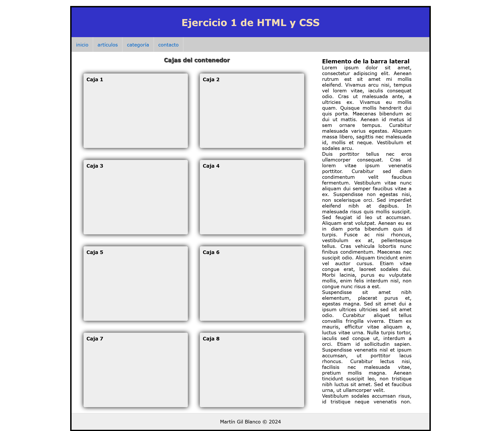

# Ejercicio 1 de HTML y CSS

### HTML y CSS básico

1. **Estructura Base:**

   - El contenedor principal `#general` debe tener un ancho fijo de **1200px** y estar centrado en la pantalla utilizando márgenes automáticos. También debe tener un borde de **5px** de color negro y un margen superior de **20px**.
   - Aplica un _reset_ general a todos los elementos para eliminar márgenes y rellenos, y establece una fuente de tipo **Verdana**, **Geneva**, **Tahoma**, o **sans-serif**.

2. **Estilo de la Cabecera:**

   - La cabecera (`header`) debe tener una altura de **100px** y el texto debe estar centrado vertical y horizontalmente con una línea de altura equivalente a su altura.
   - El color del texto debe ser **wheat** (trigo) y el fondo debe tener un color **rgb(50, 50, 200)** (un azul oscuro).
   - Asegúrate de que el texto esté alineado en el centro horizontalmente.

3. **Menú de Navegación:**

   - El menú principal (`#menu`) debe tener un fondo de color **#ccc** (gris claro).
   - Los elementos de lista (`li`) dentro del menú deben flotar a la izquierda y tener un borde derecho de **1px** color **#eee** (gris muy claro). Además, deben eliminar el estilo de lista por defecto.
   - Los enlaces (`a`) en los elementos del menú deben mostrarse como bloques con un relleno de **15px** y sin subrayado.
   - Al pasar el ratón sobre un elemento del menú (`li`), el fondo debe cambiar al color **rgb(50, 50, 200)** y los enlaces (`a`) deben cambiar su color a **wheat**.

4. **Distribución del Contenido:**

   - La sección principal de contenido (`#contenido`) debe flotar a la izquierda y ocupar el **70%** del ancho de `#general`.
   - Dentro de `#contenido`, los títulos (`h3`) deben estar centrados y tener un relleno de **15px** con un color de texto **#444** y una sombra que les dé un efecto de relieve con un desplazamiento de **1px** en cada dirección y un desenfoque de **1px**.

5. **Estilo de Cajas:**

   - Dentro de `#contenido`, las cajas (`.caja`) deben flotar a la izquierda, tener un ancho de **350px** y una altura de **250px**. Además, deben tener márgenes de **20px** en la parte superior e inferior, y un margen izquierdo de **40px**.
   - Las cajas deben tener un radio de borde de **5px**, un fondo de color **#eee**, y una sombra negra con un desenfoque de **15px**.
   - Al pasar el ratón sobre las cajas, deben cambiar el color de fondo a **rgb(50, 50, 200)** y el cursor debe mostrar un _pointer_. Además, el color de los títulos (`h2`) dentro de las cajas debe cambiar a **wheat**.
   - La transición de estos cambios debe durar **300ms**.

6. **Barra Lateral:**

   - La barra lateral (`#lateral`) debe ocupar el **25%** del ancho de `#general` y tener una altura mínima de **500px** y máxima de **1165px**.
   - Debe tener un desplazamiento vertical habilitado si el contenido excede su altura máxima (propiedad **overflow-y: scroll**).
   - Aplica un margen superior de **20px** y alinea el texto de manera justificada.

7. **Pie de Página:**

   - El pie de página (`footer`) debe tener un ancho del **100%** y una altura de **55px**, con el texto centrado vertical y horizontalmente mediante la propiedad **line-height**.
   - Establece un color de fondo **#eee** y un borde superior de **1px** en color **#ccc**.

8. **Propuesta de diseño**

