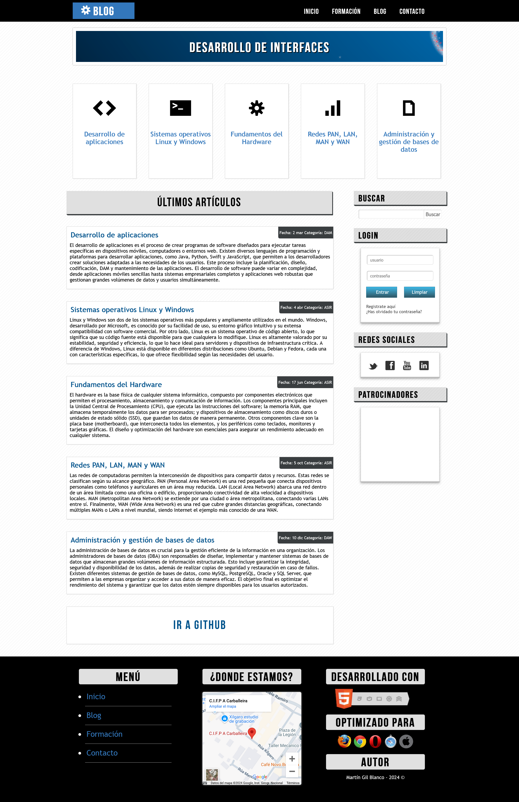

# Estilos Generales y Maquetación

### Fuentes

1. **Carga de fuentes personalizadas**:

   - Se han utilizado varias fuentes personalizadas con la directiva `@font-face`.
   - La fuente **"TrebuchetMS"** se carga desde el archivo `TrebuchetMS.ttf`.
   - La fuente **"BebasNeue"** se carga desde el archivo `BebasNeue.otf`.
   - La fuente **"WebSymbolsRegular"** se carga desde varios formatos (`.eot`, `.ttf`, `.svg`) para asegurar compatibilidad entre navegadores.
   - Estas fuentes ya se adjuntan para su uso en el archivo `styles.css`.

---

### Estilos del `body` y Contenedor General

1. **Fondo del cuerpo**:

   - El fondo del cuerpo tiene una **imagen de fondo** ubicada en `../img/pattern.png`.

2. **Ancho del contenedor principal**:

   - Se establece un **ancho de 1250 píxeles** para el contenido y está centrada.

---

### Cabecera

1. **Estilos del `header`**:

   - El `header` ocupa el **100% del ancho disponible** y tiene una **altura de 70 píxeles**.
   - Su **fondo** es de color negro y usa la fuente **"BebasNeue"** en color blanco.

2. **Logotipo**:

   - El logotipo (`#logo`) flota a la izquierda, tiene un **ancho de 200 píxeles**, y está centrado con **texto** alineado horizontalmente.
   - Cambia de estilo suavemente en 300ms al interactuar con él gracias a la propiedad `transition`.

---

### Menú

1. **Estilos del menú**:

   - El contenedor del menú (`#menu`) flota a la derecha con un **margen derecho de 70 píxeles**.

2. **Elementos de la lista del menú**:

   - Los elementos (`li`) del menú son **bloques en línea**, con un **tamaño de fuente de 24 píxeles** y márgenes laterales de **20 píxeles**.
   - Los enlaces (`a`) dentro de los `li` tienen un **color blanco** y, al pasar sobre ellos, cambian a **color azul** (`#3377bb`) y aumentan de tamaño en 1.2 veces con la propiedad `transform: scale(1.2, 1.2);`.

---

### Banner

1. **Contenedor del `#banner`**:

   - El `#banner` tiene un **ancho del 95%** y una **altura de 100 píxeles**, con un **borde blanco de 10 píxeles** y una **sombra suave**.

2. **Texto del `h1` en el banner**:

   - El título (`h1`) del `#banner` tiene una **fuente "BebasNeue"** de **45 píxeles** y un **sombreado de texto** negro.

---

### Tarjetas

1. **Estilos de las tarjetas**:

   - Las tarjetas (`.card`) flotan a la izquierda con un **ancho de 205 píxeles** y una **altura de 305 píxeles**. Poseen un **borde gris claro** (`#ccc`) y una **sombra ligera**.

2. **Interacción con las tarjetas**:

   - Al pasar el ratón sobre las tarjetas, estas aumentan de tamaño y adquieren un **borde redondeado** con una suave transición de 300ms.

---

### Barra Lateral

1. **Estilos del `#lateral`**:

   - La barra lateral (`#lateral`) tiene un **ancho de 300 píxeles**, está alineada a la derecha y usa la fuente **"TrebuchetMS"**.

2. **Campos de búsqueda**:

   - Los campos de texto (`input[type="text"]`) en la barra lateral tienen bordes redondeados y un efecto de **sombra interna** que cambia al poner sobre ellos el foco.

---

### Artículos

1. **Estilos de los artículos**:

   - Los artículos dentro de `#articles` tienen un **ancho del 98%** y un **borde gris claro** (`#ccc`). Además, tienen una **sombra ligera** y el fondo de color blanco.

2. **Encabezados y enlaces**:

   - Los encabezados de los artículos (`h4`) usan la fuente **"TrebuchetMS"** con un **tamaño de 23 píxeles**. Los enlaces dentro de ellos cambian de estilo al pasar el ratón sobre ellos.

---

### Pie de página

1. **Estructura del `#footer`**:

   - El pie de página tiene un **ancho completo** y una **altura de 470 píxeles**, con fondo negro y **texto blanco**.
   - Los elementos dentro del pie de página están alineados en tres columnas con un **ancho de 320 píxeles** cada una.

2. **Sombra y bordes**:

   - Los **iframes** en el pie de página tienen un **borde blanco de 5 píxeles** y una suave sombra que les da profundidad visual.

---

### Animaciones

1. **Animación del engranaje en el logotipo**:

   - El elemento con la clase `.gear` rota constantemente mediante una **animación infinita** llamada `rotate-gear`, que gira en 360 grados durante 2 segundos. Esta animación ya se aporta en el archivo `styles.css`.

---

### Contenido adaptado a otras pantallas.

1. La web ha de adaptarse a otros tamaños de pantalla para su correcta vista en tablets y smartphone.

