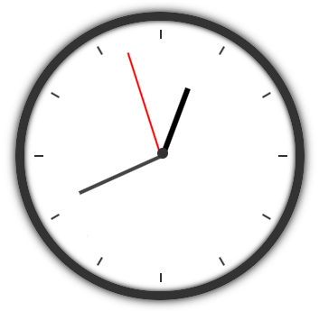

# Reloj con animaciones

### Estructura General

**Objetivo:**  
Crear un reloj analógico funcional y animado utilizando únicamente HTML y CSS3 (sin JavaScript).

**Estructura básica del reloj:**  
- Una esfera de reloj circular.
- Tres agujas (horas, minutos, segundos) con diferentes longitudes y grosores, que deben girar desde el centro exacto de la esfera.

**Instrucciones:**

**1. Animaciones y estilos de las agujas:** *(2 puntos)*  
- **Aguja de los segundos:**  
  - Debe dar una vuelta completa (360°) cada 60 segundos, de manera suave y continua.
  - Longitud: 120px.
  - Ancho: 2px.
  - Color: rojo (#f00).
- **Aguja de los minutos:**  
  - Debe moverse gradualmente cada minuto (6° por minuto).
  - Longitud: 100px.
  - Ancho: 4px.
  - Color: gris (#444).
- **Aguja de las horas:**  
  - Debe moverse 30° por hora.
  - Longitud: 70px.
  - Ancho: 6px.
  - Color: negro (#000).

**2. Diseño de la esfera del reloj:** *(1,5 puntos)*  
- **Esfera circular.**
- **Punto central de color gris (#333).**
- **Marcas horarias:** líneas o números en la esfera del reloj.
- **Efecto de profundidad:** sombra y gradiente.

---

