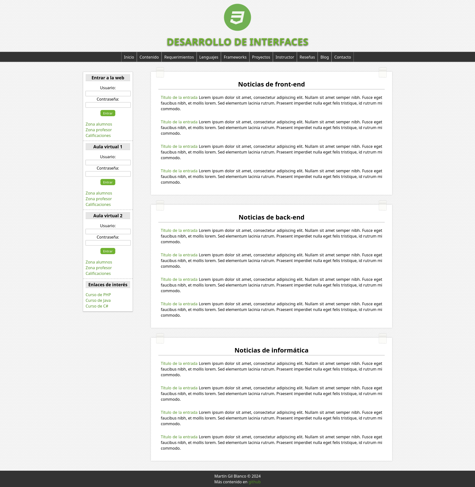
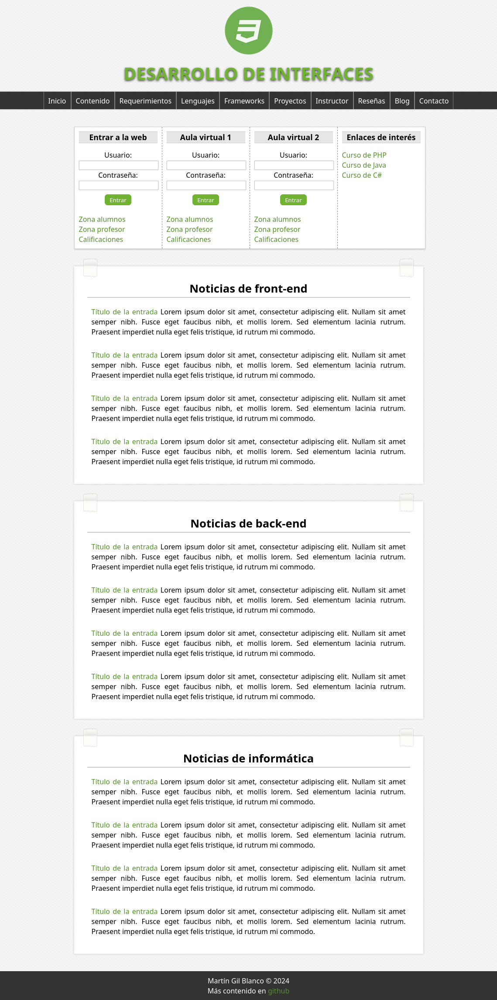

# Maquetación web con Flexbox

Utilizando Flexbox y medidas relativas para los tamaños, recrea el diseño mostrado en la imagen de referencia. Configura la maquetación para ser responsive y adaptarse a tres tamaños de pantalla: 1024px, 768px y 480px, garantizando una visualización óptima en cada resolución.

---

---

---

---