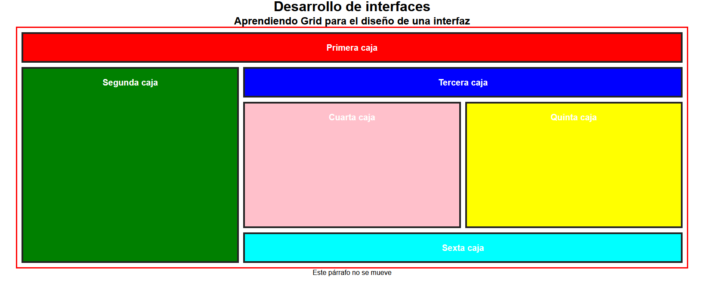

# Práctica CSS Grid: Maquetación de un Layout Complejo

## Objetivo

Aplicar conocimientos de **CSS Grid** para maquetar un layout complejo, asignando posiciones y tamaños específicos a cada elemento del grid, utilizando las propiedades `grid-template-columns`, `grid-template-rows`, `grid-gap`, y las propiedades individuales de grid para cada caja.

---

## Enunciado

1. **Estructura HTML**  
   Utiliza la estructura proporcionada, donde el grid solo afecta al contenedor `.layout` que contiene seis cajas de colores diferentes.

2. **Configuración del Grid**

   - El contenedor `.layout` debe tener un **ancho del 60%** y estar **centrado horizontalmente**.
   - Aplica un **display: grid** al contenedor.
   - Define la **rejilla de columnas** con la propiedad `grid-template-columns` para que existan **tres columnas de igual tamaño**.
   - Define la **rejilla de filas** con la propiedad `grid-template-rows` para que existan **cinco filas**, donde las dos primeras y las dos últimas tengan el mismo tamaño, y la fila central sea el triple de alta.
   - Añade un **espacio de 10 píxeles** entre filas y columnas con la propiedad `grid-gap`.
   - Añade un **borde rojo de 3 píxeles** al contenedor `.layout`.

3. **Estilizado de las Cajas**

   - Todas las cajas deben tener:
     - **Fuente en negrita** y tamaño de **20 píxeles**.
     - **Color de texto blanco**.
     - **Relleno de 20 píxeles**.
     - **Borde de 4 píxeles** color #222.

4. **Posicionamiento y color de las cajas en el grid**  
   Utiliza las propiedades `grid-column` y `grid-row` para posicionar cada caja según las siguientes especificaciones:

   - **Primera caja (roja):**
     - Debe ocupar **toda la primera fila** (de la columna 1 a la 3).
     - Fondo rojo.
   - **Segunda caja (verde):**
     - Debe ocupar **todas las filas** de la **segunda columna** (de la fila 2 a la 6).
     - Fondo verde.
   - **Tercera caja (azul):**
     - Debe ocupar las **columnas 2 y 3** de la **segunda fila**.
     - Fondo azul.
   - **Cuarta caja (rosa):**
     - Debe ocupar la **columna 2** y las **filas 3 y 4**.
     - Fondo rosa.
   - **Quinta caja (amarilla):**
     - Debe ocupar la **columna 3** y las **filas 3 y 4**.
     - Fondo amarillo.
   - **Sexta caja (cian):**
     - Debe ocupar las **columnas 2 y 3** de la **última fila**.
     - Fondo cian (`#00ffff`).

5. **Otros estilos**

   - El texto fuera del grid (`Este párrafo no se mueve`) no debe verse afectado por la maquetación del grid.

---

## Resultado esperado

El resultado debe ser un layout donde las cajas se distribuyen en el grid según lo especificado, cada una con su color y posición correspondiente, y el contenedor `.layout` centrado y con su borde rojo. El resto de la página debe mantenerse centrado y sin estilos adicionales.

---

### Vista previa del diseño

