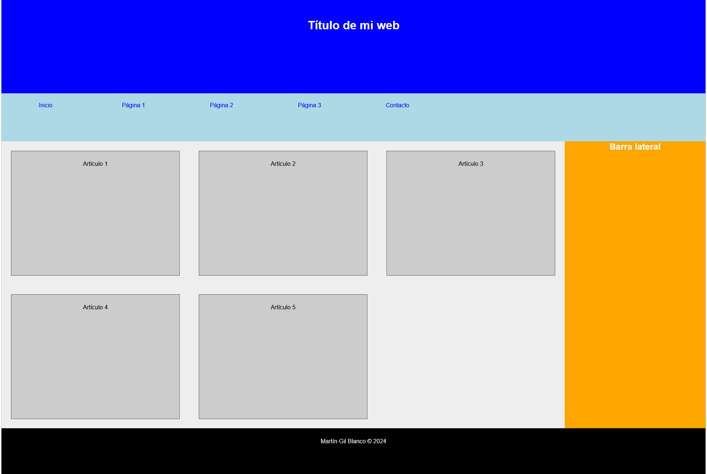

# Práctica CSS Grid: Maquetación de Sitio Web Completo

## Objetivo  
Maquetar una estructura web completa utilizando **CSS Grid** para organizar elementos en 2D, aplicando subgrids y posicionamiento preciso de componentes.

---

## Enunciado

### 1. Configuración del Grid Principal
   - El contenedor `#website` debe:
     - Usar **display: grid**
     - Tener un **ancho del 75%** centrado horizontalmente
     - Crear 5 columnas iguales con `grid-template-columns: repeat(5, 1fr)`
     - Definir 4 filas con alturas: **20% | 10% | 60% | 10%**
     - Mostrar un **borde gris claro** de 1px (`#ccc`)

### 2. Posicionamiento de Secciones Principales
   - **Cabecera (`#cabecera`)**:
     - Ocupar **todas las columnas** (de 1 a 6)
     - Color de fondo: **azul**  
     - Altura de línea: **150px**
   
   - **Menú (`#menu`)**:
     - Ocupar **todas las columnas** debajo de la cabecera
     - Color de fondo: **celeste claro**  
     - Altura de línea: **65px**
     - Contener un menú horizontal con **8 columnas iguales** usando subgrid

   - **Contenido Principal (`#contenido`)**:
     - Ocupar **4 columnas** (1 a 5)
     - Usar subgrid con **3 columnas iguales**
     - Cada artículo debe tener:
       - Margen del **5%**
       - Relleno del **5%**
       - Borde gris oscuro de **1px**

   - **Barra Lateral (`#lateral`)**:
     - Ocupar la **columna 5**
     - Color de fondo: **naranja**

   - **Pie de Página (`#pie-pagina`)**:
     - Ocupar **todas las columnas**
     - Color de fondo: **negro**
     - Altura de línea: **70px**

### 3. Estilos Generales
   - **Reset básico**:
     - Eliminar márgenes/paddings predeterminados
     - Quitar estilos de lista y decoración de enlaces
     - Fuente: **sans-serif**
   
   - **Artículos**:
     - Fondo: **gris medio** (`#ccc`)
     - Borde: **1px gris oscuro** (`#555`)

   - **Textos**:
     - Todos los textos centrados
     - Cabecera y pie: **texto blanco**
     - Barra lateral: **texto blanco**

### 4. Requisitos de Subgrids
   - En `#menu ul`:
     - Usar grid con **8 columnas iguales**
     - Elementos de lista deben distribuirse automáticamente

   - En `#contenido`:
     - Crear grid de **3 columnas** dentro de la sección
     - Los artículos deben adaptarse al espacio disponible

---

### Vista previa del diseño

