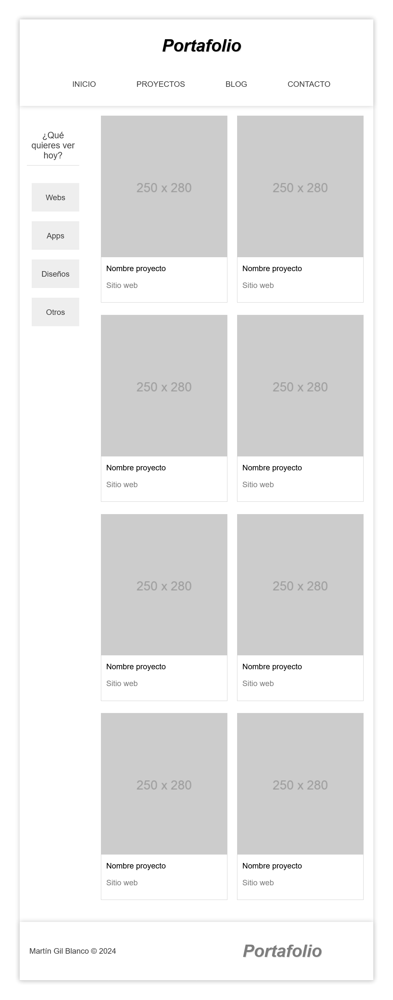

# Práctica CSS Grid: Portafolio Responsive con Grid Anidados

## Objetivo  
Convertir un layout inicialmente diseñado con Flexbox a **CSS Grid**, implementando un sistema de rejilla complejo con grids anidados y diseño responsive mediante media queries.

---

## Enunciado

### 1. Configuración General del Contenedor Principal
   - `#container` debe:
     - Tener un **ancho del 90%** centrado
     - Mostrar **sombra exterior** (`box-shadow: 0px 0px 10px #ccc`)
     - Mantener un **alto mínimo de 700px**

### 2. Cabecera (Header)
   - Usar **grid de 2 columnas** (68% | 30%) en desktop
   - Alinear verticalmente el logo y el menú con `align-items: center`
   - Menú de navegación (`#menu ul`):
     - Convertir en grid de **4 columnas iguales**
     - Elementos de lista centrados verticalmente

### 3. Sección de Contenido Principal
   - `#content` debe:
     - Crear grid de **2 columnas** (20% | 1fr)
     - Espacio entre columnas: **25px**
     - Alinear elementos al inicio con `align-items: start`
   
   - **Barra Lateral (`aside`)**:
     - Mantener margen derecho de **30px** en desktop
     - Enlaces con efecto hover inverso (fondo/texto)

### 4. Grid de Proyectos
   - `#projects` debe:
     - Usar grid **responsive** con `grid-template-columns: repeat(auto-fill, 250px)`
     - Espacio entre elementos: **20px**
     - Cada proyecto (`article.project`):
       - Borde gris claro de **1px**
       - Margen inferior de **25px**
       - Imágenes al **100% del contenedor**

### 5. Footer
   - Grid de **2 columnas** (80% | 20%)
   - Logo alineado a la izquierda en desktop
   - Texto de copyright con color **44

### 6. Diseño Responsive
Implementar los siguientes breakpoints:

- **Pantallas ≤ 1500px**:
  - Cabecera: columnas **1:1**
  
- **Pantallas ≤ 784px**:
  - Cabecera: **columna única**
  - Contenido: **columna única**
  - Proyectos: **1 columna**
  - Footer: **columna única** con elementos centrados

### 7. Efectos Visuales
   - **Transiciones suaves** (300ms) en:
     - Enlaces del menú (hover: fondo gris/texto blanco)
     - Enlaces de proyectos (hover: color verde)
     - Botones de la barra lateral (hover: fondo oscuro)
   - **Sombras** en:
     - Cabecera, footer y contenedor principal
   - **Estilos tipográficos**:
     - Logo con fuente Helvetica italic 900
     - Títulos en barra lateral con peso fino (100)

---

## Resultado Esperado

**Desktop:**
- Header dividido en 2 columnas con menú de 4 ítems
- Layout principal con barra lateral izquierda y grid de proyectos responsive
- Footer con dos columnas alineadas

**Mobile:**
- Todos los elementos en columna única
- Proyectos apilados verticalmente
- Textos y logos centrados

---

### Vista previa del diseño

