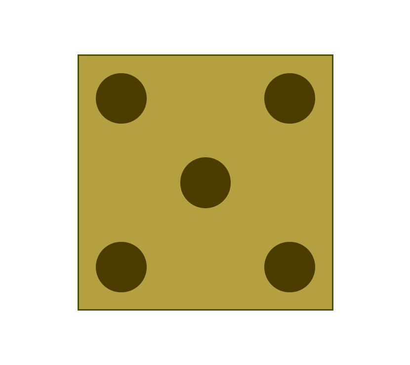

# Práctica CSS Grid: Simulación de Cara de Dado

## Objetivo  
Crear una representación visual de la cara del 5 de un dado usando **CSS Grid**, manteniendo el HTML proporcionado sin modificaciones y aplicando únicamente estilos mediante unidades de medida relativas.

---

## Enunciado

### 1. Configuración del Contenedor Principal
- **`.caixa`** debe:
  - Usar **CSS Grid** con una cuadrícula de **3x3 celdas**.
  - Tener dimensiones relativas (**ancho y alto proporcionales**).
  - Mostrar **borde visible** (color y grosor a elección).
  - Incluir **sombra exterior** para efecto de profundidad.

### 2. Posicionamiento de Círculos
- Los **5 círculos** deben ubicarse en:
  - Las **cuatro esquinas** de la cuadrícula.
  - El **centro exacto** del contenedor.
- Usar **`grid-column` y `grid-row`** o **`grid-template-areas`** para el posicionamiento.
- Cada círculo debe:
  - Ser **perfectamente redondo** (usar `border-radius`).
  - Tener tamaño proporcional al contenedor (unidades relativas como `vw`).
  - Mostrar **alineación centrada** en su celda.

### 3. Requisitos Técnicos
- **Prohibido** modificar el HTML proporcionado.
- **Obligatorio** usar:
  - **Unidades relativas** para todos los tamaños (ej: `vw`, `%`).
  - **CSS Grid** para el layout (no Flexbox).
- Opcional:
  - Elección libre de colores para fondo y bordes.
  - Efectos visuales adicionales (sombras, transiciones).

---

## Resultado Esperado

**Visualización en navegador:**
- Contenedor cuadrado con borde visible.
- Cinco puntos circulares distribuidos simétricamente en forma de "X".
- Diseño responsivo que se adapta al tamaño de la ventana.
  
--- 

