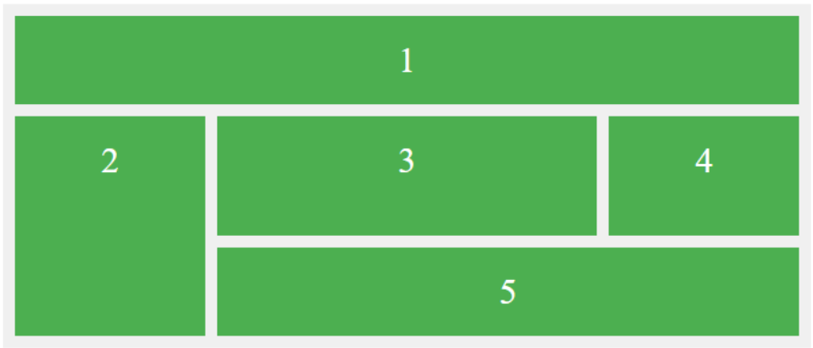

# Práctica CSS Grid: Preguntas sobre Grid

Dado el siguiente fragmento de código HTML y CSS, tu tarea es analizar cómo se distribuirán los elementos en una cuadrícula (grid) CSS y describir cómo se verá el resultado en el navegador. Para ello, deberás responder a las preguntas que se muestran a continuación.

```html
<!DOCTYPE html>
<html lang="es">
<head>
    <meta charset="UTF-8">
    <meta name="viewport" content="width=device-width, initial-scale=1.0">
    <title>Ejercicio Grid Avanzado</title>
    <link rel="stylesheet" type=”text/css” src="style.css">
</head>
<body>
    <div class="grid-container">
        <div class="grid-item item1">1</div>
        <div class="grid-item item2">2</div>
        <div class="grid-item item3">3</div>
        <div class="grid-item item4">4</div>
        <div class="grid-item item5">5</div>
    </div>
</body>
</html>
```

```css
.grid-container {
    display: grid;
    grid-template-columns: 1fr 2fr 1fr;
    grid-template-rows: auto 100px auto;
    gap: 10px;
    padding: 10px;
    background-color: #f0f0f0;
}
.grid-item {
    background-color: #4CAF50;
    color: white;
    text-align: center;
    padding: 20px;
    font-size: 30px;
}
.item1 {
    grid-column: 1 / 4;
    grid-row: 1;
}
.item2 {
    grid-column: 1 / 2;
    grid-row: 2 / 4;
}
.item3 {
    grid-column: 2 / 3;
    grid-row: 2;
}
.item4 {
    grid-column: 3 / 4;
    grid-row: 2 / 3;
}
.item5 {
    grid-column: 2 / 4;
    grid-row: 3;
}
```

### Preguntas
- ¿Cuántas columnas y filas tiene la cuadrícula?
La cuadrícula tiene 3 columnas y 3 filas (propiedades de CSS: grid-template-columns y grid-template-rows)

- ¿Qué tamaño tienen las columnas y filas?
  - La primera y la tercera columna ocupan una fracción del espacio disponible (1fr). (propiedad de CSS: grid-template-columns).
  - La segunda columna ocupa dos fracciones del espacio disponible (2fr). (propiedad de CSS: grid-template-columns). 
  - La primera y la tercera fila tienen un tamaño automático (auto), es decir, se ajustarán según el contenido. (propiedad de CSS: grid-template-rows).
  - La segunda fila tiene un tamaño fijo de 100px. (propiedad de CSS: grid-template-rows)

- ¿Cómo se posicionarán y qué tamaño tendrán los elementos dentro de la cuadrícula?
  - *Elemento 1 (item1)*:
    Ocupa la primera fila y se extiende a lo largo de las tres columnas (grid-column: 1 / 4).
    Se ubica en la primera fila (grid-row: 1).
  - *Elemento 2 (item2)*:
    Ocupa la primera columna de la segunda y tercera fila (grid-column: 1 / 2 y grid-row: 2 / 4).
  - *Elemento 3 (item3)*:
    Ocupa la segunda columna de la segunda fila (grid-column: 2 / 3 y grid-row: 2).
  - *Elemento 4 (item4)*:
    Ocupa la tercera columna de la segunda fila (grid-column: 3 / 4 y grid-row: 2 / 3).
  - *Elemento 5 (item5)*:
    Ocupa la segunda y tercera columna de la tercera fila (grid-column: 2 / 4 y grid-row: 3).

- ¿Cuál será el espacio entre los elementos?
    Hay un espacio (propiedad gap) de 10px entre las columnas y las filas de la cuadrícula.

- ¿Cómo se visualizará la página? Dibuja un esquema.
  - *Primera fila (Elemento 1)*: Este elemento se extiende a lo largo de las tres columnas, ocupando toda la fila superior.
  - *Segunda fila*:  
    - Primera columna (Elemento 2): Este elemento ocupa la primera columna de la segunda y tercera fila.  
    - Segunda columna (Elemento 3): Este elemento ocupa la segunda columna de la segunda fila.  
    - Tercera columna (Elemento 4): Este elemento ocupa la tercera columna de la segunda fila.
  - *Tercera fila*:  
    - Segunda y tercera columna (Elemento 5): Este elemento ocupa la segunda y tercera columna de la tercera fila.

