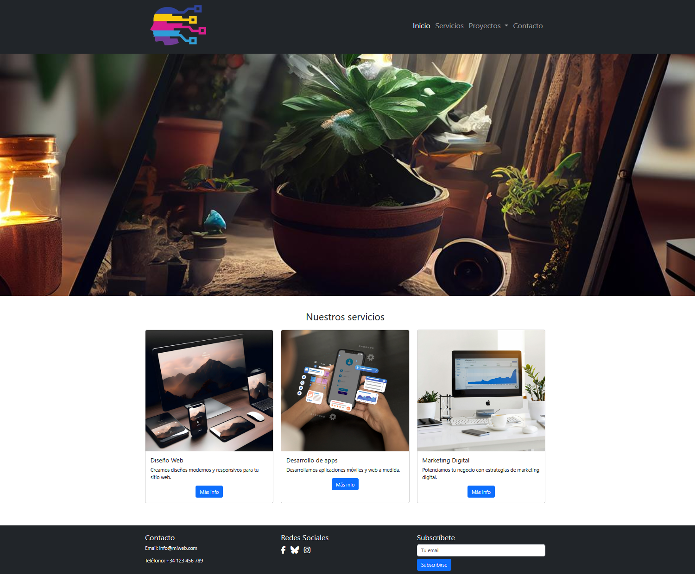
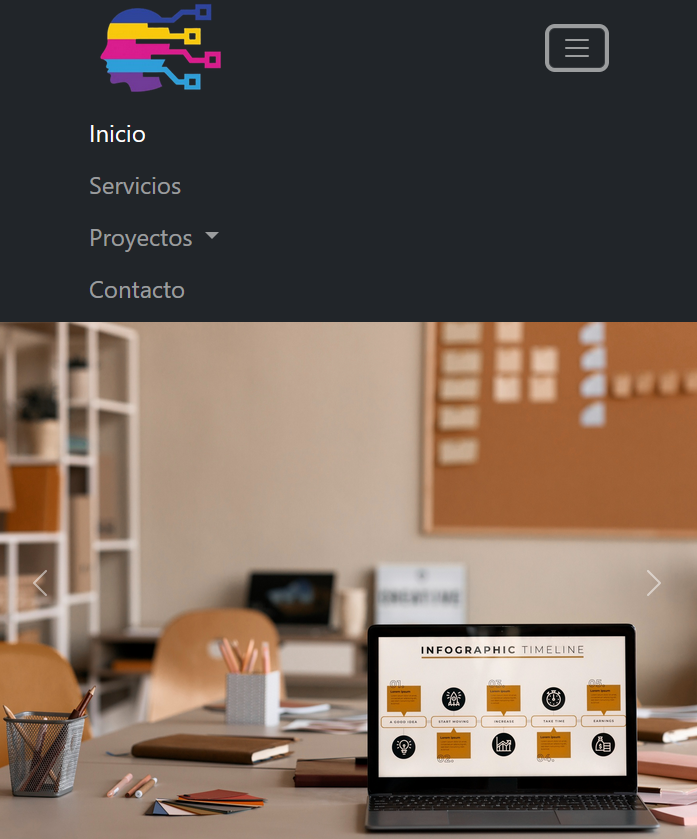

# Creación de un sitio web utilizando Bootstrap

## Objetivo  
Aplicar conocimientos de **Bootstrap 5** para crear una página web responsiva que integre componentes clave y personalización mediante CSS.

---

## Enunciado

1. **Estructura básica**  
   Crea un archivo HTML desde cero con la estructura básica (``, ``, ``).

2. **Cabecera con menú**  
   - Implementa una barra de navegación (`navbar`) con:
     - Logo enlazado a la página principal.
     - Menú que incluya un desplegable (dropdown) para "Proyectos".
     - Botón colapsable para móviles (hamburguesa).

3. **Carrusel de imágenes**  
   - Añade un carrusel (`carousel`) en la sección principal con:
    - Mínimo 3 imágenes (propias o libres de derechos).
    - Controles de navegación (anterior/siguiente).

4. **Sección de servicios**  
   - Crea 3 tarjetas (`cards`) que muestren servicios, cada una con:
     - Título.
     - Descripción breve.
     - Botón que abra un modal con detalles del servicio.

5. **Pie de página**  
   - Incluye:
     - Información de contacto (dirección, teléfono).
     - Iconos de redes sociales enlazados.
     - Formulario de suscripción con campo de email y botón "Suscribirse".

6. **Personalización CSS**  
   - Crea un archivo `styles.css` para:
     - Modificar colores, tamaños y márgenes de componentes de Bootstrap.
     - Añadir efectos hover en tarjetas y botones.
     - Asegurar que se cargue después del CSS de Bootstrap (usa `` en el `` en este orden: Bootstrap primero, tu CSS después).

---

## Resultado esperado  
Una página web funcional y responsiva donde:  
- El menú se colapsa correctamente en móviles.  
- El carrusel muestra imágenes sin distorsión.  
- Las tarjetas se reorganizan en columnas en pantallas pequeñas.  
- Los modales se activan al hacer clic en los botones.  
- Los estilos personalizados sobrescriben los predeterminados de Bootstrap donde sea necesario.

---

### Vista previa del diseño  

