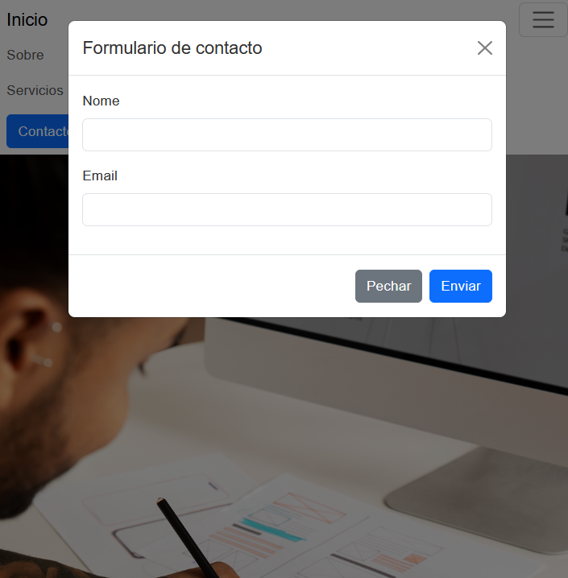
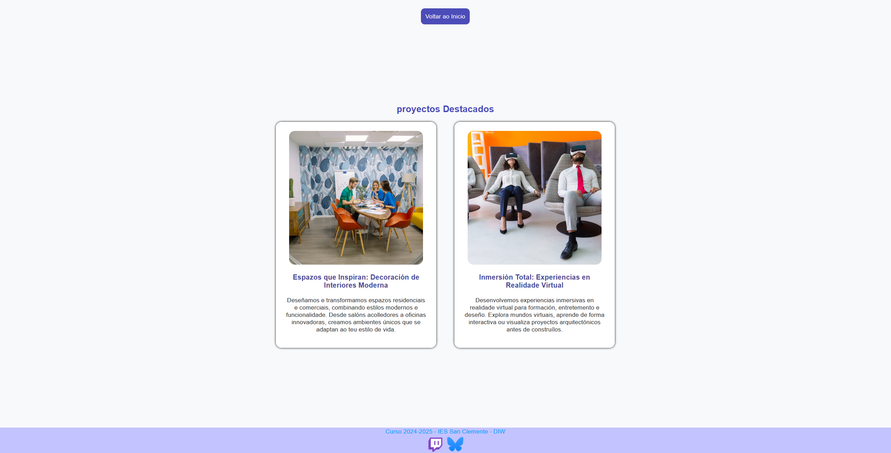

# Práctica Bootstrap 5 y CSS Personalizado: Maquetación de Páginas Web

## Objetivo  
Aplicar conocimientos de **Bootstrap 5** y **CSS personalizado** para crear una página principal responsiva y maquetar una página de proyectos usando Flexbox y media queries, siguiendo especificaciones técnicas detalladas.

---

## Enunciado

### 1. **Página Principal (`indice.html`)**  
   - **Estructura básica**:  
     - Usa el archivo `indice_incompleto.html` proporcionado y renómbralo a `indice.html`.  
     - Incluye Bootstrap 5 **localmente** (directorio `bootstrap-5.3.3-dist`).  
     - Añade las etiquetas `` y `` necesarias en el `` y al final del `` para cargar los archivos locales de Bootstrap.  

   - **Barra de navegación**:  
     - Menú fijo superior con:  
       - Enlaces a "Inicio", "Sobre" y un dropdown para "Servicios" (opciones: "Diseño Web" y "SEO").  
       - Botón hamburguesa para móviles (colapsable).  

   - **Carrusel**:  
     - 3 imágenes con transición de fundido.  
     - Controles "anterior/siguiente".  
     - Estilos adicionales en CSS:  
       ```css  
       .carousel { max-height: 800px; }  
       .carousel-item img { width: 100%; object-fit: cover; }  
       ```

   - **Botones**:  
     - Botón "Ver Proyectos" que enlace a `proxectos.html`.  
     - Botón "Contacto" que abra un modal con formulario (nombre y email).  

   - **Footer**:  
     - Texto: *«2025 IES San Clemente - Proba de 2ª avaliación DIW»*.  
     - Iconos de redes sociales con animación al hover:  
       ```css  
       .footer-icon:hover { transform: scale(1.5); }  
       ```

---

### 2. **Página de Proyectos (`proxectos.html`)**  
   - **Requisitos**:  
     - **No modifiques el HTML proporcionado**.  
     - Usa el archivo `estilos_incompleto.css` y renómbralo a `estilos.css`.  

   - **Maquetación con Flexbox**:  
     - Para pantallas > 768px:  
       ```css  
       .proyecto { flex: 0 1 48%; } /* 2 columnas */  
       ```
     - Para pantallas ≤ 768px:  
       ```css  
       .proyecto { flex: 0 1 100%; } /* 1 columna */  
       ```

   - **Estilos personalizados**:  
     - Botón "Voltar ao Inicio":  
       ```css  
       .btn-voltar {  
           background: #007bff;  
           transition: background 0.3s;  
       }  
       .btn-voltar:hover { background: #0056b3; }  
       ```
     - Imágenes responsivas:  
       ```css  
       .proyecto img { max-width: 100%; height: auto; }  
       ```

---

## Recursos Proporcionados  
- `proxectos.html`: HTML predefinido (no editable).  
- `indice_incompleto.html`: Esqueleto para completar con Bootstrap.  
- `estilos_incompleto.css`: Base para los estilos personalizados.  
- Directorio `img`: Imágenes e iconas.  
- Directorios locales de Bootstrap 5 (`bootstrap-5.3.3-dist`, `bootstrap-offline-docs-5.3`).  

---

## Resultado Esperado  
- **Página Principal**:  
  - Menú colapsable en móviles.  
  - Carrusel funcional con imágenes 16:9.  
  - Modal de contacto y enlace a proyectos.  

- **Página de Proyectos**:  
  - Diseño adaptativo (2 columnas en escritorio, 1 en móvil).  
  - Botón "Voltar" con efecto hover.  
  - Footer estilizado según capturas.  

---

### Vista previa del diseño  


