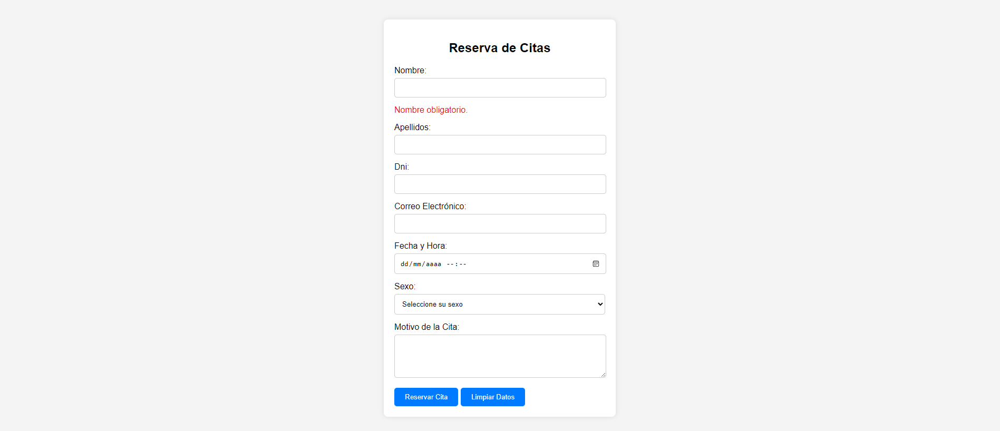

# Enunciado de Tarea: Validación de un Formulario

**Objetivo:**  
El objetivo de esta tarea es implementar y documentar las validaciones de un formulario de reserva de citas, asegurando que los datos ingresados por el usuario cumplan con los requisitos establecidos. El formulario debe manejar de forma adecuada tanto la validación de entradas como la visualización de mensajes de error en la interfaz de usuario.

---

#### **Requisitos del Formulario:**

El formulario tiene los siguientes campos obligatorios:

1. **Nombre**  
   - No debe estar vacío.
   - Debe contener únicamente caracteres alfabéticos.
   - Longitud mínima de 3 caracteres.
   - Longitud máxima de 20 caracteres.

2. **Apellidos**  
   - No debe estar vacío.
   - Debe contener únicamente caracteres alfabéticos.
   - Longitud mínima de 3 caracteres.
   - Longitud máxima de 20 caracteres.

3. **DNI**  
   - No debe estar vacío.
   - Debe cumplir el formato estándar del DNI español: 8 dígitos seguidos de una letra (ejemplo: 12345678A).
   - La letra del DNI debe ser válida según el algoritmo de verificación.

4. **Correo Electrónico**  
   - No debe estar vacío.
   - Debe tener un formato válido (ejemplo: usuario@dominio.com).

5. **Motivo de la Cita**  
   - No debe estar vacío.
   - Debe contener solo caracteres alfanuméricos y algunos símbolos permitidos: `, . ; ()`.
   - Longitud máxima de 255 caracteres.

---

#### **Validaciones a Implementar:**

1. **En el código JavaScript**  
   - Crear funciones específicas para validar cada campo (`validarNombre`, `validarApellido`...).
   - Cada función debe:
     - Verificar que el campo no esté vacío.
     - Aplicar la validación correspondiente (formato, longitud, etc.).
     - Mostrar mensajes de error en tiempo real debajo del campo correspondiente si hay errores.

2. **Mensajes de Error**  
   - Los errores deben mostrarse en un `
` con una clase de estilo específica (`error-message`) y un `id` relacionado con el campo (por ejemplo, `error-nombre`).
   - Los mensajes deben desaparecer cuando el usuario corrija el campo.

3. **Prevención de Envío**  
   - Bloquear el envío del formulario si hay errores.
   - Confirmar el envío de datos válidos con un mensaje de confirmación a la URL de un webhook creado por vosotros, se ofrece como posible ejemplo de webhook: https://webhook.site. Es necesario adjuntar una imagen de la captura de datos correctamente enviados.

4. **Limpieza del Formulario**  
   - Proveer funcionalidad para limpiar los campos y ocultar los mensajes de error con el botón "Limpiar Datos".

---

