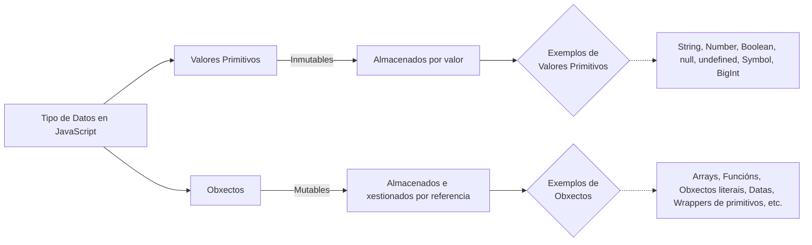

Para a mellor aprendizaxe de JS recoméndase os seguintes recursos:
* [MDM Web Doc: Guía de JavaScript](https://developer.mozilla.org/es/docs/Web/JavaScript/Guide)
* [MDM Web Doc:  JavaScript](https://developer.mozilla.org/es/docs/Learn/JavaScript)
* [W3Schools: Javascript Tutorial](https://www.w3schools.com/js/)
* [Learn JavaScript](https://learnjavascript.online/)
* [El Tutorial de JavaScript Moderno](https://es.javascript.info/)

## 1. Fundamentos de JS
### 1.0 Introducción.
En JavaScript, os tipos de datos primitivos son aqueles que non son obxectos e non teñen métodos. Hai 7 tipos primitivos:

* **Number**: Representa tanto números enteros como flotantes. Exemplos inclúen 42 e 3.14. JavaScript usa un único tipo para todos os números, baseado no estándar IEEE 754 para aritmética de punto flotante.

* **String**: Representa secuencias de caracteres, usadas para texto. Podes definir cadeas de texto usando comiñas simples, dobres, ou acentos graves (template literals), por exemplo, 'ola', "mundo" e `¡Ola mundo!`.

* **Boolean**: Ten dous valores posibles, true (verdadeiro) e false (falso), usados para loxística e condicións.

* **Undefined**: Unha variable á que non se lle asignou un valor ten o valor undefined. Tamén é o valor retornado por funcións que non teñen unha declaración return explícita.

* **Null**: Usado para indicar a ausencia deliberada de calquera valor de obxecto. null é considerado un literal en JavaScript e representa un valor nulo.

* **Symbol**: Introducido en ECMAScript 2015 (ES6), o tipo Symbol permite crear identificadores únicos para *propiedades de obxectos. Cada valor do tipo Symbol é único e inmutable.

* **BigInt**: Tamén introducido en versións máis recentes de ECMAScript, BigInt é un tipo de datos que pode representar números enteiros máis grandes que o límite seguro para o tipo Number (Number.MAX_SAFE_INTEGER).

Estes tipos primitivos son inmutables, o que significa que non podes cambiar o valor dun primitivo unha vez que estea creado. Por exemplo, cando modificas unha cadea, en realidade estás creando unha nova cadea, non modificando a orixinal.


### 1.1 A ter en conta en JS.
#### 1.1.1 O punto e coma 
JS non obriga a que cada instrucción remate en **;** e sobre entende que cada salto de liña é unha nova instrucción. Este comportamento en ocasións é confuso provocando funcionamentos do código pouco esperables. 
```js
// Interprétase de maneira implicita que cada liña é unha instrucción. 
"use strict";
alert('Hola')
alert('Mundo')
```
**Exemplo de dous códigos non equivalente**

**Caso 1: Con ;** 
```js

function obterObxecto() {
  return {
    nome: "Obxecto"
  }; //PUNTO E COMA 
}

```
Realizamos un  console.log e obtemos o obxecto. 
```console.log(obterObxecto()); // ```


**Caso 2**

Os programas de JavaScript escríbense utilizando o conxunto de caracteres Unicode.  ECMAScript 3 require que as implementacións de JavaScript soporten a versión 2.1 de Unicode ou posterior, **e ECMAScript 5 require que as implementacións soporten Unicode 3 ou posterior**.
```js

function obterObxecto() {
  return
  {
    nome: "Obxecto"
  } //FALTA o ; 
}

```

Realizamos un  console.log e obtemos undefined

```console.log(obterObxecto());```   

#### 1.1.2 Conxunto de carácteres 
Os programas de JavaScript escríbense utilizando o conxunto de caracteres Unicode. Unicode é un superconxunto de ASCII e Latin-1 e soporta practicamente todas as linguas escritas que se usan actualmente no planeta.  **ECMAScript 5 require que as implementacións soporten Unicode 3 ou posterior**. 


#### 1.1.3 Sensibilidade a Maiúsculas e Minúsculas
JavaScript é unha linguaxe sensible a maiúsculas e minúsculas. Isto significa que as palabras clave da linguaxe, variables, nomes de funcións e outros identificadores sempre deben escribirse cunha capitalización consistente das letras.

Por **exemplo**, a palabra clave "while" debe escribirse "while", non "While" nin "WHILE". De forma similar, 1.1.online, Online, OnLine e ONLINE son catro nomes de variables distintos.

#### 1.1.4 Comentarios
JavaScript soporta dous estilos de comentarios. 
* Calquera texto entre un **//** e o final dunha liña trátase como un comentario e é ignorado por JavaScript. 
* Calquera texto entre os caracteres **/* e /** tamén se trata como un comentario; estes comentarios poden abranguer múltiples liñas pero non poden anidarse. 

As seguintes liñas de código son todos comentarios  de JavaScript:
```js
 
// Isto é un comentario de unha soa liña.
/ Isto tamén é un comentario / // e aquí hai outro comentario.
/*
Este é outro comentario máis.
Ten múltiples liñas.
*/

```

#### 1.1.5 Literais
Un literal é un valor de datos que aparece directamente nun programa. Os seguintes son todos literais:
```js

12            // O número doce
1.2           // O número un punto dous
"ola mundo"   // Unha cadea de texto
'Ola'         // Outra cadea
verdadeiro    // Un valor booleano
falso         // O outro valor booleano
/javascript/gi // Un literal "expresión regular" (para a correspondencia de patróns)
null           // Ausencia dun obxecto
{ x:1, y:2 }   // Un inicializador de obxecto
[1,2,3,4,5]    // Un inicializador de matriz
 
```


#### 1.1.5 Palabras reservadas 
JavaScript reserva un número de identificadores como palabras clave do propio linguaxe.

| Categoría                        | Palabras Reservadas                                                                                                                                                                                                         |
| -------------------------------- | --------------------------------------------------------------------------------------------------------------------------------------------------------------------------------------------------------------------------- |
| Estruturas de Control            | break, continue, do, if, else, for, switch, case, try, catch, finally, return, while, with                                                                                                                                  |
| Declaracións e Variables         | var, let, const                                                                                                                                                                                                             |
| Funcións e Ámbito de Execución   | function, return, void, new, this                                                                                                                                                                                           |
| Manipulación de Obxectos e Tipos | delete, in, typeof, instanceof                                                                                                                                                                                              |
| Valores Primitivos e Tipos       | true, false, null, Infinity, NaN, undefined                                                                                                                                                                                 |
| Estruturas de Datos              | Array, Boolean, Date, Error, JSON, Math, Number, Object, RegExp, String, Function                                                                                                                                           |
| Traballo con Código              | class, extends, super, import, export, implements, interface, package, protected, static, private, public, yield                                                                                                            |
| Xestión de Erros                 | try, catch, finally, throw, EvalError, RangeError, ReferenceError, SyntaxError, TypeError, URIError                                                                                                                         |
| Funcións e Métodos Globais       | decodeURI, decodeURIComponent, encodeURI, encodeURIComponent, isFinite, isNaN, parseFloat, parseInt, eval                                                                                                                   |
| Palabras Reservadas Especiais    | enum                                                                                                                                                                                                                        |
| Compatibilidade e Futuro         | abstract, double, goto, native, static, boolean, enum, implements, package, synchronized, char, extends, int, protected, throws, class, final, interface, public, transient, const, float, long, short, volatile, arguments |


ECMAScript 3 reservou todas as palabras clave do idioma Java, e aínda que isto foi relaxado nas seguintes versións. 


### 1.2 Números.
Ao contrario de moitos idiomas, JavaScript **non fai distinción entre valores enteiros e valores de punto flotante**. Todos os números en JavaScript están representados como valores de punto flotante. JavaScript representa os números usando o formato de punto flotante de 64 bits definido polo estándar IEEE 754, o que significa que pode representar números tan grandes como ±1.7976931348623157 × 10^308 e tan pequenos como ±5 × 10^−324.
```js
let x=1
typeof(x) //Number
let y=1.1
typeof(y) //Number
let z=0xA
typeof(z)
console.log(z)
```
En JavaScript, os números enteiros base-10 escríbense como secuencias de díxitos, mentres que os valores **hexadecimais** inícianse con **"0x"** ou "0X" e en binario inicianse con **0b**. Exemplos como operarn os números en JS.
```js
255; 
255.0; // é o mesmo numero que o anterior?Si
255 === 255.0; // true
255 === 0xff; // true (hexadecimal)
255 === 0b11111111; // true (binary)
255 === 0.255e3; // true (decimal exponential notation)
```

#### Advertencia con OCTAL 
Aínda que o estándar ECMAScript non soporta literais octais (base-8), algúns intérpretes de JavaScript aínda os permiten, empezando estes literais con un 0 seguido de díxitos entre 0 e 7. Non obstante, **o uso de literais octais pode levar a inconsistencias entre diferentes implementacións**, e están explicitamente **prohibidos** no modo estrito de **ECMAScript 5** para evitar confusións entre a interpretación octal e decimal.


#### Literais en punto flotante
Os literais de punto flotante en JavaScript poden incluír un **punto decimal** para representar números reais e tamén poden usar a **notación exponencial**, combinando díxitos con 'e' ou 'E' seguido dun expoñente, para representar números moi grandes ou moi pequenos multiplicándoos por 10 á potencia dese expoñente.
```js
// Literal de punto flotante con parte enteira e fraccional
var numero1 = 3.14;

// Literal de punto flotante só con parte fraccional (precedido por punto decimal)
var numero2 = .333333333333333333;

// Uso da notación exponencial para representar números grandes
var numeroGrande = 6.02e23; // Equivale a 6.02 × 10^23

// Uso da notación exponencial para representar números moi pequenos
var numeroPequeno = 1.4738223E-32; // Equivale a 1.4738223 × 10^−32

```
#### Aritmética 
JS soporta  os operadores aritméticos básicos e tamén outros máis complexas por medio dun conxunto de cfuncións e constantes definidas como propiedades do obxecto Math:
```js
Math.pow(2,53); // => 9007199254740992: 2 á potencia de 53
Math.round(.6); // => 1.0: redondear ao enteiro máis próximo
Math.ceil(.6); // => 1.0: redondear cara arriba a un enteiro
Math.floor(.6); // => 0.0: redondear cara abaixo a un enteiro
Math.abs(-5); // => 5: valor absoluto
Math.max(x,y,z); // Devolve o argumento máis grande
Math.min(x,y,z); // Devolve o argumento máis pequeno
Math.random(); // Número pseudoaleatorio x onde 0 <= x < 1.0
Math.PI; // π: circunferencia dun círculo / diámetro
Math.E; // e: A base do logaritmo natural
Math.sqrt(3); // A raíz cadrada de 3
Math.pow(3, 1/3); // A raíz cúbica de 3
Math.sin(0); // Trigonometría: tamén Math.cos, Math.atan, etc.
Math.log(10); // Logaritmo natural de 10
Math.log(100)/Math.LN10; // Logaritmo base 10 de 100
Math.log(512)/Math.LN2; // Logaritmo base 2 de 512
Math.exp(3); // Math.E elevado ao cubo

```

#### Desbordamento
En JavaScript **as operacións aritméticas non lanzan erros** en caso de desbordamento, subdesbordamento ou división por cero. Cando o resultado dunha operación numérica é maior que o maior número representable (desbordamento), o resultado é unha infinito especial, que JavaScript mostra como **Infinity**. Do mesmo xeito, cando un valor negativo se fai maior que o maior número negativo representable, o resultado é **-Infinity**. Os valores infinitos comportanse como se esperaría: sumalos, restalos, multiplicalos ou dividelos por calquera cousa dá como resultado un valor infinito (posiblemente co signo invertido).

A división por cero non é un erro en JavaScript: simplemente devolve infinito ou menos infinito. Hai unha excepción, porén: **cero dividido por cero non ten un valor ben definido**, e o resultado desta operación é o valor especial de non é un número, representado como **NaN**. NaN tamén ocorre se intenta dividir infinito por infinito, ou se calcula a raíz cadrada dun número negativo ou se utilizan operadores aritméticos con operandos non numéricos que non se poden converter a números.

```js
// Desbordamiento
let overflow = Math.pow(2, 1024); // Overflow: demasiado grande para representar
console.log(overflow); // Infinity

// Subdesbordamiento
let underflow = 1e-1000; // Subdesbordamiento: demasiado pequeno para representar
console.log(underflow); // 0

// División por cero
let division = 10 / 0; // División por cero: devolve infinito
console.log(division); // Infinity

let divisionZero = 0 / 0; // División cero por cero: resultado non definido
console.log(divisionZero); // NaN

// Valor negativo cero
let negativeZero = -0;
console.log(negativeZero === 0); // true

// Operacións non numéricas
let operacionNaN = Math.sqrt(-1); // Raíz cadrada de un número negativo
console.log(operacionNaN); // NaN

let operacionNaN2 = Math.sqrt("string"); // Operación coa cadea non numérica
console.log(operacionNaN2); // NaN

```

#### Erros de Arredondamento en punto flotante
O formato de punto flotante IEEE-754 usado por JavaScript non aporta precisión nas operacións. Un exemplo onde se pode observar esta situación é a seguinte:
```js
var x = .3 - .2; // trinta céntimos menos vinte céntimos
var y = .2 - .1; // vinte céntimos menos dez céntimos
x == y // => false: os dous valores non son o mesmo!
x == .1 // => false: .3-.2 non é igual a .1
y == .1 // => true: .2-.1 é igual a .1
```


[Podes ampliar máis información nesta ligazón](https://marquesfernandes.com/es/tecnologia-es/by-what-the-javascript-and-bad-in-mathmatic/)


#### Métodos máis populares de Number

| Método           | Descrición                                                                                   |
|------------------|----------------------------------------------------------------------------------------------|
| `toString()`     | Converte un número a unha cadea de texto.                                                    |
| `toFixed()`      | Devolve unha cadea que representa o número cun número fixo de decimais.                      |
| `toPrecision()`  | Devolve unha cadea que representa o número cunha lonxitude específica.                        |
| `toExponential()`| Devolve unha cadea que representa o número en notación exponencial.                           |
| `parseInt()`     | Converte unha cadea nun número enteiro.                                                      |
| `parseFloat()`   | Converte unha cadea nun número de punto flotante.                                             |
| `isNaN()`        | Determina se un valor é NaN (Non é un número).                                                |
| `isInteger()`    | Determina se un número é un enteiro.                                                          |
| `isFinite()`     | Determina se un número é un valor finito.                                                     |
| `valueOf()`      | Devolve o valor primitivo do obxecto Number.                                                   |

Exemplo de código cos métodos:

```js
// Definimos un número
var numero = 123.456;

// Usamos o método toString() para converter o número nunha cadea de texto
var numeroComoCadea = numero.toString();
console.log("Número como cadea:", numeroComoCadea);

// Usamos o método toFixed() para obter o número con dous decimais
var numeroFixo = numero.toFixed(2);
console.log("Número con dous decimais:", numeroFixo);

// Usamos o método toExponential() para obter o número en notación exponencial
var numeroExponencial = numero.toExponential();
console.log("Número en notación exponencial:", numeroExponencial);

// Usamos o método parseInt() para converter unha cadea nun número enteiro
var cadeaEnteira = "456";
var numeroEnteiro = parseInt(cadeaEnteira);
console.log("Cadea convertida en enteiro:", numeroEnteiro);

// Usamos o método parseFloat() para converter unha cadea nun número de punto flotante
var cadeaFlotante = "789.123";
var numeroFlotante = parseFloat(cadeaFlotante);
console.log("Cadea convertida en punto flotante:", numeroFlotante);

// Usamos o método isNaN() para comprobar se un valor é NaN (Non é un número)
var nonENumero = isNaN("abc");
console.log("O valor é NaN:", nonENumero);

// Usamos o método isFinite() para comprobar se un valor é finito
var valorFinito = isFinite(123);
console.log("O valor é finito:", valorFinito);

// Usamos o método valueOf() para obter o valor primitivo do obxecto Number
var valorPrimitivo = numero.valueOf();
console.log("Valor primitivo do obxecto Number:", valorPrimitivo);


```
#### parseInt()
Converte unha cadea a  un entero da base especificada. A sintaxe sería:
```js
  parseInt(string, base);

```
Exemplos de uso: 
```js
parseInt("F", 16);
parseInt("17", 8);
parseInt("15", 10);
parseInt(15.99, 10);
parseInt("FXX123", 16);
parseInt("1111", 2);
parseInt("15*3", 10);
parseInt("12", 13);

```

#### parseFloat()
A función parseFloat()analiza un argumento e devolve un número de coma flotante.A sintaxe sería:
```js
parseFloat(string);
```
Os seguintes exemplos devolven sempre 3.14 .

```js
parseFloat(3.14);
parseFloat("3.14");
parseFloat("  3.14  ");
parseFloat("314e-2");
parseFloat("0.0314E+2");
parseFloat("3.14some non-digit characters");
parseFloat({
  toString: function () {
    return "3.14";
  },
});
```
Cando a conversión non é posible retorna **NaN**  .

```js
parseFloat("FF2");

```

#### toFixed()
O método toFixed()formatea un número usando notación de punto fixo. A súa sintaxe: 
```js
numObj.toFixed([digitos])

```
Exemplos de uso:
```js
var numObj = 12345.6789;

numObj.toFixed(); // Returns '12346': note rounding, no fractional part
numObj.toFixed(1); // Returns '12345.7': note rounding
numObj.toFixed(6); // Returns '12345.678900': note added zeros
(1.23e20).toFixed(2); // Returns '123000000000000000000.00'
(1.23e-10).toFixed(2); // Returns '0.00'
(2.34).toFixed(1); // Returns '2.3'
(2.35).toFixed(1); // Returns '2.4'. Note that it rounds up in this case.
-(2.34).toFixed(1); // Returns -2.3 (due to operator precedence, negative number literals don't return a string...)
(-2.34).toFixed(1); // Returns '-2.3' (...unless you use parentheses)

```


### 1.3 Date & Time

JavaScript proporciona o construtor **Date()** para xerar obxectos que representan momentos específicos no tempo, que dispoñen de métodos para facilitar operacións básicas con datas. O obxecto Date contén un Number que representa os milisegundos transcorridos desde o 1 de xaneiro de 1970 UTC.


```js
var then = new Date(2010, 0, 1); // O primeiro día do primeiro mes de 2010
var later = new Date(2010, 0, 1, // O mesmo día, ás 17:10:30, hora local
 17, 10, 30);
var now = new Date(); // A data e hora actuais
var elapsed = now - then; // Subtracción de datas: intervalo en milisegundos
later.getFullYear() // => 2010
later.getMonth() // => 0: os meses comezan en cero
later.getDate() // => 1: os días comezan en un
later.getDay() // => 5: día da semana. 0 é domingo, 5 é venres.
later.getHours() // => 17: as 5pm, hora local
later.getUTCHours() // horas en tempo UTC; depende do fuso horario
later.toString() // => "Ven 01 Xan 2010 17:10:30 GMT-0800 (PST)"
later.toUTCString() // => "Sáb, 02 Xan 2010 01:10:30 GMT"
later.toLocaleDateString() // => "01/01/2010"
later.toLocaleTimeString() // => "05:10:30 PM"
later.toISOString() // => "2010-01-02T01:10:30.000Z"; só en ES5

```

A continuación algúns dos métodos do obxecto `Date()` máis habituais:

| Método                 | Descrición                                                         |
| ---------------------- | ------------------------------------------------------------------ |
| `getDate()`            | Devolve o día do mes (1-31) do obxecto `Date`.                     |
| `getDay()`             | Devolve o día da semana (0-6) do obxecto `Date`.                   |
| `getMonth()`           | Devolve o mes (0-11) do obxecto `Date`.                            |
| `getFullYear()`        | Devolve o ano do obxecto `Date`.                                   |
| `getHours()`           | Devolve a hora (0-23) do obxecto `Date`.                           |
| `getMinutes()`         | Devolve os minutos (0-59) do obxecto `Date`.                       |
| `getSeconds()`         | Devolve os segundos (0-59) do obxecto `Date`.                      |
| `getMilliseconds()`    | Devolve os milisegundos (0-999) do obxecto `Date`.                 |
| `getTime()`            | Devolve o número de milisegundos desde o 1 de xaneiro de 1970 UTC. |
| `getUTCDate()`         | Devolve o día do mes (UTC) do obxecto `Date`.                      |
| `getUTCDay()`          | Devolve o día da semana (UTC) do obxecto `Date`.                   |
| `getUTCMonth()`        | Devolve o mes (UTC) do obxecto `Date`.                             |
| `getUTCFullYear()`     | Devolve o ano (UTC) do obxecto `Date`.                             |
| `getUTCHours()`        | Devolve a hora (UTC) do obxecto `Date`.                            |
| `getUTCMinutes()`      | Devolve os minutos (UTC) do obxecto `Date`.                        |
| `getUTCSeconds()`      | Devolve os segundos (UTC) do obxecto `Date`.                       |
| `getUTCMilliseconds()` | Devolve os milisegundos (UTC) do obxecto `Date`.                   |
| `setDate()`            | Establece o día do mes do obxecto `Date`.                          |
| `setMonth()`           | Establece o mes do obxecto `Date`.                                 |
| `setFullYear()`        | Establece o ano do obxecto `Date`.                                 |
| `setHours()`           | Establece a hora do obxecto `Date`.                                |
| `setMinutes()`         | Establece os minutos do obxecto `Date`.                            |
| `setSeconds()`         | Establece os segundos do obxecto `Date`.                           |
| `setMilliseconds()`    | Establece os milisegundos do obxecto `Date`.                       |
| `setTime()`            | Establece o valor de tempo do obxecto `Date`.                      |
| `setUTCDate()`         | Establece o día do mes (UTC) do obxecto `Date`.                    |
| `setUTCDay()`          | Establece o día da semana (UTC) do obxecto `Date`.                 |
| `setUTCMonth()`        | Establece o mes (UTC) do obxecto `Date`.                           |
| `setUTCFullYear()`     | Establece o ano (UTC) do obxecto `Date`.                           |
| `setUTCHours()`        | Establece a hora (UTC) do obxecto `Date`.                          |
| `setUTCMinutes()`      | Establece os minutos (UTC) do obxecto `Date`.                      |
| `setUTCSeconds()`      | Establece os segundos (UTC) do obxecto `Date`.                     |
| `setUTCMilliseconds()` | Establece os milisegundos (UTC) do obxecto `Date`.                 |
| `toDateString()`       | Devolve a data como unha cadea de caracteres, excluíndo a hora.    |
| `toTimeString()`       | Devolve a hora como unha cadea de caracteres, excluíndo a data.    |
| `toLocaleDateString()` | Devolve a data como unha cadea de caracteres, no formato local.    |
| `toLocaleTimeString()` | Devolve a hora como unha cadea de caracteres, no formato local.    |
| `toUTCString()`        | Devolve unha cadea de caracteres da data                           |
#### Intl.DateTimeFormat

Intl.DateTimeFormat é un obxecto en JavaScript que proporciona unha maneira flexible e localizada de formatear datas e horas, permitindo que os desenvolvedores adapten a representación das datas segundo as preferencias lingüísticas e culturais dos usuarios. [Documentación para ampliar información](https://developer.mozilla.org/en-US/docs/Web/JavaScript/Reference/Global_Objects/Intl/DateTimeFormat)

##### Funcionamento
Ao crear unha instancia de `Intl.DateTimeFormat`, podes especificar as opcións de formato desexadas para personalizar a representación da data e/ou hora. Estas opcións poden incluír a lingua, a zona horaria, o estilo de formateo (como 'long', 'short' ou 'medium'), a localización de símbolos (como 'numeric', '2-digit' ou 'narrow'), e moitas máis.
```js
var data = new Date();
var formato = new Intl.DateTimeFormat('es-ES', { weekday: 'long', year: 'numeric', month: 'long', day: 'numeric' });
console.log(formato.format(data)); // Saída: "luns, 28 de marzo de 2024"

```


##### Consideracións
1. **Soporte**: Aínda que Intl.DateTimeFormat é compatible con moitos navegadores modernos, é importante **comprobar a compatibilidade en navegadores** específicos se se require suporte en navegadores máis antigos.
2. **Configuración**: É importante entender as opcións de formateo dispoñibles e como elas afectan á representación da data e/ou hora. **Algúns estilos de formateo poden variar entre linguas e culturas**.

##### Exemplos
```js
//---------------------------------------------------------
//Exemplo 1: Formatear a data actual en diferentes linguas
//---------------------------------------------------------

var data = new Date();

var formatoES = new Intl.DateTimeFormat('es-ES');
console.log("Data en español:", formatoES.format(data));

var formatoEN = new Intl.DateTimeFormat('en-US');
console.log("Data en inglés:", formatoEN.format(data));

var formatoDE = new Intl.DateTimeFormat('de-DE');
console.log("Data en alemán:", formatoDE.format(data));

//---------------------------------------------------------
//Exemplo 2:  Personalizar o formato da data
//---------------------------------------------------------
var data = new Date();

var formatoPersonalizado = new Intl.DateTimeFormat('es-ES', { weekday: 'long', year: 'numeric', month: 'long', day: 'numeric' });
console.log("Data personalizada:", formatoPersonalizado.format(data));

//---------------------------------------------------------
//Exemplo 3: formato "YYYY-MM-DD"
//---------------------------------------------------------
var data = new Date();

var opciones = { year: 'numeric', month: '2-digit', day: '2-digit' };
var formato = new Intl.DateTimeFormat('es-ES', opciones);

console.log("Data no formato YYYY-MM-DD:", formato.format(data));


```
#### Experimental: Temporal
Na actualidade estase a probar de maneira experimental o obxecto **Temporal** e que agarda simplificar o manexo de Date e Time. Podes consultar máis infomración en:
* [Web do proxecto](https://tc39.es/proposal-temporal/docs/index.html)
* [Repositorio](https://github.com/tc39/proposal-temporal)

### 1.4 String

Para incluír unha cadea literalmente nun programa JavaScript, simplemente encerra os caracteres da cadea dentro dun par coincidente de comiñas simples ou dobres (' ou "). Os caracteres de comiña dobre poden estar contidos dentro de cadeas delimitadas por comiñas simples, e os caracteres de comiña simple poden estar contidos dentro de cadeas delimitadas por comiñas dobres. Aquí tes exemplos de cadeas literais:
```js

""                  // A cadea baleira: non ten ningún carácter
'proba'             // Cadea con comiñas simples
"300.14"              // Cadea con comiñas dobres e cuxo valor non é un número.
'nome="oMeuFormulario"' //Cadea cunha comiña => nome="oMeuFormulario"
"Non prefires 'Follas Novas'?" //Cadea  cunha comiña=> Non preferirías o libro de O'Reilly?
"Esta cadea\nten dúas liñas"
```


#### A ter en conta coa lonxitude dos carácteres.
En JavaScript, un texto é como un tren de caixas que gardan letras ou símbolos. Algunhas letras especiais ocupan dúas caixas. No simil das caixas o número de caixas é a lonxitude do texto. As caixas cóntanse sendo a primeira a posición 0. 


Exemplo dun caracter con lonxitude 2. 
```js
//Representación do número e
e ="\ud835\udc52";
console.log(e);
console.log(e.length);
```
Estes caracteres están fóra do Plano Multilingüe Básico (BMP) de Unicode, que vai desde U+0000 ata U+FFFF, e **requiren dous puntos de código Unicode** para a súa representación, coñecidos como pares substitutos (surrogate pairs) en UTF-16.Outros exemplos de caracteres que teñen unha lonxitude de 2 (debido ao uso de pares substitutos en JavaScript) inclúen:

- Símbolos Matemáticos Extendidos:
  - "\ud835\udee2" representa o símbolo matemático para a constante de Euler en cursiva.
- Emojis:
  - "\ud83d\ude00" representa o emoji de cara sorrindo.
  - "\ud83d\udc36" representa o emoji de un can.
Podemos facer a representación do Emoji dende JavaScript cos seus valores unicode: `String.fromCharCode(0xd83d, 0xde00);`

#### Escapado de carácteres.

O carácter barra invertida en JavaScript úsase para crear secuencias de escape, permitindo r**epresentar caracteres especiais** dentro das cadeas de texto. Por exemplo, \n representa unha nova liña, e ' permite incluír un apóstrofo en cadeas delimitadas por comiñas simples. Ademais, pódense representar calquera carácter mediante o seu código en Latín-1 ou Unicode, usando secuencias como **\xA9** para o símbolo de dereitos de autor ou **\u03c0** para o carácter **π**.

Na explicación anterior mencionáronse as secuencias de escape en JavaScript, que permiten representar caracteres que doutro xeito serían difíciles de incluír directamente nunha cadea de texto. Aquí tes algúns exemplos para ilustrar o seu uso:


```javascript
//Nova Liña (\n): Usado para inserir un salto de liña dentro dunha cadea.
   console.log("Primeira liña\nSegunda liña");

//Apóstrofo
console.log('It\'s easy.');

//Símbolo dereitos de autor.
console.log("\xA9 2023 Dereitos Reservados.");
```
#### Manipulación de Strings.
A operación máis habitual é a concatenación de cadeas empregando o operador **+**.  Por exemplo:
```js
let mensaxe="ola"+" "+"mundo"
```
A propiedade máis habitual é **length** e ademais temos outros métodos para manipular as cadeas. Algúns dos máis populares son:
```js
var s = "ola mundo" 
s.charAt(0)           // => "o": o primeiro carácter.
s.charAt(s.length-1)  // => "o": o último carácter.
s.substring(1,4)      // => "la ": o 2º, 3º e 4º caracteres.
s.slice(1,4)          // => "la ": o mesmo
s.slice(-3)           // => "ndo": os últimos 3 caracteres
s.indexOf("l")        // => 1: posición da primeira letra l.
s.lastIndexOf("l")    // => 1: posición da última letra l.
s.indexOf("l", 3)     // => -1: posición da primeira "l" en ou despois do 3, non atopada
s.split(" ")          // => ["ola", "mundo"] dividido en subcadeas
s.replace("o", "O")   // => "Ola mundo": substitúe a primeira instancia de "o"
s.toUpperCase()       // => "OLA MUNDO"

```


Lembra que **as cadeas son inmutables en JavaScript**. Métodos como replace() e toUpperCase() devolven novas cadeas: non modifican a cadea na que son invocados. As cadeas poden ser tratadas como arrays de só lectura, e podes acceder a caracteres individuais. 
```js
var s = "ola mundo" ;
s.toUpperCase() ;
s[1]="L";
console.log(s);      // => "ola mundo"
```

#### Expresións regulares 
En JS  podes definir unha expresión regular empregando barras inclinadas para delimitar o patrón e letras posteriores á segunda barra para modificar o seu comportamento.

Exemplos de patróns:
* /^HTML/ // Coincide coas letras H T M L ao inicio dunha cadea
* /[1-9][0-9]*/ // Coincide cun díxito non cero, seguido de calquera número de díxitos
* /\bjavascript\b/i // Coincide con "javascript" como palabra, sen distinguir maiúsculas de minúsculas

**Exemplo de uso:**
```js
var text = "testing: 1, 2, 3";        // Texto de exemplo
var pattern = /\d+/g                  // Coincide con todas as instancias de un ou máis díxitos
pattern.test(text)                    // => true: existe unha coincidencia
text.search(pattern)                  // => 9: posición da primeira coincidencia
text.match(pattern)                   // => ["1", "2", "3"]: array de todas as coincidencias
text.replace(pattern, "#");           // => "testing: #, #, #"
text.split(/\D+/);                     // => ["","1","2","3"]: divide en non díxitos

```

### 1.5 Boolean 
Só hai dous valores posibles deste tipo. As palabras reservadas true (verdadeiro) e false (falso) avalíanse a estes dous valores. Os valores booleanos xeralmente son o resultado de comparacións que fas nos teus programas de JavaScript.


Os seguintes valores convértense a `false` (falso):
* undefined
* null
* 0
* -0
* NaN
* "" // a cadea baleira

Todos os demais valores, incluíndo todos os obxectos (e arrays) convértense en, e funcionan como, true (verdadeiro). 

#### Exemplos falsos
```js
if (!undefined) {
  console.log("undefined é falso");
}

if (!null) {
  console.log("null é falso");
}

if (!0) {
  console.log("0 é falso");
}

if (!-0) {
  console.log("-0 é falso");
}

if (!NaN) {
  console.log("NaN é falso");
}

if (!"") {
  console.log("A cadea baleira ('') é falso");
}
```
#### Exemplos verdadeiros
```js
if ("string") {
  console.log("'string' é verdadeiro");
}

if (42) {
  console.log("42 é verdadeiro");
}

if ({}) {
  console.log("{} (un obxecto baleiro) é verdadeiro");
}

if ([]) {
  console.log("[] (un array baleiro) é verdadeiro");
}

if (function(){}) {
  console.log("Unha función baleira é verdadeiro");
}

```
#### Operadores
| Tipo                                | Operador/Método              | Descripción                                                                                  |
| ----------------------------------- | ---------------------------- | -------------------------------------------------------------------------------------------- |
| **Operadores Lóxicos**              | `&&`                         | Retorna `true` se ambos operandos son verdadeiros; de outro xeito, retorna `false`.          |
|                                     | ```js or```                  | Retorna `true` se calquera dos operandos é verdadeiro; se ambos son falsos, retorna `false`. |
|                                     | `!`                          | Retorna `false` se o operando pode ser convertido a `true`; de outro xeito, retorna `true`.  |
| **Operadores de Comparación**       | `==`                         | Compara a igualdade entre dous valores despois de converter ambos valores ao mesmo tipo.     |
|                                     | `!=`                         | Compara se dous valores non son iguais, despois de converter ambos valores.                  |
|                                     | `===`                        | Compara se dous valores son iguais e do mesmo tipo, sen converter os valores.                |
|                                     | `!==`                        | Compara se dous valores non son iguais ou non son do mesmo tipo.                             |
| **Conversión a Booleano**           | `Boolean()`                  | Converte calquera valor a un valor booleano.                                                 |
|                                     | `!!`                         | Dobre NOT para conversión rápida a valor booleano.                                           |
| **Condicionais e Control de Fluxo** | `if`, `else`, `while`, `for` | Usan valores booleanos para controlar a execución do código.                                 |
| **Avaliación de Curto Circuíto**    | `&&`, `                      |                                                                                              | ` | Avalía expresións de esquerda a dereita e pode deter a avaliación cando a lóxica de curto circuíto determina o resultado final sen avaliar todo a expresión. |

#### Avaliación en curto circuito
Con **&&** e **||**: JavaScript avalía expresións de **esquerda a dereita** e pode deter a avaliación cando a lóxica de curto circuíto determina o resultado final sen necesidade de avaliar o resto da expresión.  
```js
var resultado = false || "Valor por defecto";
console.log(resultado); // "Valor por defecto"

```


### 1.6 null

`null` é unha palabra de JS que se emprega para indicar a ausencia dun valor. Usar o operador `typeof` en null devolve a cadea "**object**", indicando que null pode ser considerado como un valor de obxecto especial que indica "**ningún obxecto**". Na práctica pode ser usado para indicar "ningún valor" tanto para números e cadeas como para obxectos. A maioría das linguaxes de programación teñen un equivalente ao null de JavaScript: pode que o coñezas como null ou nil.

### 1.7 undefined
JavaScript tamén o valor `undefined` que representa un tipo de ausencia máis profundo. **É o valor de variables que non foron inicializadas e o valor que obtés cando consultas o valor dunha propiedade de obxecto ou elemento de array que non existe**. O valor undefined tamén é devolto por funcións que non teñen valor de retorno, e o valor de parámetros de función para os que non se proporcionou un argumento. 

**undefined é unha variable global predefinida** , se aplicas o operador typeof ao valor undefined, devolve "undefined", indicando que este valor é o único membro dun tipo especial.

O operador de igualdade **non estricto == considera null e undefined como iguais**, pero o operador de **igualdade estrita === non**. En xeral, recoméndase usar null para indicar unha ausencia de valor de xeito intencionado nun programa.
```js
// Definindo variables
var variableSinAsignar;
var variableConNull = null;

// Comprobando o tipo e valor
console.log(typeof variableSinAsignar); // "undefined"
console.log(typeof variableConNull); // "object"

console.log(variableSinAsignar === undefined); // true
console.log(variableConNull === null); // true

// Comprobando igualdade e igualdade estrita
console.log(variableSinAsignar == null); // true, ambos son "falsos"
console.log(variableSinAsignar === null); // false, tipos diferentes

console.log(variableSinAsignar == undefined); // true
console.log(variableConNull == undefined); // true, igualdade solta considera ambos similares

// Tentando acceder a propiedades
try {
  console.log(variableSinAsignar.algo); // Lanza TypeError
} catch(e) {
  console.log("variableSinAsignar causa un error ao acceder a unha propiedade");
}

try {
  console.log(variableConNull.algo); // Lanza TypeError
} catch(e) {
  console.log("variableConNull causa un error ao acceder a unha propiedade");
}
```

### 1.8 Symbol
Os símbolos son usados principalmente como **identificadores únicos** para propiedades de obxectos, garantindo que non haberá conflitos de nome entre propiedades, especialmente cando se trata de engadir novas propiedades a obxectos que poden estar fora do teu control (como obxectos en bibliotecas de terceiros).

En JavaScript, un Symbol é un tipo de datos primitivo  coas seguintes características:
* **Inmutable**. 
* **Non enumerables**. As propiedades dun obxecto que usan símbolos como chaves non son incluídas en iteracións como for...in ou métodos como Object.keys() ou JSON.stringify().
* **Único**.
```js
let symbol1 = Symbol("probas");
let symbol2 = Symbol("probas");
console.log(symbol1 === symbol2); // false
```
* Emprego como ***keys*** de propiedades: Podes usar símbolos como chaves para propiedades de obxectos para evitar colisións de nome e asegurar a privacidade das propiedades.
```js
let mySymbol = Symbol();
let obj = {
    [mySymbol]: "valor"
};
console.log(obj[mySymbol]); // "valor"

```
### 1.9 Valores primitivos vs obxectos.  
En JavaScript, os datos poden clasificarse en dúas categorías principais: valores primitivos e obxectos. A diferenza fundamental entre eles é que os **valores primitivos son inmutables**, mentres que os obxectos son mutables. Ademais, os **valores primitivos almacénanse por valor** e os **obxectos** almacénanse e manexanse por **referencia**. Vexamos máis detalle sobre cada un destes aspectos.


#### Valores inmutables. 
Os valores primitivos en JavaScript inclúen tipos como string, number, boolean, null, undefined, symbol, e bigint. Aqui un exemplo práctico onde observar a inmutabilidade e os efectos que pode ter nas cadeas de texto. 
```js
let texto = "ola";
texto[1]="C"
texto.toUpperCase();  
console.log(texto) // ==> ola

texto=texto.toUpperCase(); //Aqui estamos a reemplazar un valor por outro. 
console.log(texto) 
```
#### Referencias de obxectos mutables
Ao contrario dos valores primitivos, os obxectos (incluíndo arrays e funcións) en JavaScript son mutables e almacénanse por referencia. Isto significa que cando asignas un obxecto a unha variable, o que almacenas na variable é unha referencia ao obxecto, non o propio obxecto. Se modificas o obxecto a través dunha das súas referencias, os cambios serán visibles a través de todas as referencias a ese obxecto.
```js
let obxecto1 = { valor: 10 };
let obxecto2 = obxecto1; // obxecto2 referencia o mesmo obxecto que obxecto1
obxecto2.valor = 20; // Modifica o obxecto a través de obxecto2
console.log(obxecto1.valor); // 20, o cambio é visible a través de obxecto1
```

Neste exemplo, obxecto1 e obxecto2 apuntan ao mesmo obxecto. Calquera modificación feita a través de obxecto2 reflictese tamén en obxecto1, xa que ambos son simplemente referencias ao mesmo obxecto na memoria.

### 1.10 Conversións de tipos 
Algunhas cosideracións sobre as conversións de tipos en JS:
- **Como String**: Cando JavaScript necesita unha cadea, intentará converter o valor dado a texto. Por exemplo, un obxecto converterase ao texto '[object Object]', e un array baleiro converterase á cadea baleira.
```js
let value = true;
alert(typeof value); // boolean

value = String(value); // ahora value es el string "true"
alert(typeof value); // string
```
- **Como Número**: Se JavaScript necesita un número, intentará converter o valor a un número. Isto pode resultar en NaN se a conversión non ten sentido (por exemplo, converter texto non numérico).
```js
let str = "123";
alert(typeof str); // string

let num = Number(str); // se convierte en 123

alert(typeof num); // number

// Outros casos:
alert( Number("   123   ") ); // 123
alert( Number("123z") );      // NaN (error al leer un número en "z")
alert( Number(true) );        // 1
alert( Number(false) );       // 0
```
- **Como Booleano:** Calquera valor en JavaScript pode actuar como verdadeiro ou falso. Valores como 0, null, undefined, NaN e a cadea baleira son falsos, mentres que case todo o demais é verdadeiro.
```js 
alert( Boolean(1) ); // true
alert( Boolean(0) ); // false

alert( Boolean("hola") ); // true
alert( Boolean("") ); // false
```
- **Como Obxecto:** Cando se intenta tratar un valor primitivo como un obxecto, JavaScript crea unha "envoltura" obxecto temporal. Por exemplo, cando chamas un método nun número, temporalmente actúa como un obxecto Number.


Resumo como se converten os valores nas diferentes conversións de tipos en JavaScript. 

 

| Valor                             | Convertido a: String | Convertido a: Number | Convertido a: Boolean | Convertido a: Object  |
| --------------------------------- | -------------------- | -------------------- | --------------------- | --------------------- |
| undefined                         | "undefined"          | NaN                  | false                 | lanza TypeError       |
| null                              | "null"               | 0                    | false                 | lanza TypeError       |
| true                              | "true"               | 1                    |                       | new Boolean(true)     |
| false                             | "false"              | 0                    |                       | new Boolean(false)    |
| "" (cadea baleira)                |                      | 0                    | false                 | new String("")        |
| "1.2" (non baleiro, numérico)     |                      | 1.2                  | true                  | new String("1.2")     |
| "one" (non baleiro, non numérico) |                      | NaN                  | true                  | new String("one")     |
| 0                                 | "0"                  |                      | false                 | new Number(0)         |
| -0                                | "0"                  |                      | false                 | new Number(-0)        |
| NaN                               | "NaN"                |                      | false                 | new Number(NaN)       |
| Infinity                          | "Infinity"           |                      | true                  | new Number(Infinity)  |
| -Infinity                         | "-Infinity"          |                      | true                  | new Number(-Infinity) |
| 1 (finito, non cero)              | "1"                  |                      | true                  | new Number(1)         |


## 2. As variables.
Unha variable é un "*almacén*" para gardar datos, en JS decláranse as  variables coas palabras reservadas **var** e **let**. Ademais temos variables non mutables (constantes)  que se declaran coa palabra **const**. 
### 2.0 Declaración das variables. 
As variables decláranse con var ou let . As principais diferenzas son:
* **var**: Ten un alcance de función (function scope), o que significa que se unha variable se declara con var dentro dunha función, só pode ser accesible dentro dese función. Fóra dunha función, as variables declaradas con var convértense en globais.
* **let**: Aínda que tecnicamente tamén se elevan, non se pode acceder a elas antes da súa declaración no código debido a unha zona morta temporal (Temporal Dead Zone), o que provoca un erro se se intenta acceder a elas antes da súa declaración.

Exemplos:
```js
var t1;
var suma;

//Tamén podes declarar múltiples variables coa mesma palabra clave var:
var t2, resta;

//E podes combinar a declaración de variables coa inicialización das variables:
var mensaxe = "ola";
var i = 0, j = 0, k = 0;

```
Se **non especificas un valor inicial** para unha variable coa declaración var, a variable é declarada, pero o seu valor é **undefined** ata que o teu código almacene un valor nela.

A declaración de variables tamén aparece como parte da sintaxe dos bucles. 
```js
for(var i = 0; i < 10; i++) console.log(i);
for(var i = 0, j=10; i < 10; i++,j--) console.log(i*j);
for(var p in o) console.log(p);

```
#### Tipado non estricto.
 Unha variable de JavaScript pode conter un valor de calquera tipo. Por exemplo,
```js
var i = 10;
i = "sorpresa!!";
```
#### Omisión de declaración de variables
```js
var contador = 1;       // Primeira declaración con inicialización
var contador;           // Declaración repetida sen inicialización

console.log(contador);  // Saída: 1

contador2 = 2;          // Asignación sen declaración previa

console.log(contador2); // Saída: 2 (funciona en modo non estricto)

```

### 2.1 Declaración das constantes. 
Para declarar unha variable constante (inmutable) usa const en lugar de let:
```js
const IVA = 0.21;
IVA = 0.10;       //As constantes non poden ser redefinidas  
const IVA = 0.33;
```
#### Boa práctica
Hai unha práctica moi estendida de usar constantes:
- Nomealas coas letras maiúsculas e guións baixos.
- Empregalas para valores difíciles de lembrar e que se coñecen antes da execución.

Por exemplo, creemos constantes para as cores en hexadecimal:

```js
const COR_VERMELLA = "#F00";
const COR_VERDE = "#0F0";
const COR_AZUL = "#00F";
const COR_LARANXA = "#FF7F00";
```

### 2.2 Nomeamento das variables. 
Existen dúas limitacións de nome de variables en JavaScript:
- O nome unicamente pode incluír letras, díxitos, ou os símbolos **$** e **_**.
- O primeiro carácter non pode ser un díxito.

Exemplos de nomes válidos:
```js
let userName;
let test123;

let $ = 1; // Declara unha variable co nome "$"
let _ = 2; // e agora unha variable co nome "_"
alert($ + _); // 3
```

É interesante destacar que o símbolo do dólar **'$'** e o guión baixo **'_'** tamén se utilizan en nomes

### 2.3 Alcance das variables. 
O alcance dunha **variable** é a zona do teu programa **onde podes usala**. Se creas unha variable global, podes accedela dende calquera parte do teu código JavaScript. Pero se defines unha variable dentro dunha función, só podes usala dentro dese bloque, é dicir, é unha variable local que só vive alí.

Cando tes unha variable local dentro dunha función que se chama igual que unha variable global, a variable local é a que se usa dentro da función, deixando á global sen efecto alí dentro
```js
var scope = "global"; // Declara unha variable global
function checkscope() {
 var scope = "local"; // Declara unha variable local co mesmo nome
 return scope;        // Retorna o valor local, non o global
}
checkscope() // => "local"
if (scope=="local"){
  var t1="ola";
}
```
Aínda que podes escapar de non usar a declaración var cando escribes código **no ámbito global**, **sempre debes usar var para declarar variables locais**. Considera o que sucede nese código:
```js
scope = "global";           // Declara unha variable global, mesmo sen var.
function checkscope2() {
 scope = "local";           // Ups! Acabamos de cambiar a variable global.
 myscope = "local";         // Isto declara implicitamente unha nova variable global.
 return [scope, myscope];    // Devolve dous valores.
}
checkscope2()                // => ["local", "local"]: ten efectos secundarios!
scope                        // => "local": a variable global cambiou.
myscope                      // => "local": o espazo de nomes global está abarrotado.
```

As definicións de funcións poden estar aniñadas. Cada función ten o seu propio ámbito local, así que é posible ter varias capas aniñadas de ámbito local. 

```js
var alcance = "alcance global";           // Unha variable global
function comprobarAlcance() {
 
 var alcance = "alcance local";           // Unha variable local
 
 function anidado() {
    var alcance = "alcance aniñado";         // Un alcance aniñado de variables locais
    return alcance;                          // Devolve o valor en alcance aquí
 }

 return anidado();
}
comprobarAlcance() // => "alcance aniñado"
```
### 2.4 Variables: valor vs referencia. 
En JS as variables poden almacenar tanto valores como referencias a obxectos. A diferencia entre **almacenar un valor** e **almacenar unha referencia a un obxecto**(dirección de memoria) ten importantes implicacións no comportamento do programa. 

#### Variables por valor.

Cando asignas un valor primitivo (como un número, unha cadea de texto ou un booleano) a unha variable, a variable almacena directamente ese valor. Cada variable ten a súa propia copia do valor, e **as modificacións feitas nunha variable non afectan ás demais**. Por exemplo:
```js
let a = 5;
let b = a;
b = 10;

console.log(a); 
// Saída: 5
console.log(b); 
// Saída: 10

```
#### Variables por referencia.
Cando asignas un obxecto (incluíndo arrays e funcións) a unha variable, a variable non almacena directamente os datos do obxecto, senón unha referencia a ese obxecto na memoria. Isto significa que **varias variables poden referenciar ao mesmo obxecto**. Por exemplo:

```js
let array1 = [1, 2, 3];
let array2 = array1;
array2.push(4);

console.log(array1); // Saída: [1, 2, 3, 4]
console.log(array2); // Saída: [1, 2, 3, 4]

```

**En xeral, os valores primitivos pasan por valor e os obxectos pasan por referencia.**

### 2.5 Hosting. 
O concepto de elevación (hoisting) en JavaScript establece que **o valor dunha variable declarada con "var" pode ascender ao principio do ámbito da función dentro da cal está declarada**. Isto pode ser arriscado, xa que podes acabar cun valor do tipo undefined a pesar de ter asignado valor ás túas variables. É dicir, a palabra clave var ás veces sorpréndenos con valores indefinidos en variables definidas.

Para comprender mellor este proceso temos que saber que o motor de JavaScript procesa o código en dúas fases:
1. *Creación*, Analiza  o código e crea un ámbito para definir as variables e funcións (scope). Nesta fase estas son **elevadas** a parte superior do ámbito. 
2. *Execución* , logo o motor executa liña por liña as instruccións de código. 


#### Exemplo 1: Orde de execución
```js
numero=5;
var numero;
console.log(numero); //retorna 5

```
#### Exemplo 2: Alcance da variable.
No seguinte caso mostraremos que o comportamento de `var` e `let` é lixeiramente diferente co hoisting. O let dalle vida a variable **únicamente dentro do ámbito**. 
```js
if (true) {
  var test = true; // uso de "var" en lugar de "let" (mala idea)
}

alert(test); // true, a variable vive logo do if
```
Mudamos o exemplo empregando let e a variable non vive a declración do *if*.  
```js
if (true) {
  let test1 = true;
}

alert(test1); // Uncaught ReferenceError
```


## 3. Operadores. 

Os operadores en JavaScript son símbolos especiais utilizados para realizar operacións sobre valores e variables. Estes operadores poden clasificarse en varios tipos, incluíndo operadores aritméticos, de asignación, de comparación, lóxicos, e máis.
### 3.1 Operadores Aritméticos
Os operadores aritméticos son utilizados para realizar operacións matemáticas comúns.
* `+` Suma
* `-` Resta
* `*` Multiplicación
* `/` División
* `%` Módulo (resto da división)
* `++` Incremento (suma un ao seu operando)
* `--` Decremento (resta un ao seu operando)

```js
// Exemplo de suma
let suma = 5 + 3; // suma será 8

// Exemplo de resta
let resta = 5 - 3; // resta será 2

// Exemplo de multiplicación
let multiplicacion = 5 * 3; // multiplicacion será 15

// Exemplo de división
let division = 15 / 3; // division será 5

// Exemplo de módulo
let modulo = 14 % 5; // modulo será 4, porque 14 dividido por 5 deixa un resto de 4

// Exemplo de incremento
let numero = 10;
numero++; // numero agora é 11

// Exemplo de decremento
let outroNumero = 10;
outroNumero--; // outroNumero agora é 9

// Mostramos os resultados na consola
console.log('Suma: ' + suma);
console.log('Resta: ' + resta);
console.log('Multiplicación: ' + multiplicacion);
console.log('División: ' + division);
console.log('Módulo: ' + modulo);
console.log('Incremento: ' + numero);
console.log('Decremento: ' + outroNumero);

```
### 3.2 Operadores de Asignación
Os operadores de asignación son utilizados para asignar valores a variables.

| Operador | Descrición                                                               |
|----------|---------------------------------------------------------------------------|
| =        | Asigna o valor da dereita ao operando da esquerda.                       |
| +=       | Suma o valor da dereita ao operando da esquerda e asigna o resultado.     |
| -=       | Resta o valor da dereita do operando da esquerda e asigna o resultado.    |
| *=       | Multiplica o operando da esquerda polo valor da dereita e asigna o resultado. |
| /=       | Divide o operando da esquerda polo valor da dereita e asigna o resultado. |
| %=       | Toma o módulo do operando da esquerda dividido polo valor da dereita e asigna o resultado. |
```js
let x = 10;
let y = 5;

console.log("Operador = (Asignación):");
console.log("x =", x); // x = 10
console.log();

console.log("Operador += (Suma y Asignación):");
x += y;
console.log("x += y -> x =", x); // x = 15
console.log();

console.log("Operador -= (Resta y Asignación):");
x -= y;
console.log("x -= y -> x =", x); // x = 10
console.log();

console.log("Operador *= (Multiplicación y Asignación):");
x *= y;
console.log("x *= y -> x =", x); // x = 50
console.log();

console.log("Operador /= (División y Asignación):");
x /= y;
console.log("x /= y -> x =", x); // x = 10
console.log();

console.log("Operador %= (Módulo y Asignación):");
x %= y;
console.log("x %= y -> x =", x); // x = 0
console.log();

``` 

### 3.3 Operadores de Comparación
Os operadores de comparación son utilizados para comparar dous valores.

| Operador | Descripción                                                   |
|----------|---------------------------------------------------------------|
| ==       | Igual a                                                       |
| ===      | Estritamente igual a (igual valor e tipo)                    |
| !=       | No igual a                                                    |
| !==      | Estritamente NON igual a (diferente valor ou tipo)            |
| >        | Maior que                                                     |
| <        | Menor que                                                     |
| >=       | Maior ou igual que                                            |
| <=       | Menor ou igual que                                            |

```js
let a = 5;
let b = 10;

console.log("a =", a);
console.log("b =", b);

console.log("a == b:", a == b); // Igual a -> false
console.log("a === b:", a === b); // Estritamente igual a -> false
console.log("a != b:", a != b); // No igual a -> true
console.log("a !== b:", a !== b); // Estritamente NON igual a -> true
console.log("a > b:", a > b); // Maior que -> false
console.log("a < b:", a < b); // Menor que -> true
console.log("a >= b:", a >= b); // Maior ou igual que -> false
console.log("a <= b:", a <= b); // Menor ou igual que -> true

```

### 3.4 Operadores Lóxicos

Os operadores lóxicos son utilizados para determinar a lóxica entre variables ou valores.
* && AND lóxico
* || OR lóxico
* ! NOT lóxico

```js
// Exemplo do operador lóxico && (AND lóxico)
let temperatura = 25;
let hora = 14;

// Verifica se a temperatura é superior a 20 graos E a hora está entre as 12 e as 18 horas
if (temperatura > 20 && hora >= 12 && hora <= 18) {
    console.log("As condicións son adecuadas para saír a pasear.");
} else {
    console.log("Non son as mellores condicións para saír a pasear.");
}

// Exemplo do operador lóxico || (OR lóxico)
let chove = true;
let vento = false;

// Verifica se está a chover OU hai vento forte
if (chove || vento) {
    console.log("O tempo non é o mellor para saír á rúa.");
} else {
    console.log("O tempo é adecuado para saír á rúa.");
}

// Exemplo do operador lóxico ! (NOT lóxico)
let luzApagada = true;

// Verifica se a luz está apagada (negando a condición)
if (!luzApagada) {
    console.log("A luz está encendida.");
} else {
    console.log("A luz está apagada.");
}

```

### 3.5 Operador ternario
O operador ternario é un operador que toma tres operandos. Utilízase para facer unha elección entre dous valores baseados nunha condición. A estructura é a seguinte: 

```condición ? valor1 : valor2 ```
Se a **condición** é verdadeira, o operador devolve **valor1**; se non, devolve **valor2**.

```js
// Exemplo 1: Verifica se o número é par ou impar
let numero = 7;
let resultado = (numero % 2 === 0) ? "par" : "impar";
console.log("O número", numero, "é", resultado);

// Exemplo 2: Verifica se unha persoa é maior de idade
let idade = 25;
let eMaior = (idade >= 18) ? "maior de idade" : "menor de idade";
console.log("A persoa ten", idade, "anos e é", eMaior);

// Exemplo 3: Calcula o prezo dun produto con desconto
let prezoProduto = 50;
let desconto = 0.2; // 20% de desconto
let prezoFinal = (desconto > 0) ? prezoProduto - (prezoProduto * desconto) : prezoProduto;
console.log("O prezo final do produto é", prezoFinal, "euros.");

```

### 3.6 Operadores de Bitwise
Os Operadores de Bitwise, tamén coñecidos como **operadores a nivel de bits** e permiten realizar operacións a nivel de bits.

- **Operador AND a nivel de bits (&)**:
  - Este operador realiza un AND lóxico bit a bit entre os dous números. Cada bit do resultado será 1 se ambos os bits correspondentes dos números de entrada son 1.
  - Exemplo de Código: 
    ```javascript
    let num1 = 5;  // Representación binaria: 101
    let num2 = 3;  // Representación binaria: 011
    let resultado = num1 & num2; // resultado = 1 (Representación binaria: 001)
    ```

- **Operador OR a nivel de bits (|)**:
  - Este operador realiza un OR lóxico bit a bit entre os dous números. Cada bit do resultado será 1 se polo menos un dos bits correspondentes dos números de entrada é 1.
  - Exemplo de Código:
    ```javascript
    let num1 = 5;  // Representación binaria: 101
    let num2 = 3;  // Representación binaria: 011
    let resultado = num1 | num2; // resultado = 7 (Representación binaria: 111)
    ```

- **Operador XOR a nivel de bits (^)**:
  - Este operador realiza un XOR lóxico bit a bit entre os dous números. Cada bit do resultado será 1 se os bits correspondentes dos números de entrada son diferentes.
  - Exemplo de Código:
    ```javascript
    let num1 = 5;  // Representación binaria: 101
    let num2 = 3;  // Representación binaria: 011
    let resultado = num1 ^ num2; // resultado = 6 (Representación binaria: 110)
    ```

- **Operador Desplazamento a la izquierda (<<)**:
  - Este operador despraza os bits dun número á esquerda nun número determinado de posicións. Os bits que se desprazan fóra do límite á esquerda son eliminados, e os novos bits á dereita son preenchidos con ceros.
  - Exemplo de Código:
    ```javascript
    let num = 5;  // Representación binaria: 101
    let resultado = num << 1; // resultado = 10 (Representación binaria: 1010)
    ```

- **Operador Desplazamento a la dereita (>>)**:
  - Este operador despraza os bits dun número á dereita nun número determinado de posicións. Os bits que se desprazan fóra do límite á dereita son eliminados, e os novos bits á esquerda son preenchidos cos bits do signo do número.
  - Mantén o bit do signo orixinal durante o desprazamento.
  - Exemplo de Código:
    ```javascript
    let num = 5;  // Representación binaria: 101
    let resultado = num >> 1; // resultado = 2 (Representación binaria: 10)
    ```

- **Operador Desplazamento a la dereita sin signo (>>>)**:
  - Este operador despraza os bits dun número á dereita nun número determinado de posicións, pero sen signo, o que significa que non se conserva o bit de signo. Os bits que se desprazan fóra do límite á dereita son eliminados, e os novos bits á esquerda son preenchidos con ceros.
  - Enche os bits baleiros con ceros, independentemente do signo orixinal do número.
  - Exemplo de Código:
    ```javascript
    let num = 5;  // Representación binaria: 101
    let resultado = num >>> 1; // resultado = 2 (Representación binaria: 10)
    ```
 
### 3.7 Operador "coma"

En JavaScript, o operador de coma (,) utilízase para separar expresións nunha lista. Cando se usa nunha expresión, o operador de coma avalía cada unha das expresións en secuencia, pero devolve o resultado da última expresión.

| Contexto                        | Exemplo                                                  | Resultado             |
|--------------------------------|----------------------------------------------------------|-----------------------|
| Declaracións de variables      | `let a = 1, b = 2, c = 3;`                               | `a = 1`, `b = 2`, `c = 3` |
| Chamadas de función             | `aMinhaFuncion(1, 2, 3);`                                | Chamada de función com 3 argumentos |
| Estruturas de control       | `for (let i = 0, j = 10; i < j; i++, j--){ // código aquí }` | Bucle for com declaração de múltiplas variáveis |
| Expresións                     | `let x = (5 + 2, 3 * 2, 10 - 3);`                        | `x = 7`               |


### 3.8 Obxectos: typeof e  instanceof
* **typeof** Retorna unha cadea indicando o tipo do operando.
  ```js
  typeof 42;  // Retorna "number"
  typeof "Hola";  // Retorna "string"
  typeof true;  // Retorna "boolean"
  typeof {a: 1};  // Retorna "object"
  typeof function() {};  // Retorna "function"
  typeof undefined;  // Retorna "undefined"

  ```
* **instanceof** Comproba se o obxecto ten na súa cadea de prototipos a clase especificada.
  ```js
  class Animal {}
  class Dog extends Animal {}

  let animal = new Animal();
  let dog = new Dog();

  console.log(animal instanceof Animal);  // Retorna true
  console.log(dog instanceof Animal);     // Retorna true, porque Dog é uma subclasse de Animal
  console.log(animal instanceof Dog);     // Retorna false

  ```

## 4. Funcións
As funcións en JavaScript son esenciais para escribir código máis organizado e reutilizable. Para a súa definición emprégase a palabra reservada `function` como neste exemplo:
```js
function hs(a, b) {
  return a * a + b * b;
}
//invocación
const resultado = hs(3, 4);
console.log("O resultado é:", resultado); // Saída: "O resultado é: 25"
```
As funcións acostuman retornar un valor pero este non é obrigatorio a continuación un exemplo desta situación.
```js
function suma(a, b) {
  return a + b;
}

function saudar(nome) {
  console.log("Ola, " + nome + "!");
}


```

En JS as funcións considéranse obxectos, polo que terán propiedades e métodos aos que podemos acceder para obter información:

```js

function objectInfo() {
  return arguments.length;
}
typeof objectInfo; // function
objectInfo(3,4,5); // 3
objectInfo.toString(); // function objectInfo() { return arguments.length; }
```
Unha función pode considerarse, segundo o seu ámbito de uso:
*  Método: se é definida como unha propiedade dun obxecto.
*  Construtor: se é definida para crear obxectos novos.
*  

### 4.1 Nomenclatura das funcións.
Cando se escribe un código, é importante que as funcións estean ben descritas para que calquera persoa que lea o código poida entender claramente o que fai cada unha delas. 

Unha práctica común é comezar o nome das funcións cun prefixo verbal que describe vagamente a acción que realiza a función. Unha acordo habitual é o seguinte:
* get… - Devolven un valor.
* calc… - Calculan algo.
* create… - Crean algo.
* check… - Revisan algo e devolven un valor booleano.

### 4.2 Erros coas funcións.
Cando escribimos unha función en JavaScript e usamos a instrución return para devolver un valor, **é importante non engadir unha nova liña entre o return e o valor que queremos devolver**.
```js
return
 (unha + expresion + o + calquera + cousa * f(a) + f(b));
//estas liñas non funcionan correctamente, sería equivalente a....

return;
 (unha + expresion + o + calquera + cousa * f(a) + f(b));

//---> !!Isto converte  o return nun return baleiro.
```
### 4.3 Funcións predefinidas
Estas funcións son parte do conxunto de ferramentas poderosas que JavaScript ofrece para manipular datos e realizar accións específicas. Lembra sempre consultar a documentación oficial para obter máis detalles sobre o seu uso e aplicación. Algúns sitios webs de referencia son:
* [Developer Mozilla](https://developer.mozilla.org/es/docs/Web/JavaScript/Guide/Functions)
* [w3schools](https://www.w3schools.com/js/js_functions.asp) 


| **Función** | **Descrición** |
|-------------|----------------|
| `eval` | Avalía unha cadea de texto como código JavaScript. |
| `isFinite` | Comproba se un valor é finito. |
| `isNaN` | Comproba se un valor non é un número válido. |
| `parseInt` e `parseFloat` | Converte unha cadea nun enteiro ou número de punto flotante. |
| `Number` e `String` | Funcións construtoras para crear obxectos Number e String. |
| `escape` e `unescape` (obsoletas) | Usadas para codificar e decodificar caracteres especiais. |

```js
//******* parseInt
const num1 = parseInt("1234blue"); // Devolve 1234
const num2 = parseInt("0xA"); // Devolve 10 (hexadecimal)
const num3 = parseInt("22.5"); // Devolve 22 (non acepta decimais)
const num4 = parseInt("blue"); // Devolve NaN
// Tamén podes usar parseInt() para converter números en bases diferentes (binario, octal, hexadecimal):
const num5 = parseInt("AF", 16); // Devolve 175 (hexadecimal)
const num6 = parseInt("10", 2); // Devolve 2 (binario)

//******* parseFloat
const num7 = parseFloat("12.627"); // Devolve 12.627
const num8 = parseFloat("abcd 12.34"); // Devolve NaN

//******* eval
// usa eval() con coidado e só cando sexa estritamente necesario  xa que pode executar calquera código.
const resultado = eval("2 + 3"); // Devolve 5

//******* isInfinite 
const infinito = isInfinite(1 / 0); // Devolve true

//******* isNaN
const nonNumero1 = isNaN("FF2"); // Devolve true
const nonNumero2 = isNaN(parseFloat("abc")); // Devolve true

```

### 4.4 Función anónima
Son funcións que non teñen como tal un nome propio. Acostúmase definir mediante asignación a unha variable. Algúns exemplos: 
```js
//Función anónima asignada a unha variable:
let resta = function(a, b) {
    return a - b;
};
let diferenza = resta(4,3);

//Función con nome asignada a unha variable:
const calcularArea = function(base, altura) {
  return base * altura;
};

const areaRetangulo = calcularArea(5, 3);
console.log(`A área do retángulo é ${areaRetangulo}.`); 
// Saída: "A área do retángulo é 15."

```
As funcións anónimas tamén se empregan para definir o procesado de coleccións como son o filtrado e a ordenación. 

**Neste exemplo,** o método *filter()* utilízase para crear un novo array que contén só os elementos do array orixinal que son maiores que 10.


```js
// Definimos un array de números
var numeros = [15, 7, 25, 3, 11, 9];

// Filtramos os números maiores de 10
var numerosFiltrados = numeros.filter(function(numero) {
    return numero > 10;
});

// Mostramos o resultado
console.log(numerosFiltrados); 
//>> Output: [15, 25, 11]
```
Neste exemplo, o *método sort()* úsase para ordenar os elementos do array orixinal de forma ascendente.
```js
// Definimos un array de números
var numeros = [15, 7, 25, 3, 11, 9];

// Ordenamos os números de forma ascendente
var numerosOrdenados = numeros.sort(function(a, b) {
    return a - b;
});

// Mostramos o resultado
console.log(numerosOrdenados); 
//>> Saída: [3, 7, 9, 11, 15, 25]
```

### 4.5 O construtor Function 
O construtor Function en JavaScript é unha maneira de **crear novas funcións dinamicamente durante a execución do código**. Permitenos crear funcións pasándolle cadenas de texto que conteñen o código fonte da función. A súa sintaxe básica é a seguinte:

```js
new Function([arg1[, arg2[, ...argN]],] functionBody)
```
Donde:
* Os **parámetros opcionais** *[arg1[, arg2[, ...argN]]]* representan os argumentos da función que queremos crear. 
*  **functionBody** é unha cadea de texto que contén o **código fonte da función**.

Por exemplo:
```js 
var suma = new Function('a', 'b', 'return a + b;');

```
#### Advertencia de uso: Trusted Type
Trusted Types é unha medida de seguridade implementada en algúns navegadores web, como Google Chrome e Microsoft Edge, para mitigar riscos asociados con vulnerabilidades de inxección de código, como Cross-Site Scripting (XSS). **Con Trusted Types activado, os desenvolvedores non poden usar métodos que avalíen ou executen código de cadeas de texto, como o construtor Function**.


### 4.6 Función frecha
As funcións de flecha (arrow functions) son unha característica introducida en ECMAScript 6  que ofrecen unha sintaxe máis concisa. Unha función de flecha ten a seguinte sintaxe básica:
```js
const nomeDaFuncion = (param1, param2, ...) => {
    // Corpo da función
    return resultado;
};
```
Donde cada un dos elementos operan da seguinte maneira:
* `nomeDaFuncion`: O nome da función, opcional. Podes asignar a función a unha variable se queres reutilizala, ou simplemente podes usala como unha función anónima.
* `(param1, param2, ...)`: A lista de parámetros da función. Podes ter calquera cantidade de parámetros, incluídos ningún parámetro se a función non require ningunha entrada.
* `=>`: O operador de frecha, que separa a lista de parámetros do corpo da función.
* `{}`: O corpo da función. Aquí tes o código que queres que a función execute. Se a función ten unha única expresión, podes omitir as chaves e o retorno, e a función devolverá o valor da expresión.
* `return resultado;`: O retorno da función, que especifica o valor que a función devolve. Podes omitir o return se a función ten unha única expresión.ç

Aquí tes un exemplo de función de flecha que suma dous números:


```js
const suma = (a, b) => {
    return a + b;
};

console.log(suma(2, 3)); 
// Saída: 5

//!!E aquí tes o mesmo exemplo pero con unha función de frecha máis concisa:

const suma2 = (a, b) => a + b;
console.log(suma2(2, 3)); 
// Saída: 5
```
### 4.7 Obxecto arguments
O obxecto arguments en JS é un obxecto que está dispoñible dentro do contexto dunha función e contén unha matriz dos argumentos pasados.

Aquí tes un exemplo que ilustra o uso do obxecto arguments:
```js
function sumaTodos() {
    let total = 0;
    for (let i = 0; i < arguments.length; i++) {
        total += arguments[i];
    }
    return total;
}

console.log(sumaTodos(1, 2, 3, 4)); 
//>> Saída: 10

```

Se queremos emular o anterior exemplo coa función frecha **atopamos un inconvinte xa que non se pode acceder a *this***.

Empregamos `...args` como un parámetro da función de frecha para recoller todos os argumentos pasados nun array chamado `args`. Logo, iteramos a través deste array e sumamos todos os elementos, devolvendo o resultado total. Esta é unha forma máis concisa de manexar os argumentos da función sen necesidade de usar o obxecto arguments.

```js
const sumaTodos = (...args) => {
    let total = 0;
    for (let i = 0; i < args.length; i++) {
        total += args[i];
    }
    return total;
};

console.log(sumaTodos(1, 2, 3, 4)); 
//>> Saída: 10

```

## 5. Estructuras condicionais
As estruturas condicionais en JavaScript permiten que o teu código execute accións diferentes baseadas en certas condicións. 

### 5.1 if
O `if` é a estrutura condicional máis básica en JavaScript. Permite executar un bloque de código se unha condición é verdadeira.

```js
let idade = 18;

if (idade >= 18) {
    console.log("És maior de idade.");
}

```

### 5.2 else 
**O else acompaña a unha instrución** **if** e permite executar un bloque de código se a condición NON é verdadeira.


```js
let idade = 16;

if (idade >= 18) {
    console.log("És maior de idade.");
} else {
    console.log("És menor de idade.");
}

```

### 5.3 else if
Podes usar **else if** para comprobar múltiples condicións despois dunha instrución if. Se a condición do if non se cumpre, o else if proporciona unha nova condición para comprobar.


```js
let hora = 14;

if (hora < 12) {
    console.log("Bos días!");
} else if (hora < 18) {
    console.log("Boas tardes!");
} else {
    console.log("Boas noites!");
}

```

### 5.4 Operador ternario
O operador ternario é unha **forma concisa de escribir unha estrutura condicional if...else**. É útil cando queres asignar un valor baseado nunha condición.
```js
let idade = 20;
let status = (idade >= 18) ? "Maior de idade" : "Menor de idade";

console.log(status); // Saída: Maior de idade

```

### 5.4 switch
O **switch** permite comparar unha expresión con múltiples valores potenciais e executar bloques de código baseados en coincidencias. O seu funcionamento toma os seguintes pasos:
1. Avalíase a expresión unha única vez.
2. Faise unha comparación de igualdade estrita (=== deben coincidir tanto valor coma tipo) do valor da expresión cos valores de cada case.
3. Éntrase no primeiro case para o que haxa coincidencia e execútase a secuencia de instrucións **até atopar un break**.


```js
function obterNomeDia(dia) {
    let nomeDia;

    switch (dia) {
        case 1:
            nomeDia = "Luns";
            break;
        case 2:
            nomeDia = "Martes";
            break;
        case 3:
            nomeDia = "Mércores";
            break;
        default:
            nomeDia = "Outro día";
    }

    return nomeDia;
}

let dia = 3;
let nomeDia = obterNomeDia(dia);
console.log(nomeDia); 
//>> Saída: Mércores


```


## 6. Bucles
### 6.1 for
O bucle **for** executa un bloque de código un número específico de veces.


```js
// Exemplo de bucle for que conta de 1 a 5
for (let i = 1; i <= 5; i++) {
    console.log(i);
}

```
Neste exemplo, `let i = 1` inicializa a variable i, `i <= 5` é a condición que se evalúa antes de cada iteración, e `i++` incrementa o valor de i despois de cada iteración.


### 6.2 while
O bucle while executa un bloque de código mentres se cumpra unha condición específica.


```js
// Exemplo de bucle while que conta de 1 a 5
let i = 1;
while (i <= 5) {
    console.log(i);
    i++;
}

```

Neste exemplo, a condición i <= 5 é verificada antes de cada iteración. Mentres a condición sexa verdadeira, o bloque de código dentro do bucle é executado.


### 6.3 do/while
O bucle **do...while** executa un bloque de código polo menos unha vez e despois repite a execución mentres se cumpra unha condición específica.


```js
// Exemplo de bucle do...while que conta de 1 a 5
let i = 1;
do {
    console.log(i);
    i++;
} while (i <= 5);

```

 O bloque de código dentro do **bucle do é executado polo menos unha vez**, e despois a condición i <= 5 é verificada. Mentres a condición sexa verdadeira, o bloque de código dentro do bucle é executado de novo.

### 6.4 for/in
O bucle **for/in** é unha forma de **iterar sobre as propiedades dun obxecto**. Permite percorrer todas as propiedades enumerables dun obxecto e realizar accións con elas.
```js
const obxecto = { nome: 'Juan', idade: 30, cidade: 'Madrid' };

for (let chave in obxecto) {
    console.log(chave + ': ' + obxecto[chave]);
}

```
A ter en conta:
* **chave** é unha variable que almacena o nome de cada propiedade do obxecto obxecto mentres se executa o bucle. 
* Dentro do bucle, accedemos ao valor de cada propiedade usando `obxecto[chave]`.
* Para **evitar** **iterar** sobre **propiedades herdadas**, é boa práctica usar o método hasOwnProperty() dentro do bucle.

#### 6.4.1 Propiedade enumerable.
As propiedades dun obxecto en JavaScript teñen un atributo chamado "enumerable", que **especifica se a propiedade debe ser incluída ou non nas iteracións de bucles for/in**. Por defecto, todas as propiedades creadas directamente sobre un obxecto son enumerables, pero isto pode ser modificado utilizando o método `bject.defineProperty()` ou `Object.defineProperties()`.

 
```js
const obxecto = {};

Object.defineProperty(obxecto, 'propiedadNonEnumerable', {
    value: 'Non Enumerável',
    enumerable: false
});

for (let chave in obxecto) {
    console.log(chave); // Só imprimirá propiedades enumerables
}

console.log(obxecto.propiedadNonEnumerable); // Non será listada no bucle for/in

```


Para ampliar información desta estructura aconséllase revisar [Developer Mozilla:for..in](https://developer.mozilla.org/es/docs/Web/JavaScript/Reference/Statements/for...in) .

### 6.5 for/of

O bucle *for/of* en JavaScript é unha estrutura que permite iterar sobre elementos iterables, como arrays, cadeas de texto, mapas, conxuntos, e outros obxectos que implementan a interface de iteración.

```js
const numeros = [1, 2, 3, 4, 5];

for (let numero of numeros) {
    console.log(numero);
}
```
O bucle for/of tamén se pode usar con cadeas de texto para iterar sobre os caracteres dunha cadea:
```js 
const nome = "María";

for (let caracter of nome) {
    console.log(caracter);
}

```


## 7. Saltos
En JavaScript os saltos son accións que **permiten controlar o fluxo de execución dun programa,** permitindo saltar a unha parte específica do código. Hai tres tipos principais de saltos en JavaScript: `break`, `continue` e `return`. 
### 7.1 Break
O break é usado para terminar un bucle de forma anticipada. Cando o motor de JavaScript encontra unha sentenza break dentro dun bucle (for, while, do...while, switch), o bucle é interrompido inmediatamente e a execución do programa desprázase para fóra do bucle.


```js
for (let i = 0; i < 5; i++) {
    if (i === 3) {
        break; // Termina o bucle cando i é igual a 3
    }
    console.log(i);
}
```
Neste exemplo, o bucle termina cando i é igual a 3, e o número 3 non é imprimido no console.


### 7.2 continue
O continue é usado para omitir a iteración actual dun bucle e moverse á seguinte iteración.
```js
// Salta a iteración cando i é igual a 2
for (let i = 0; i < 5; i++) {
    if (i === 2) {
        continue; 
    }
    console.log(i);
}

```

Neste exemplo **o número 2 non é imprimido** no console porque a iteración é saltada cando i é igual a 2.


### 7.3 return
O return é usado dentro dunha función para devolver un valor e finalizar a execución da función.
```js
function suma(a, b) {
    return a + b; 
    // Devolve a suma de a e b e termina a execución da función
}

console.log(suma(2, 3)); // Saída: 5

```

## 8. Manexo de erros.

Xestionar os erros é unha parte importante da programación en JavaScript. Podes manexar erros utilizando as declaracións `try`, `catch`, `finally` e `throw`. 
### 8.1 Sintaxe “try…catch”
A sintaxe "try...catch" en JavaScript é unha forma de manexar erros ou excepcións que poden ocorrer dentro dun bloque de código. 

**Se ocorre un erro dentro do bloque try**, a execución do código dentro deste bloque é detida e o **control pasa ao bloque catch**. O obxecto error contén información sobre o erro, como a mensaxe de erro e outros detalles relevantes.
```js
function executarCodigo() {
    try {
        alert('Inicio de execucións try'); 

        lalala; // erro, a variable non está definida!

        alert('Fin de try (nunca alcanzado)'); 
    } catch (err) {
        console.log("Problema!!");
        alert(`¡Ocorreu un erro!`); 
    }
}


```
### 8.2 throw
Podes lanzar manualmente unha excepción utilizando a declaración `throw`. Podes lanzar calquera tipo de valor como unha excepción, pero é común lanzar un obxecto de erro para proporcionar información adicional sobre o tipo de excepción que ocorreu.
```js
try {
    // Bloque de código que pode lanzar unha excepción
    throw new Error('Excepción lanzada manualmente');
} catch (error) {
    // Bloque de código para capturar e xestionar a excepción
    console.error('Ocorreu un erro:', error.message);
}

```
#### Erros Personalizados
Podes crear e lanzar os teus propios obxectos de erro personalizados para manexar situacións específicas dentro do teu código.
```js
class MiError extends Error {
    constructor(mensaje) {
        super(mensaje);
        this.name = 'MiError';
    }
}

try {
    throw new MiError('Este é un erro personalizado');
} catch (error) {
    if (error instanceof MiError) {
        console.error('Ocorreu un erro personalizado:', error.message);
    } else {
        console.error('Ocorreu un erro inesperado:', error.message);
    }
}

```
O manexo de erros en JavaScript permite que controlar as excepcións e manexar situacións inesperadas no teu código de maneira eficaz.

 

### 8.3 finally
O bloque **finally** contén o código que se executará despois de que se complete a execución do bloque try e catch, independentemente de se ocorreu un erro ou non. **O finally sempre se executará, xa sexa que se produza un erro ou non dentro do bloque try**.
```js
try {
    // Bloque de código que pode lanzar unha excepción
    console.log('Inicio de execucións try');
    throw new Error('Excepción lanzada dentro de try');
} catch (error) {
    // Bloque de código para capturar e manexar a excepción
    console.error('Ocorreu un erro:', error.message);
} finally {
    // Bloque de código que se executa sempre, independentemente de se ocorreu un erro ou non
    console.log('Fin de try-catch-finally');
}

```

### 8.4 Recursos para ampliar 
* [Developer Mozilla:try...catch](https://developer.mozilla.org/es/docs/Web/JavaScript/Reference/Statements/try...catch)
* [El Tutorial de JavaScript Moderno](https://es.javascript.info/try-catch)
* [w3schools:JavaScript Errors](https://www.w3schools.com/js/js_errors.asp)


## 9. Coleccións 
 As coleccións en JavaScript poden ser de varios tipos, incluíndo arrays, obxectos, mapas e conxuntos.

### 9.1 Array
Os arrays en JavaScript son obxectos que permiten almacenar múltiples elementos nunha secuencia ordenada. Podes acceder aos elementos dun array utilizando os seus índices numéricos, comezando desde o índice 0.
```js
const cores = ['vermello', 'verde', 'azul'];
console.log(cores[0]); // Saída: vermello
console.log(cores.length); // Saída: 3

```
#### Creación dun array
Podes crear un array en JavaScript de varias maneiras. A forma máis común é definilo utilizando corchetes [] e colocando os elementos desexados dentro deles, separados por comas. Por exemplo

```js
var numeros = [1, 2, 3, 4, 5];

var frutas = [];
frutas.push("Maza", "Kiwi", "Pera", "Pomelo");

var meuArray = new Array(); //Array  e push
meuArray.push("Hola");
meuArray.push("Mundo");

var saudos = new Array("ola","adeus")
```

#### Acceso a elementos do Array
Podes acceder aos elementos dun array utilizando os seus índices. O índice comeza en 0 para o primeiro elemento. Outro mecanismo é co método `at`.

```js
var frutas = [];
frutas.push("Maza", "Kiwi", "Pera", "Pomelo");
console.log(frutas[0]); // Saída: "Mazá"
console.log(frutas.at(0)); 
console.log(numeros[2]); // Saída: "Pera"
console.log(frutas.at(2)); 

```
 


#### Métodos para operar cun Array
JavaScript proporciona varios métodos integrados para manipular arrays. Os máis populares son: 

| Método          | Descripción                                                                                                                         |
|-----------------|-------------------------------------------------------------------------------------------------------------------------------------|
| `push(elemento)`| Engade un elemento ao final do array.                                                                                              |
| `pop()`         | Elimina e devolve o último elemento do array.                                                                                      |
| `shift()`       | Elimina e devolve o primeiro elemento do array.                                                                                    |
| `unshift(elemento)`| Engade un elemento ao principio do array.                                                                                         |
| `splice(inicio, cantidad, [elemento1, elemento2, ...])`| Engade ou elimina elementos dun array en función dos parámetros proporcionados.|
| `slice(inicio, fin)`| Devolve unha copia dos elementos seleccionados do array, sen modificar o array orixinal.|
| `concat(array1, array2, ...)`| Concatena dous ou máis arrays devolvendo un novo array.                                                                          |
| `join(separador)`| Crea e devolve unha cadea de texto concatenando todos os elementos do array separados polo separador especificado.                 |
| `indexOf(elemento, inicio)`| Devolve o índice da primeira ocorrencia do elemento no array, ou -1 se non se atopa.                                                  |
| `lastIndexOf(elemento, inicio)`| Devolve o índice da última ocorrencia do elemento no array, ou -1 se non se atopa.                                                    |
| `includes(elemento, inicio)`| Devolve true se o array contén o elemento especificado, senón devolve false.                                                     |
| `reverse()`| Inverte a orde dos elementos do array.                                                                                             |
| `sort([funcionDeComparación])`| Ordena os elementos do array. Podes proporcionar unha función de comparación opcional para especificar o criterio de ordenación.|
| `forEach(funcion(elemento, índice, array))`| Executa unha función para cada elemento do array.                                                                                |
| `map(funcion(elemento, índice, array))`| Crea un novo array cos resultados da aplicación dunha función a cada elemento do array.                                              |
| `filter(funcion(elemento, índice, array))`| Crea un novo array cos elementos que pasan unha proba especificada nunha función.                                                    |
| `reduce(funcion(acumulador, elemento, índice, array), [valorInicial])`| Executa unha función reductora sobre cada elemento do array, devolvendo un único valor.                                          |
| `reduceRight(funcion(acumulador, elemento, índice, array), [valorInicial])`| Executa unha función reductora (da dereita á esquerda) sobre cada elemento do array, devolvendo un único valor.                 |
| `every(funcion(elemento, índice, array))`| Comprueba se todos os elementos do array pasan unha proba especificada nunha función.                                              |
| `some(funcion(elemento, índice, array))`| Comprueba se algún elemento do array pasa unha proba especificada nunha función.                                                     |
| `find(funcion(elemento, índice, array))`| Devolve o primeiro elemento do array que pasa unha proba especificada nunha función.                                                |
| `findIndex(funcion(elemento, índice, array))`| Devolve o índice do primeiro elemento do array que pasa unha proba especificada nunha función.                                    |


```js
// Creación dun array
var array = [1, 2, 3, 4, 5];

// Método push(): Engade un elemento ao final do array
array.push(6);
console.log("push():", array); // Saída: [1, 2, 3, 4, 5, 6]

// Método pop(): Elimina e devolve o último elemento do array
var ultimoElemento = array.pop();
console.log("pop():", array, "Último elemento eliminado:", ultimoElemento); // Saída: [1, 2, 3, 4, 5] Último elemento eliminado: 6

// Método shift(): Elimina e devolve o primeiro elemento do array
var primerElemento = array.shift();
console.log("shift():", array, "Primer elemento eliminado:", primerElemento); // Saída: [2, 3, 4, 5] Primer elemento eliminado: 1

// Método unshift(): Engade un elemento ao principio do array
array.unshift(0);
console.log("unshift():", array); // Saída: [0, 2, 3, 4, 5]

// Método splice(): Engade ou elimina elementos dun array en función dos parámetros proporcionados
array.splice(2, 0, 1.5);
console.log("splice(2, 0, 1.5):", array); // Saída: [0, 2, 1.5, 3, 4, 5]

// Método slice(): Devolve unha copia dos elementos seleccionados do array
var newArray = array.slice(1, 4);
console.log("slice(1, 4):", newArray); // Saída: [2, 1.5, 3]

// Método concat(): Concatena dous o máis arrays devolvendo un novo array
var outroArray = [6, 7, 8];
var concatenatedArray = array.concat(outroArray);
console.log("concat(outroArray):", concatenatedArray); // Saída: [0, 2, 1.5, 3, 4, 5, 6, 7, 8]

// Método join(): Crea e devolve unha cadea de texto concatenando todos os elementos do array separados polo separador especificado
var joinedArray = array.join("-");
console.log("join('-'):", joinedArray); // Saída: "0-2-1.5-3-4-5"

// Método indexOf(): Devolve o índice da primeira ocorrencia do elemento no array, ou -1 se non se atopa
var index = array.indexOf(1.5);
console.log("indexOf(1.5):", index); // Saída: 2

// Método lastIndexOf(): Devolve o índice da última ocorrencia do elemento no array, ou -1 se non se atopa
var lastIndex = array.lastIndexOf(3);
console.log("lastIndexOf(3):", lastIndex); // Saída: 3

// Método includes(): Devolve true se o array contén o elemento especificado, senón devolve false
var includes = array.includes(2);
console.log("includes(2):", includes); // Saída: true

// Método reverse(): Invierte a orde dos elementos do array
array.reverse();
console.log("reverse():", array); // Saída: [5, 4, 3, 1.5, 2, 0]

// Método sort(): Ordena os elementos do array
array.sort();
console.log("sort():", array); // Saída: [0, 1.5, 2, 3, 4, 5]

// Método forEach(): Executa unha función para cada elemento do array
array.forEach(function(elemento) {
    console.log("forEach():", elemento);
});

// Método map(): Crea un novo array cos resultados da aplicación dunha función a cada elemento do array
var mappedArray = array.map(function(elemento) {
    return elemento * 2;
});
console.log("map():", mappedArray); // Saída: [0, 3, 4, 6, 8, 10]

// Método filter(): Crea un novo array cos elementos que pasan unha proba especificada nunha función
var filteredArray = array.filter(function(elemento) {
    return elemento > 2;
});
console.log("filter():", filteredArray); // Saída: [3, 4, 5]

// Método reduce(): Executa unha función reductora sobre cada elemento do array, devolvendo un único valor
var reducedValue = array.reduce(function(acumulador, elemento) {
    return acumulador + elemento;
}, 0);
console.log("reduce():", reducedValue); // Saída: 15

// Método every(): Comprueba se todos os elementos do array pasan unha proba especificada nunha función
var everyResult = array.every(function(elemento) {
    return elemento < 10;
});
console.log("every():", everyResult); // Saída: true

// Método some(): Comprueba se algún elemento do array pasa unha proba especificada nunha función
var someResult = array.some(function(elemento) {
    return elemento < 0;
});
console.log("some():", someResult); // Saída: false

// Método find(): Devolve o primeiro elemento do array que pasa unha proba especificada nunha función
var foundElement = array.find(function(elemento) {
    return elemento > 3;
});
console.log("find():", foundElement); // Saída: 4

// Método findIndex(): Devolve o índice do primeiro elemento do array que pasa unha proba especificada nunha función
var foundIndex = array.findIndex(function(elemento) {
    return elemento > 3;
});
console.log("findIndex():", foundIndex); // Saída: 1

```


#### Matrices ou arrays anidados
Son arrays que a súa vez conteñen outro array e permitenos crear matrices. 
```js
// Array aninhado contendo duas matrizes
var arrayAninhado = [
    [1, 2, 3],
    [4, 5, 6],
    [7, 8, 9]
];

// Acessando elementos do array aninhado
console.log(arrayAninhado[0][0]); // Saída: 1
console.log(arrayAninhado[1][1]); // Saída: 5
console.log(arrayAninhado[2][2]); // Saída: 9

// Adicionando um novo array ao array aninhado
arrayAninhado.push([10, 11, 12]);

// Iterando sobre os elementos do array aninhado
for (var i = 0; i < arrayAninhado.length; i++) {
    for (var j = 0; j < arrayAninhado[i].length; j++) {
        console.log(arrayAninhado[i][j]);
    }
}

// Saída:
// 1
// 2
// 3
// 4
// 5
// 6
// 7
// 8
// 9
// 10
// 11
// 12

```
### 9.2 Obxectos 
Son coleccións de pares clave-valor, onde cada clave é única e asociada a un valor. Permiten almacenar información estruturada e acceder aos datos mediante as claves.

Exemplo:
```js
var person = {
    nome: "Carlos",
    idade: 30,
    cidade: "Vigo"
};
```
O exemplo anterior coñecese como a definición "literal" do obxecto, ainda asi podemos crear obxectos empregando `new Object`, `function` e tamén por medio de `class`.  

```js
//Utilizando o Constructor de Obxectos
var persoa = new Object();
persoa.nome = "Ana";
persoa.idade = 30;
persoa.cidade = "Vigo";

//Utilizando unha Función Constructora:
function Persoa(nome, idade, cidade) {
    this.nome = nome;
    this.idade = idade;
    this.cidade = cidade;
}
var persoa = new Persoa("Ana", 30, "Vigo");

```
#### Manipulación dun obxecto.
Un resumo das operacións máis habituais.
| Operación                                      | Descripción                                                                                                            |
|------------------------------------------------|------------------------------------------------------------------------------------------------------------------------|
| Creación con Sintaxe de Obxecto Literal        | Crea un obxecto utilizando a sintaxe de chavetas `{}` e engade propiedades dentro delas separadas por comas.         |
| Acceso a Propiedades con Notación de Punto     | Accede ás propiedades dun obxecto utilizando a notación de punto, como `obxecto.propiedade`.                            |
| Acceso a Propiedades con Notación de Corchetes | Accede ás propiedades dun obxecto utilizando a notación de corchetes, como `obxecto["propiedade"]`.                    |
| Engadir Propiedades                           | Engade novas propiedades a un obxecto asignándolles un valor, como `obxecto.novaPropiedade = valor`.                   |
| Modificar Propiedades                         | Modifica o valor dunha propiedade existente dun obxecto, como `obxecto.propiedade = novoValor`.                        |
| Eliminar Propiedades                          | Elimina unha propiedade dun obxecto utilizando o operador `delete`, como `delete obxecto.propiedade`.                 |
| Iteración sobre Propiedades                   | Itera sobre todas as propiedades dun obxecto utilizando o bucle `for...in`, accedendo a cada propiedade do obxecto.    |
| Creación con Constructor de Obxectos          | Crea un obxecto utilizando o constructor `Object()`, e engade propiedades ao obxecto individualmente.                 |
| Creación con Función Constructora             | Define unha función constructora que crea obxectos coas propiedades especificadas e permite crear varios obxectos con esas propiedades. |

A continuación un exemplo para comprender o funcionamento destas operacións.

```js
function Persoa(nome, idade, cidade) {
    this.nome = nome;
    this.idade = idade;
    this.cidade = cidade;
}
var persoa = new Persoa("Ana", 30, "Vigo");

//Acceso a Propiedades de Obxectos
console.log(persoa.nome); // Saída: "Ana"
console.log(persoa["idade"]); // Saída: 30

//Engadir ou Modificar Propiedades

persoa.profesion = "Desenvolvedora";
persoa["idade"] = 31;

// Eliminación de Propiedades
delete persoa.cidade;

//Iteración sobre Propiedades
for (var prop in persoa) {
    console.log(prop + ": " + persoa[prop]);
}

```

### 9.3 Map
Son estruturas semellantes a obxectos que permiten almacenar pares clave-valor, pero con maiores flexibilidade e funcionalidades que os obxectos estándar. O**s mapas poden ter calquera tipo de clave, non só cadeas**.

Algúns métodos de referencia son:
| Método                            | Descripción                                                                                                           |
|-----------------------------------|-----------------------------------------------------------------------------------------------------------------------|
| `set(clave, valor)`               | Engade un novo par clave-valor ao `Map`.                                                                             |
| `get(clave)`                      | Devolve o valor asociado á clave especificada.                                                                       |
| `has(clave)`                      | Comproba se o `Map` contén unha clave especificada.                                                                   |
| `delete(clave)`                   | Elimina o par clave-valor asociado á clave especificada do `Map`.                                                    |
| `size`                            | Propiedade que devolve o número de pares clave-valor no `Map`.                                                        |
| `forEach(callbackFn)`             | Executa unha función de devolución de chamada para cada par clave-valor no `Map`.                                     |
| `clear()`                         | Elimina todos os pares clave-valor do `Map`.                                                                          |

Exemplo manipulando un map:

```js
var mapa = new Map();
mapa.set("clave1", "valor1");
mapa.set("clave2", "valor2");
mapa.set("nome", "Ana");
mapa.set(1, "Valor 1");

//Acceso a Valores
console.log(mapa.get("clave1")); 
  //>> Saída: "valor1"

//----------------
// Comprobación de Existencia de Claves
console.log(mapa.has("clave1")); 
  //> Saída: true
console.log(mapa.has("clave3"));
  //> Saída: false

//----------------
//Podes eliminar pares clave-valor do Map utilizando o método delete() e pasando a clave que desexas eliminar.
mapa.delete("clave1");
console.log(mapa.has("clave1")); // Saída: false

//----------------
//Tamaño do Map
console.log(mapa.size); 

//----------------
//Iteración sobre Pares Clave-Valor
mapa.forEach(function(valor, clave) {
    console.log(clave + " = " + valor);
});

//----------------
//Eliminación de Todos os Pares
mapa.clear();
console.log(mapa.size); // Saída: 0

```
### 9.4 Set  
Son coleccións de valores únicos, sen orden. Permiten comprobar rapidamente a existencia dun valor e eliminar duplicados dunha lista.

Os Set en JavaScript usan o operador `===` (igualdade estrita) para comparar elementos. O operador `===` compara tanto o valor como o tipo de dato dos elementos, asegurando que os elementos **sexan idénticos en valor e tipo** para ser considerados iguais.
```js
var set = new Set();
 
var set = new Set();
set.add("elemento1");
set.add("elemento2");
set.add("elemento2");// Este elemento non se engade porque os conxuntos só admiten valores únicos

//Comprobación de Existencia de Elementos
console.log(set.has("elemento1")); // Saída: true
console.log(set.has("elemento3")); // Saída: false

//Eliminación de Elementos
set.delete("elemento1");
console.log(set.has("elemento1")); // Saída: false


//Tamaño do Set

console.log(set.size); // Saída: 1 (despois de eliminar un elemento)


//Iteración sobre Elementos
set.forEach(function(elemento) {
    console.log(elemento);
});

// ou

for (var elemento of set) {
    console.log(elemento);
}

//Eliminación de Todos os Elementos
set.clear();
console.log(set.size); // Saída: 0
```
#### Exemplo a ter en conta
Ao usar o método has() nun Set para comprobar a existencia dun elemento, tamén se usa o operador === internamente. Neste exemplo, o Set **contén tanto o número 1 como a cadea "1"**. A pesar de que parezan ser o mesmo valor, o operador === distingue entre un número e unha cadea de texto, polo que ambos son considerados elementos diferentes no Set.

```js
var set = new Set();
set.add(1);
set.add("1");

console.log(set.has(1));   // Saída: true
console.log(set.has("1")); // Saída: true
console.log(set.has(2));   // Saída: false

```
