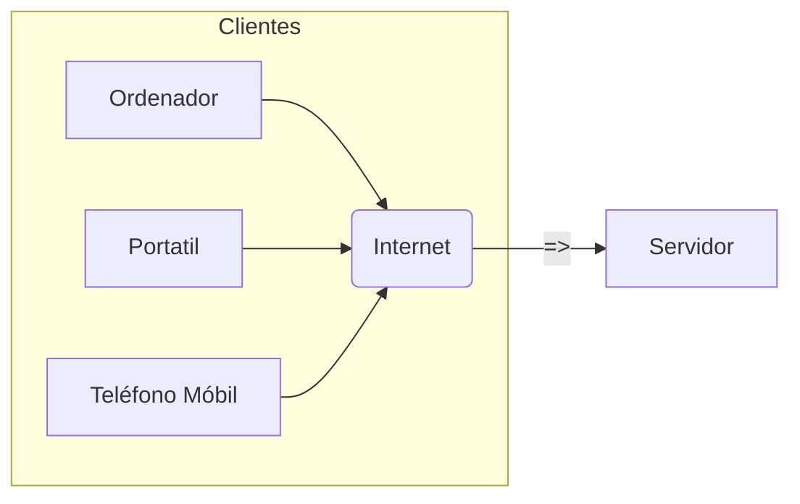
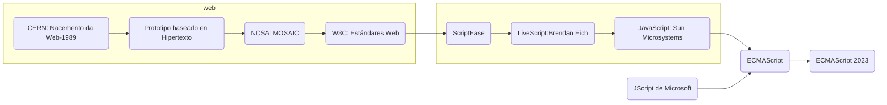
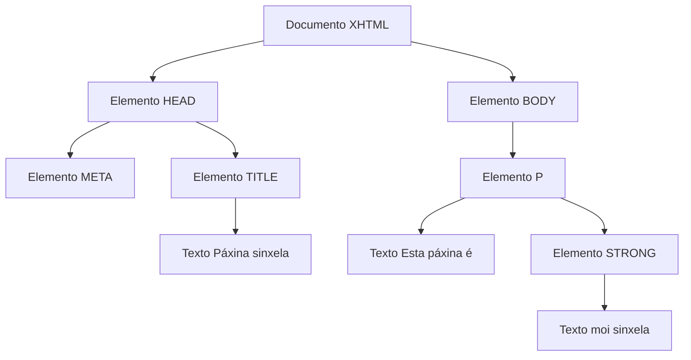

## 1. Mundo web
Pódese pensar no mundo web como **clientes** que consumen contidos fornecidos por  **servidores web**. Na esquina do cliente está o usuario e as ferramentas empregadas, por  exemplo, o navegador web. No lado do servidor hai servidores web (por exemplo, Apache, Nginx, Cherokee, Internet Information Services, ...) aloxados en empresas de hospedaxe .


Tradicionalmente, o navegador web (Mozilla Firefox, Chrome, Internet Explorer) foi o
encargado de interpretar o contido HTML. Hoxe en día as páxinas web conteñen un forte contido de interacción co usuario e efectos visuais, o que fai que a web sexa máis atractiva e dinámica. Estos elementos acostuman codificarse con JavaScript sobre todo aqueles relacionados coas peticións asíncronas. 

### 1.1 As orixes da web e de JS



 
A web foi inicialmente concibida e creada por Tim Berners-Le, un especialista do laboratorio europeo de partículas ( CERN) en 1989. Nas súas  palabras, había unha "*necesidade dunha ferramenta colaborativa que soportase o coñecemento científico*" nun contexto internacional. El e o seu compañeiro Robert Cailliau crearon un prototipo web para o CERN e mostrárono á comunidade para as súas probas e comentarios.

Devandito prototipo estaba baseado no concepto de hipertexto. Como resultado creáronse uns protocolos e especificacións que foron adoptados universalmente e incorporados a Internet, grazas a achegas posteriores como o desenvolvemento pola **NCSA** da popular interface **MOSAIC**.

Todos os prototipos e desenvolvementos posteriores creceron baixo a guía do consorcio
W3C, que é unha organización con base no MIT de Massachusetts e que se responsabiliza de desenvolver e manter a estándares web.
 
**JavaScript**, creado por Netscape en 1995 e baseado en CEnvi de Nombas, foi evolucionando significativamente desde a súa concepción. Brendan Eich adaptou tecnoloxías como ScriptEase para crear LiveScript, logo renomeado a JavaScript en colaboración con Sun Microsystems. A aparición de **JScript de Microsoft** e a necesidade de estandarización levaron á creación do estándar ECMA-262. As versións sucesivas de **ECMAScript** incorporaron melloras como soporte de expresións regulares, manejo avanzado de strings, e innovacións como módulos, generators e proxys, marcando o desenvolvemento continuo de JavaScript.

A última versión de [ECMAScript](https://en.wikipedia.org/wiki/ECMAScript_version_history) publicada é **ECMAScript 2023**. Esta é a **14ª edición** da especificación do lenguaxe e inclúe novas características como métodos para ordenar, reverter e manipular arrays, ... 

#### As últimas melloras de ECMAScript
* **2020 ECMAScript 2020 (ES11)**: Introduciu BigInt para números enteiros de precisión arbitraria, Promise.allSettled, globalThis, e melloras en String e Array.
* **2021 ECMAScript 2021 (ES12)**: Engadiu String.prototype.replaceAll, operadores de asignación lóxica, e WeakRef.
* **2022 ECMAScript 2022 (ES13)**: Incluíu novidades como métodos de clase privados e acceso a propiedades privadas usando #, e melloras en Array e Object.
* **2023 ECMAScript 2023 (ES14)**: Continúa a tendencia de mellorar e engadir novas funcionalidades ao lenguaxe, mantendo a compatibilidade e expandindo as capacidades de JavaScript no desenvolvemento web e máis aló.


### 1.2 Linguaxes no cliente
As linguaxes do lado do cliente, como HTML, CSS e JavaScript, son executadas no navegador do usuario, permitindo a creación de contidos web dinámicos e interactivos. HTML estrutura o contido, CSS define a presentación visual, e JavaScript engade funcionalidades interactivas. Ademais, JavaScript expandiuse ao lado do servidor con tecnoloxías como Node.js, facilitando o desenvolvemento full-stack co mesmo lenguaxe. Esta converxencia reflicte a tendencia actual cara a aplicacións web máis integradas e versátiles, onde a distinción entre cliente e servidor se volve máis fluída.

#### 1.2.1 Características de JS
As principais características de JS son:
* Imperativo e Estructurado: Execución secuencial de sentenzas, soporta programación estructurada.
* **Tipado Débil:** As variables non requiren definición de tipo; este asignase dinamicamente.
* Interpretado: Non compila a código máquina, precisa dun intérprete.
* Sinxelo e moi empregado: Fácil de aprender e amplamente empregado en desenvolvemento web.
* Cliente e Servidor: Úsase tanto en front-end (cliente) como en back-end (servidor).
* Orientado a Obxectos: Soporta programación orientada a obxectos mediante prototipos.
* Multiplataforma: Funciona en múltiples navegadores e sistemas operativos.

### 1.3 Linguaxes do lado do servidor
As linguaxes do lado do servidor procesan a información antes de enviarla ao cliente, garantindo compatibilidade entre navegadores e ocultando o código fonte. No ecosistema web, as linguaxes de servidor máis comúns inclúen PHP, Java (a través de tecnoloxías como JSP e JSF), ASP.NET (desenvolvida por Microsoft), Python (popular en análise de datos e desenvolvemento web con Django ou Flask), Ruby (co seu framework Ruby on Rails), Node.js (que permite usar JavaScript no lado do servidor), e Perl, coñecido polo seu poderoso procesamento de texto. Cada unha ten características únicas que as fan adecuadas para diferentes tipos de proxectos web.


## 2. O navegador web

A función dun navegador é pedir e mostrar recursos web, como documentos HTML ou imaxes, usando unha URI para atopar a súa localización. A forma en que estes recursos se amosan depende das normas de CSS e HTML definidas polo W3C, que promove a compatibilidade entre navegadores e facilita o acceso á web desde calquera dispositivo. Historialmente, as diferenzas entre navegadores causaron problemas de compatibilidade, pero hoxe a maioría segue estas normas para mellorar a experiencia do usuario na web.

A arquitectura dun navegador inclúe varios compoñentes básicos que son comúns na maioría deles, formando o que se coñece como arquitectura de referencia. Estes compoñentes, identificados nun estudo por [Grosskurth e Godfrey](https://grosskurth.ca/papers/browser-refarch.pdf)[¹], constitúen a estrutura fundamental sobre a que se constrúen os navegadores web. Os principais compoñentes son:
* Subsistema de interface de usuario
* Subsistema do motor do navegador
* Subsistema de renderizado
* Subsistema de comunicacións
* Intérprete de JavaScript
* Parser XML
* Compoñente de visualización
* Subsistema de persistencia de datos

 ```mermaid
graph TB
  style DATA fill:#FFA500
  style NET fill:#00FFAA
  style JS fill:#00FFAA
  style XML fill:#00FFAA
  style DISPLAY fill:#00FFAA
 
  UI(Interface de usuario)
  BE(Motor do navegador)
  RE(Motor de renderizado)
  NET(Networking)
  JS(Intérprete de JavaScript )
  XML(XML Parser)
  DISPLAY(Display Backend)
  DATA(Persistencia)
  UI --> BE
  BE --> RE
  RE --> NET
  RE --> JS
  RE --> XML
  RE --> DISPLAY
  UI --> DATA
  BE --> DATA
  RE --> DATA
```

### 2.1 Subsistema de interface de usuario
É a capa que actúa de interface entre o usuario e o motor do navegador. Ofrece funcionalidades tales como a visualización de barras de ferramentas, progreso de carga da páxina, xestión intelixente das descargas, preferencias de configuración de usuario ou impresión. Nalgúns casos pode comunicarse co sistema operativo para o manexo de sesións de usuario ou o almacenamento de preferencias de visualización ou configuración.

###  2.2 Subsistema do motor do navegador
Este subsistema é un compoñente que ofrece unha interface de alto nivel para o motor de  renderizado. A súa función principal é a de cargar unha direcció determinada (URL ou  URI) e soportar os mecanismos básicos de navegación tales como ir á páxina anterior ou seguinte ou a recarga da páxina. Ademais, é o compoñente que xestiona as alertas de JavaScript (mensaxes de usuario) e o proceso de carga dunha páxina (é quen lle prové de información á interface de usuario respecto diso). Finalmente, é o encargado de consultar e administrar as preferencias de execución do motor de renderizado.


###  2.3 Subsistema de renderizado
Este compoñente é o encargado de producir unha representación visual do recurso obtido a partir do acceso a unha dirección web. O código dunha páxina web é interpretado por este módulo. En función das linguaxes, estándares e tecnoloxías soportadas polo navegador, este módulo será capaz de mostrar documentos HTML, XML, follas de estilo  CSS e mesmo contido embebido na páxina(audio/vídeo) e imaxes. Ademais, este módulo establece as dimensións exactas de cada elemento para mostrar e, en ocasións, é o responsable de ubicar os devanditos elementos nunha páxina.

Algúns dos motores de  renderizado máis utilizados son:
* **WebKit**: Este é o motor utilizado polo navegador **Safari** de Apple. Tamén é empregado en todos os navegadores no sistema operativo iOS de Apple, xa que as políticas da App Store requiren que calquera navegador en iOS use este motor​​​​.

* **Blink**: Baseado en **Chromium**, este é o motor de renderizado usado por Google **Chrome**, e tamén é o motor detrás de outros navegadores baseados en Chromium como Microsoft Edge, Opera e outros. Microsoft inicialmente tiña o seu propio motor, EdgeHTML, para o navegador Edge, pero pasou a usar Blink despois de basear Edge no código de Chromium​​​​.

* **Gecko**: É o motor de renderizado utilizado por Mozilla Firefox. Firefox é coñecido por centrarse na privacidade e personalización​​​​.

Aconséllase que amplies a información sobre o renderizado nos seguintes sitios web:
* [Programador Click: Proceso de renderizado del navegador](https://programmerclick.com/article/252718941/)
* [Medium: The rendering process of a web page](https://medium.com/@gneutzling/the-rendering-process-of-a-web-page-78e05a6749dc)

###  2.4 Subsistema de comunicacións
É o subsistema encargado de implementar os protocolos de transferencia de ficheiros e documentos utilizados na internet ( HTTP,  FTP, etc.). Ademais, é o responsable de identificar a codificación dos datos obtidos en función do seu tipo, de tal forma que é capaz de identificar se o recurso obtido é de tipo texto, audio, vídeo, etc. Dependendo das capacidades personalizadas para o navegador, este subsistema pode almacenar unha caché de elementos accedidos recentemente.

###  2.5 Intérprete de JavaScript
s páxinas HTML habitualmente levan código intercalado para a provisión de certas funcionalidades ao usuario como pode ser a resposta a certos eventos do rato ou do teclado.A linguaxe comunmente aceptada para a programación deste código embebido é  JavaScript (seguindo o estándar  ECMAScript). O intérprete de  JavaScript será o encargado de analizar e executar devandito código. Este módulo pode ser configurado (e mesmo deshabilitado) por cuestións de seguridade ou facilidade de navegación desde o motor de navegación ou o motor de  renderizado (por exemplo, para evitar que aparezan xanelas emerxentes). A existencia de módulos de interpretación de código difire dun navegador a outro. Por iso, é posible que existan subsistemas intérpretes doutras linguaxes, como miniaplicacións de Java (desuso), AJAX ou ActionScript.

###  2.6 Parser XML
Co fin de poder acceder máis facilmente aos contidos definidos nun documento HTML (en realidade XHTML), os navegadores web adoitan incluír un módulo ( parser) que permite cargar en memoria unha **representación en árbore** (árbore  **DOM**,  Document  Object  Model) da páxina. Desta forma, o acceso aos diferentes elementos dunha páxina por parte do navegador é moito máis rápido. Un exemplo dunha páxina web sinxela é o seguinte.

```html
<!DOCTYPE html>
<html xmlns="http://www.w3.org/1999/xhtml" xml: >
<head>
    <meta charset="UTF-8" />
    <title>páxina sinxela</title>
</head>
<body>
    <p>Esta páxina é  <strong>moi sinxela</strong>.</p>
</body>
</html>
```
E  a súa representación en árbore é: 


Para consultar  os distintos obxectos DOM recoñecidos no estándar pódese consultar:
* [W3C: Document Object Model (DOM) Technical Reports](https://www.w3.org/DOM/DOMTR)
* [DOM Living Standard — Last Updated 16 February 2024](https://dom.spec.whatwg.org/)
* [Mozilla:Modelo de Objetos del Documento (DOM)](https://developer.mozilla.org/es/docs/Web/API/Document_Object_Model)
  

###  2.7 Compoñente de visualización
Este subsistema ofrece funcionalidades relacionadas coa visualización dos contidos dun documento HTML nunha páxina web. Ofrece primitivas de debuxo e posicionamento nunha xanela, un conxunto de compoñentes visuais  predefinidos ( widgets) e un conxunto de fontes tipográficas  aos subsistemas principais da navegador web. Adoita estar moi relacionado coas librerías de visualización do sistema operativo.
### 2.8 Subsistema de persistencia de datos
Funciona como almacén de diferentes tipos de datos para o principais subsistemas do navegador. Estes datos adoitan estar relacionados co almacenamento do historial de navegación e o mantemento de sesións de usuario en disco. Outros datos de alto nivel que tamén son xestionados por este subsistema inclúen as preferencias de configuración do navegador (de barras de ferramentas, por exemplo) ou a listaxe de marcadores. A baixo nivel, este sistema administra tamén os certificados de seguridade e as cookies.

No caso de JavaScript a maneira habitual para implementar a persistencia é empregando LocalStorage, SessionStorage, Cookies e IndexedDB (complexo). Exemplos de implementación son:
```js
//***************************
//LocalStorage
//***************************
// Gardar datos
localStorage.setItem('clave', 'valor');
// Obter datos
let datos = localStorage.getItem('clave');


//***************************
//SessionStorage
//***************************
// Gardar datos
sessionStorage.setItem('clave', 'valor');

// Obter datos
let datos = sessionStorage.getItem('clave');


//***************************
//Cookies
//***************************
document.cookie = "username=John Doe";


 
```
### 2.9 Funcionamento do navegador.
Para ampliar sobre o funcionamento interno de WebKit e Gecko podes ampliar os contidos en [https://web.dev/](https://web.dev/articles/howbrowserswork?hl=es-419). 


## 3. Ferramentas 
A mellor forma de aprender estas tecnoloxías é probando e desenvolvendo proxectos nas cales nos atoparemos con retos a superar. **Non se recomenda** o uso de editor de tipo **WYSIWYG** xa que xera un código difícil de interpretar e non logramos aproveitar todo o potencial das tecnoloxías. 

###  3.1 Navegador web 
Para o desenvolvemento en JavaScript, os navegadores web son ferramentas esenciais. Firefox e Google Chrome son dous dos navegadores máis recomendados debido ás súas **consolas de depuración** (F12) avanzadas e á súa capacidade de soportar numerosos complementos e extensións que poden axudar a aumentar a produtividade do desenvolvedor.As funcións máis destacadas:
* Executar código JavaScript de forma interactiva.
* Ver mensaxes de log, avisos e erros que axudan a identificar problemas no código.
* Inspeccionar variables e obxectos en tempo real.
* Realizar un seguimento da execución do código paso a paso utilizando ferramentas de perfilado e de puntos de interrupción.
* Editor de estilos


A continuación amosamos un exemplo como facer a traza na consola co seguinte fragmento de código que debes pegar na consola do navegador. 

```js
 function debugExemplo(valor) {
  console.log("Inicio da función debugExemplo");
  console.log("Valor da variable:", valor);
  valor=valor+valor;
  console.log("Valor da variable:", valor);
  console.log("Fin da función debugExemplo");
}
```
O seguinte paso é invocar a función dende a consola por exemplo pasándolle o valor de "1"

```shell
debugExemplo(1)
```
O cal nos amosará na pantalla as trazas de log seguintes:
```txt
Inicio da función debugExemplo      VM44:2
Valor da variable: 1                VM44:3 
Valor da variable: 2                VM44:5 
Fin da función debugExemplo         VM44:6 
```

Se picamos nalgunha das liñas coa referencia  **VM44:??** podemos acceder ao código para incorporar un **punto de interrupción**. 

Realiza a execución de **debugExemplo** con diferentes tipos de datos como poden ser:
| Chamar a función          | Tipo de **valor** | Resumo da saída na consola                                |
|---------------------------|-----------------|-----------------------------------------------------------|
| `debugExemplo(5)`         | Número          | A función duplica o número.                               |
| `debugExemplo("test")`    | Cadea de texto  | A función concatena a cadea consigo mesma.                |
| `debugExemplo([1, 2])`    | Array           | A función concatena o array consigo mesmo.                |
| `debugExemplo({a: 1})`    | Obxecto         | A función tenta sumar o obxecto, o que non é directamente posible en JS. |
| `debugExemplo(null)`      | `null`          | A función intenta sumar `null`, resultando nun erro ou `null` concatenado consigo mesmo como cadea se a coerción implícita ocorre. |
| `debugExemplo(undefined)` | `undefined`     | A función intenta sumar `undefined`, resultando en `NaN`. |


Podes ampliar sobre o funcionamento do debug no navegador na seguinte [ligazón](https://es.javascript.info/debugging-chrome)

###  3.2 Editor de código
O editor de código máis popular a día de hoxe é [Visual Studio Code](https://code.visualstudio.com/) e temos alternativas como Brackets, Atom,  Notepad++, Sublime,Aptana, Eclipse, etc. Para a súa instalación podemos descargarlo dende a web oficial ou dende a consola da seguinte maneira:
* Sistemas **Windows**  `winget install --id=Microsoft.VisualStudioCode  -e`
* Sistemas **Debian** `sudo apt install code` ou n`sudo snap install --classic code`
 
Ao editor podemos incorporarlle novas funcionalidades empregado  diferentes plugins como son: 
* **ESLint**: Axuda a identificar e corrixir problemas no código JavaScript seguindo un conxunto de regras codificadas.
* **Prettier**: Un formateador de código para manter un estilo consistente no teu proxecto.
* Debugger for Chrome: Permite depurar o teu código JavaScript directamente no navegador Chrome desde VS Code.
* **GitLens**: Mellora a experiencia de traballar con Git, proporcionando información detallada sobre as modificacións no código.
* **Live Server**: Permite lanzar un servidor de desenvolvemento local con recarga en vivo para páxinas web estáticas.
* **Bracket Pair Colorizer**: Visualiza os pares de corchetes con cores distintas para mellorar a legibilidade do código.

Recursos para ampliar o coñecemento de VSCode: 
* [Manuais IES San Clemente: VSCode](https://manuais.iessanclemente.net/index.php/Visual_Studio_Code)
* [MC Libre:VSCode Instalación](https://www.mclibre.org/consultar/informatica/lecciones/vsc-instalacion.html)
* [MC Libre:VSCode Personalización](https://www.mclibre.org/consultar/informatica/lecciones/vsc-personalizacion.html)

###  3.3 Outras ferramentas.
#### GIT 
Git é un sistema de control de versións que facilita a colaboración en proxectos de programación. Permite aos desenvolvedores rastrexar e fusionar cambios no código, xestionar diferentes versións e colaborar eficazmente en equipos.  
```bash
## Windows
winget install --id Git.Git -e
## Linux 
sudo apt-get install git
```

#### PHP 
Ter instalado PHP no equipo para montar facilmente un servidor web lixeiro da seguinte maneira. 
```bash
php -S localhost:9090
```
#### Python 3
Ter instalado Python no equipo para montar facilmente un servidor web lixeiro da seguinte maneira. 
```bash
python3 -m http.server 9091
```
[¹]: Ligazón: https://grosskurth.ca/papers/browser-refarch.pdf

#### Editores online 
Temos diferentes alternativas como son:
* **[TutorialsPoint JS Editor](https://www.tutorialspoint.com/online_javascript_editor.php)**
* **CodePen**: Ideal para probar fragmentos de código e compartir con outros.
* **JSFiddle**: Permite escribir HTML, CSS e JavaScript e ver o resultado ao instante.
* **CodeSandbox**: Ofrece un entorno de desenvolvemento máis completo, adecuado para proxectos máis grandes.
* **Glitch**: Permite crear aplicacións completas e colaborar en tempo real.


## 4.Integración de JavaScript con HTML
A integración de JavaScript (JS) e HTML permítenos crear páxinas web interactivas. JS engádese ao HTML a través da etiqueta `<script>`, que pode colocarse no `<head>` para cargar scripts antes de que a páxina se visualice, ou antes do peche de `</body>` para mellorar a velocidade de carga da páxina. 

Dentro desta etiqueta, pódese escribir código JS directamente ou incluír un arquivo externo usando o atributo src. Esta integración fai posible manipular o DOM), permitindo modificar contidos, estilos e responder a eventos do usuario dinámicamente.
 
### 4.1 Integración en liña
Emprégase a etiqueta   `<script>` no mesmo ficheiro html. 

```html
<!DOCTYPE html>
<html>
<head>
    <title>Integración JS e HTML</title>
</head>
<body>
    <p id="parrafo">Texto orixinal do parágrafo.</p>
    <button onclick="cambiarTexto()">Cambia o Texto</button>
    
    <script>
        function cambiarTexto() {
            document.getElementById("parrafo").innerHTML = "Texto modificado!";
        }
    </script>
</body>
</html>

```

### 4.2 Integración en ficheiros independentes. 

Unha forma eficaz de usar JavaScript en páxinas web é mediante a inclusión de arquivos .js externos. Esta técnica permite agrupar funcións reutilizables nun só ficheiro, facilitando a xestión do código e a súa reutilización en diferentes partes do sitio web. A inclusión faise mediante a etiqueta `<script>` co atributo `src`, que apunta ao arquivo JavaScript externo. Esta práctica mellora a organización do código e optimiza a carga da páxina, xa que os scripts externos poden ser almacenados na caché do navegador.

**Ficheiro index.html**
```html
<!DOCTYPE html>
<html>
<head>
    <title>Integración JS e HTML</title>
</head>
<body>
    <h1>Exemplo de Integración</h1>
    <!-- Referencia ao arquivo JavaScript externo -->
    <script src="script.js"></script>
</body>
</html>
```
**Ficheiro script.js**
```js
// Este código executarase cando se cargue o HTML
alert("Ola, mundo!");
```

### 4.3 É preciso o `type =”text/javascript"` ?

**Non é necesario especificar o atributo type="text/javascript"** nos elementos <script> segundo as versións máis recentes de HTML, incluído HTML5 e os estándares ECMAScript actuais. Os navegadores modernos asumen que o código dentro das etiquetas <script> é JavaScript se non se especifica ningún tipo. Este atributo era máis relevante en versións anteriores de HTML para asegurar a compatibilidade, pero agora considérase obsoleto e non é necesario para a execución de scripts JavaScript. 

Podes ampliar máis información en [HTML Living Standard — Last Updated 15 February 2024](https://html.spec.whatwg.org/multipage/scripting.html#attr-script-type)

### 4.4 Como afecta a carga dos diferentes scripts? 
 
A **mestura de definicións** en liña e en ficheiros externos de JavaScript pode afectar a carga da páxina. Os scripts en **liña** execútanse **inmediatamente**, mentres que os **externos** requiren ser **descargados**, o que pode introducir unha demora. Ademais, o navegador pode almacenar en caché os arquivos externos, axilizando cargas futuras. Para optimizar a carga, recoméndase usar arquivos externos cando sexa posible e minimizar o uso de scripts en liña, especialmente para código que se reutiliza en varias páxinas.

**Ficheiro index.html**
```html
<!DOCTYPE html>
<html>
<head>
    <title>Script en liña</title>
</head>
<body>
    <h1>Script en liña</h1>
    <script>
        console.log('Isto é un script en liña.');
    </script>
    <script src="script.js"> </script>
</body>
</html>
```

**Ficheiro script.js**
```js
console.log('Isto é un script externo.');
```

Neste caso a saída do ConsoleLog será: 
```
Isto é un script en liña.
Isto é un script externo.
```

*Recordar que a execución do JS é dacordo se amosa as súas definicións no ficheiro*

### 4.5 Etiqueta: ´noscript´
Existe a posibilidade de indicar un texto alternativo para os navegadores que non entenden  Javascript, para informarlles de que nese lugar debería executarse un  script e que a páxina non está a funcionar ao 100% das súas capacidades. 

Podes simular este comportamento da seguinte maneira:
* **Chrome**: chrome://settings/content/javascript
* **Firefox**: about:config e logo buscar o parámetro: javascript.enabled


```html
<!-- Fragmento -->
<body>
    <script>
        console.log('Codigo JS a executar');
    </script>
  <noscript>
        Este navegador non soporta a execución de JS 
  </noscript>
</body>
```