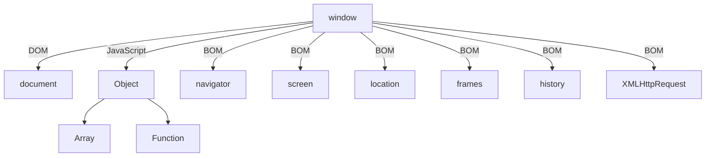

## 0. Obxectos predefinidos en JS
En JavaScript, hai varios obxectos predefinidos que proporcionan funcionalidades esenciais para a programación. Os máis relevantes xa os vimos na anterior unidade. A modo de resumo estos son:

| Obxecto    | Descrición                                                                                                                                               |
|------------|-----------------------------------------------------------------------------------------------------------------------------------------------------------|
| Object     | Base para a maioría dos obxectos en JavaScript. Ofrece métodos básicos como `toString()`, `hasOwnProperty()`, entre outros.                                |
| Function   | Representa funcións, permitindo definir blocos de código que poden ser chamados.                                                                           |
| Array      | Provee métodos para manipular arrays, como `push()`, `pop()`, `slice()`, e `sort()`.                                                                      |
| String     | Contén métodos para traballar con cadeas de texto, como `replace()`, `search()`, `substring()`, e `split()`.                                              |
| Number     | Encapsula valores numéricos e ofrece métodos como `toFixed()`, `toPrecision()`, e `isNaN()`.                                                               |
| Boolean    | Representa valores booleanos (`true` e `false`) e é útil en operacións lóxicas.                                                                            |
| Date       | Ofrece funcionalidades para traballar con datas e horas, permitindo crear, manipular, e formatar datas.                                                   |
| Math       | Proporciona propiedades e métodos para constantes e funcións matemáticas, como `Math.PI`, `Math.sqrt()`, `Math.random()`, etc.                             |
| RegExp     | Representa expresións regulares, útiles para a combinación de cadeas de caracteres mediante métodos como `test()` e `exec()`.                              |
| Global Functions | Inclúe funcións globais que non requiren un obxecto para ser chamadas, como `parseInt()`, `parseFloat()`, `encodeURI()`, e `decodeURI()`. |

JavaScript no entorno dos navegadores  dispón doutros obxectos e funcións propias que lle permiten controlar as páxinas webs. Este elemento é coñecido como o  **Browser Object Model (BOM)** e que non debemos confundir co Document Object Model (DOM).


Este gráfico describe a xerarquía de obxectos co obxecto "WINDOW" na cima, que se conecta a obxectos como "navigator", "screen", "document", "history" e "location". 


### 0.1 BOM 
O Modelo de Obxecto do Navegador (BOM) permite o acceso e a manipulación do navegador da web. O obxecto window é a parte principal do BOM e representa unha xanela que contén un documento DOM. A través do BOM, podes interaccionar co navegador para realizar accións como:
* **Manipular a xanela do navegador** (abrir, pechar, mover, redimensionar).
* Acceder e manipular outras propiedades como **location**, **history**, **navigator**, **screen**, **localStorage**, entre outros.

Exemplos para manipular o navegador:
```js
window.open(); // Abre unha nova xanela
window.open("http://google.com");

window.close(); // Pecha a xanela actual
console.log(window.location.href); // Amosa o URL actual
```

### 0.2 DOM 
O Modelo de Obxecto do Documento (DOM) é unha **interface de programación para documentos HTML** e XML. Representa a estrutura da páxina de modo que poida ser alterada con linguaxes de programación como JavaScript. O DOM transforma todos os elementos do documento en obxectos que poden ser manipulados. **O obxecto document é a entrada principal para acceder ao contido da páxina**. 

Exemplos :
```js
document.querySelector('.someClass').style.color = 'red'; // Cambia a cor de texto de elementos coa clase "someClass"
document.title = 'Novo Título'; // Cambia o título da páxina

```
**O DOM non é só para navegadores.** A especificación **DOM detalla a estrutura dun documento** e proporciona obxectos para manipulalo. Existen ferramentas fóra dos navegadores que tamén empregan o DOM. Por exemplo, os scripts do lado do servidor que descargan páxinas HTML e as procesan poden utilizar o DOM, aínda que quizais só soporten parte da especificación.

## 1, O  obxecto Window.
O obxecto `window` representa unha xanela aberta nun navegador.
O obxecto `window` representa unha xanela aberta nun navegador.

### Propiedades do obxecto Window
| Propiedade     | Descripción                                                                |
|----------------|----------------------------------------------------------------------------|
| `closed`       | Devolve un valor Boolean indicando cando unha xanela foi pechada ou non.    |
| `defaultStatus`| Devolve o valor por defecto da barra de estado dunha xanela.      |
| `document`     | Devolve o obxecto document para a xanela.                                   |
| `frames`       | Devolve un array de todos os marcos (incluídos iframes) da xanela actual.   |
| `history`      | Retorna o obxecto history da xanela.                                        |
| `length`       | Devolve o número de frames (incluíndo iframes) que hai dentro dunha xanela. |
| `location`     | Devolve a Localización do obxecto xanela (URL do ficheiro).                 |
| `name`         | Axusta ou devolve o nome dunha xanela.                                      |
| `navigator`    | Devolve o obxecto navigator dunha xanela.                                   |
| `opener`       | Devolve a referencia á xanela que abriu a xanela actual.                     |
| `parent`       | Devolve a xanela pai da xanela actual.                                      |
| `self`         | Devolve a xanela actual.                                                    |
| `status`       | Axusta o texto da barra de estado dunha xanela.                             |

### Métodos do obxecto Window
| Método           | Descripción                                                                  |
|------------------|------------------------------------------------------------------------------|
| `alert()`        | Mostra unha ventá emerxente de alerta e un botón de aceptar.                 |
| `blur()`         | Elimina o foco da xanela actual.                                              |
| `clearInterval()`| Resetea o cronómetro axustado con setInterval().                              |
| `setInterval()`  | Chama a unha función ou evalúa unha expresión nun intervalo especificado (en milisegundos). |
| `close()`        | Pecha a xanela actual.                                                       |
| `confirm()`      | Mostra unha ventá emerxente con unha mensaxe, un botón de aceptar e un botón de cancelar. |
| `focus()`        | Coloca o foco na xanela actual.                                               |
| `open()`         | Abre unha nova xanela de navegación.                                          |
| `prompt()`       | Mostra unha ventá de diálogo para introducir datos.                           |

 ### Exemplo 01: Manipulación de fiestras.

 ```html 
<html>
        <head>
          <title>Ventana Principal</title>
          <script>
          //creamos la variable ventana_secundaria que contendrá una referencia al popup que vamos a abrir
          //la creamos como variable global para poder acceder a ella desde las distintas funciones
          var ventana_secundaria
          
          function abrirVentana(){
              //guardo la referencia de la ventana para poder utilizarla luego
              ventana_secundaria = window.open("index.html","miventana","width=300,height=200,menubar=no")
          }
          
          function cerrarVentana(){
              //la referencia de la ventana es el objeto window del popup. Lo utilizo para acceder al método close
              ventana_secundaria.close()
          }
          </script>
      </head>
      
      <body>
          <h1>
              Esta es la ventana principal
          </h1>
          <form>
              <input type=button value="Abrir ventana secundaria" onclick="abrirVentana()">
              <br>
              <br>
              <input type=button value="Cerrar ventana secundaria" onclick="cerrarVentana()">
          </form>
      </body>
      </html>
 ```
 ### Exemplo 02: Manipulación de temporizadores (setTimeout).
* `clearTimeout()`: borra o temporizador establecido con setTimeout().
* `setTimeout()`: chama a unha función ou avalía unha expresión transcorridos uns milisegundos.

Exemplo para probar na consola do navegador: 
```js
function saludos(){
  console.log("Ola Mundo");
}

setTimeout(saludos, 3000);
```
Mostrará pasados 3 segundos a  mensaxe: `Ola Mundo` e actua como que a función estivera en "suspension" durante o tempo indicado. 

Tamén podes pasarlle parámetros a funcion como neste exemplo:


```js
 function saludos(nombre, rol){
  console.log(`Ola, o meu nome é  ${nombre}`);
  console.log(`Eu son ${rol}`);
}

setTimeout(saludos, 3000, "Pepe Castaño", "Locutor");

```

**Ollo!!!** Se pasamos directamente os parámetros a función d será executada de maneira inmediata. Isto acontece porque está a pasar unha chamada á función e non unha referencia á función como primeiro parámetro. 
```js
//Execución inmediata ao pasar os parámetros.
setTimeout(saludos("Natalia", "Profesora"), 3000);
```

**Conclusión se necesitas pasar un parámetro á función, debes facelo desde o método `setTimeout()`.**

#### Pechar o método setTimeout (clearTimeout)
Tamén pode evitar que o método `setTimeout()` execute a función usando o método `clearTimeout()`.

```js
 function saludos(nombre, rol){
  console.log(`Ola, o meu nome é  ${nombre}`);
  console.log(`Eu son ${rol}`);
}


const timeoutId  = setTimeout(saludos, 5000, "Pepe Castaño", "Locutor");
clearTimeout(timeoutId);
console.log(`Tempo de espera ID ${timeoutId} foi limpiado`);

```


 ### Exemplo 03: Manipulación de temporizadores (setInterval).
En window temos estes métodos para traballar con temporizadores:
* `clearInterval()`: borra o temporizador establecido con setInterval().
* `setInterval()`: chama a unha función ou avalía unha expresión a intervalos constantes (en milisegundos).

```html
<html>
        <head>
          <title>Ventana Principal</title>
          <script>
            function showTimer() {
              document.getElementById("info").innerHTML = new Date().toLocaleTimeString();
              seconds--;
              if (seconds==0) {
                // Deixa de executar a función ao borrar o temporizador
                clearInterval(myTimer); 
                // Amosa unha xanela emerxente cunha mensaxe
                window.alert("Rematou o tempo"); 
              }
            }
            // Pedimos un dato ao usuario
            var seconds = window.prompt("Indica unha cantidade de segundos: ", "5");
            // Executa unha función cada 1000 ms
            var myTimer = setInterval(showTimer, 1000);

          </script>
      </head>
      
      <body>
          <div id="info"></div>
      </body>
      </html>
```
### Exemplo 04: Manipulación de temporizadores (setInterval).
En window temos estes métodos para traballar con temporizadores:
* `clearInterval()`: borra o temporizador establecido con setInterval().
* `setInterval()`: chama a unha función ou avalía unha expresión a intervalos constantes (en milisegundos).

```html
<html>
<head>
<title>Ventana Principal</title>

<style>
.go {
  color: green;
}
.stop {
  color: red;
}
</style>

</head>
      
<body>
        <div id="my_box">
          <h3>Ola mundo!!</h3>
        </div>
        <button id="start">Start</button>
        <button id="stop">Stop</button>


<script>
// variable para almacenar nuestro intervalID
let nIntervId;

function changeColor() {
  // comprobar si ya se ha configurado un intervalo
  if (!nIntervId) {
    nIntervId = setInterval(flashText, 1000);
  }
}

function flashText() {
  const oElem = document.getElementById("my_box");
  if (oElem.className === "go") {
    oElem.className = "stop";
  } else {
    oElem.className = "go";
  }
}

function stopTextColor() {
  clearInterval(nIntervId);
  // liberar nuestro inervalId de la variable
  nIntervId = null;
}

document.getElementById("start").addEventListener("click", changeColor);
document.getElementById("stop").addEventListener("click", stopTextColor);
</script>
</body>
</html> 
```

## 2. Navigator
Este obxecto `navigator`, contén información sobre o navegador que estamos utilizando cando abrimos unha URL ou un documento local.

Este obxecto `navigator`, contén información sobre o navegador que estamos utilizando cando abrimos unha URL ou un documento local.

### Propiedades do obxecto Navigator
| Propiedade     | Descripción                                                                |
|----------------|----------------------------------------------------------------------------|
| `appCodeName`  | Cadea que contén o nome en código do navegador.                            |
| `appName`      | Cadea que contén o nome do cliente.                                        |
| `appVersion`   | Cadea que contén información sobre a versión do cliente.                   |
| `cookieEnabled`| Determina se as cookies están ou non habilitadas no navegador.             |
| `platform`     | Cadea coa plataforma sobre a que se está executando o programa cliente.    |
| `userAgent`    | Cadea que contén a cabeceira completa do axente enviada nunha petición HTTP. Contén a información das propiedades `appCodeName` e `appVersion`.|

### Métodos do obxecto Navigator
| Método         | Descripción                                                                 |
|----------------|-----------------------------------------------------------------------------|
| `javaEnabled()`| Devolve `true` se o cliente permite a utilización de Java, en caso contrario, devolve `false`.|

### Exemplo
```javascript
document.write("Navigator <b>appCodeName</b>: " + navigator.appCodeName + "<br>");
document.write("Navigator <b>appName</b>: " + navigator.appName + "<br>");
document.write("Navigator <b>appVersion</b>: " + navigator.appVersion + "<br>");
document.write("Navigator <b>language</b>: " + navigator.language + "<br>");
document.write("Navigator <b>platform</b>: " + navigator.platform + "<br>");
document.write("Navigator <b>userAgent</b>: " + navigator.userAgent + "<br>"); 
```


## 3. document
Cada documento cargado nunha xanela do navegador, será un obxecto de tipo `document`. O obxecto `document` proporciona aos scripts, o acceso a todos os elementos HTML dentro dunha páxina.
Este obxecto forma parte ademais do obxecto `window`, e pode ser accedido a través da propiedade `window.document` ou directamente `document` (xa que podemos omitir a referencia á `window` actual).

### Coleccións do obxecto Document
| Colección  | Descripción                                                       |
|------------|-------------------------------------------------------------------|
| `anchors[]`| É un array que contén todos os hiperenlaces do documento.          |
| `forms[]`  | É un array que contén todos os formularios do documento.           |
| `images[]` | É un array que contén todas as imaxes do documento.               |
| `links[]`  | É un array que contén todos os enlaces do documento.               |

### Propiedades do obxecto Document
| Propiedade | Descripción                                                        |
|------------|--------------------------------------------------------------------|
| `cookie`   | Devolve todos os nomes/valores das cookies no documento.           |
| `domain`   | Cadea que contén o nome de dominio do servidor que cargou o documento. |
| `referrer` | Cadea que contén a URL do documento desde o cal chegamos ao documento actual. |
| `title`    | Devolve ou axusta o título do documento.                           |
| `URL`      | Devolve a URL completa do documento.                               |

### Métodos do obxecto Document
| Método              | Descripción                                                                  |
|---------------------|------------------------------------------------------------------------------|
| `close()`           | Pecha o fluxo aberto previamente con `document.open()`.                      |
| `getElementById()`  | Para acceder a un elemento identificado polo id escrito entre parénteses.    |
| `getElementsByName()` | Para acceder aos elementos identificados polo atributo name escrito entre parénteses. |
| `getElementsByTagName()` | Para acceder aos elementos identificados polo tag ou a etiqueta escrita entre parénteses. |
| `open()`            | Abre o fluxo de escritura para poder utilizar `document.write()` ou `document.writeln` no documento. |
| `write()`           | Para poder escribir expresións HTML ou código de JavaScript dentro dun documento. |
| `writeln()`         | O mesmo que `write()` pero engade un salto de liña ao final de cada instrución. |
### Exemplos:
Ficheiro index.html
```html
<!DOCTYPE html>
<html >
<head>
    <meta charset="UTF-8">
    <meta name="viewport" content="width=device-width, initial-scale=1.0">
    <title>Exemplos de JavaScript</title>
</head>
<body>

<!-- Elemento identificado por ID -->
<div id="meuElemento">Elemento identificado por ID</div>

<!-- Elementos identificados por nome -->
<input type="text" name="nome" value="Elemento 1">
<input type="text" name="nome" value="Elemento 2">
<input type="text" name="nome" value="Elemento 3">

<!-- Elementos por etiqueta -->
<p>Primeiro parágrafo</p>
<p>Segundo parágrafo</p>
<p>Terceiro parágrafo</p>

<!-- Arquivo JavaScript -->
<script src="script.js"></script>
</body>
</html>

```

Ficheiro script.js
```js
// Exemplo de getElementById()
var elemento = document.getElementById('meuElemento');
elemento.textContent = 'Contido modificado polo método getElementById()';

// Exemplo de getElementsByName()
var elementosPorNome = document.getElementsByName('nome');
for (var i = 0; i < elementosPorNome.length; i++) {
    elementosPorNome[i].style.color = 'blue';
}

// Exemplo de getElementsByTagName()
var paragrafos = document.getElementsByTagName('p');
for (var i = 0; i < paragrafos.length; i++) {
    paragrafos[i].textContent = 'Texto modificado polo método getElementsByTagName()';
}
```

## 4.History

A interface `history` permite a manipulación do historial de sesións do navegador, é dicir, as páxinas visitadas na pestana ou marco no que se carga a páxina actual.

### Propiedades:
- `length` 
- `scrollRestoration`
- `state`

### Métodos:
- `back()`: Vai á páxina anterior do historial.
- `forward()`: Vai á páxina seguinte do historial.
- `go()`: Vai á páxina especificada no historial.
- `pushState()`: Engade un estado ao historial.
- `replaceState()`: Substitúe o estado actual no historial.

Documentación en: [MDN Web Docs - History](https://developer.mozilla.org/es/docs/Web/API/history)

### Exemplos:
```js
// Obter o número total de entradas no historial
var totalEntries = window.history.length;
console.log("Número total de entradas no historial:", totalEntries);

// Obter o estado actual do historial
var currentState = window.history.state;
console.log("Estado actual do historial:", currentState);

// Navegar á páxina anterior do historial
window.history.back();

// Navegar á páxina seguinte do historial
window.history.forward();

// Navegar a unha páxina específica no historial
// O parámetro é un enteiro que representa o número de pasos cara adiante (positivo) ou cara atrás (negativo)
window.history.go(-2); // Navega dúas páxinas cara atrás no historial


```
## 5. Location
O obxecto `location` contén información referente á URL actual. Este obxecto, é parte do obxecto `window` e accedemos a el a través da propiedade `window.location`.

### Propiedades do obxecto Location
| Propiedade | Descrición |
|------------|------------|
| `hash`     | Cadea que contén o nome do enlace, dentro da URL. |
| `host`     | Cadea que contén o nome do servidor e o número do porto, dentro da URL. |
| `hostname` | Cadea que contén o nome de dominio do servidor (ou a dirección IP), dentro da URL. |
| `href`     | Cadea que contén a URL completa. |
| `pathname` | Cadea que contén o camiño ao recurso, dentro da URL. |
| `port`     | Cadea que contén o número de porto do servidor, dentro da URL. |
| `protocol` | Cadea que contén o protocolo utilizado (incluíndo os dous puntos), dentro da URL. |
| `search`   | Cadea que contén a información pasada nunha chamada a un script, dentro da URL. |

### Métodos do obxecto Location
| Método   | Descrición |
|----------|------------|
| `assign()` | Carga un novo documento. |
| `reload()` | Volve a cargar a URL especificada na propiedade `href` do obxecto location. |
| `replace()` | Substitúe o historial actual mentres carga a URL especificada en `cadenaURL`. |

### Exemplo
```js
function displayLocationProperties() {
    console.log('URL Completa: ' + window.location.href);
    console.log('Protocolo: ' + window.location.protocol);
    console.log('Host: ' + window.location.host);
    console.log('Nome do Host: ' + window.location.hostname);
    console.log('Porto: ' + window.location.port);
    console.log('Camiño do Recurso: ' + window.location.pathname);
    console.log('Query String: ' + window.location.search);
    console.log('Fragmento Hash: ' + window.location.hash);
}
displayLocationProperties()
```

## 5. Screen
A interfaz Screen representa unha pantalla.

### Propiedades
| Propiedade    | Descripción                                                         |
|---------------|---------------------------------------------------------------------|
| `Orientation` | Retorna a orientación actual da pantalla. (verificar compatibilidade con diferentes navegadores). |
| `height`      | Retorna a altura da pantalla en píxeles.                            |
| `width`       | Retorna a anchura da pantalla.                                      |

### Exemplo de uso:
```javascript
if (window.screen.width >= 1024 && window.screen.height >= 768) {
  // A resolución é de 1024x768 ou superior
}

// Verificar a orientación actual da pantalla
if (window.screen.orientation.type === 'landscape-primary') {
  console.log('A orientación da pantalla é horizontal.');
} else {
  console.log('A orientación da pantalla é vertical.');
}

// Comprobar a altura e a anchura da pantalla
console.log('Altura da pantalla:', window.screen.height, 'píxeles');
console.log('Anchura da pantalla:', window.screen.width, 'píxeles');
```
- **Screen**: Representa a pantalla.
  - Propiedades:
    - `height`: Altura da pantalla en píxeles.
    - `width`: Ancho da pantalla en píxeles.
## 6. Marcos
Actualmente está en desuso o uso de marcos e a comunicación entre eles empregando JavaScript. Aínda que o uso de marcos ou **iframes** é completamente válido en HTML, **en termos de usabilidade e accesibilidade non se recomenda**, polo que o seu uso está en verdadeiro declive. 

O problema fundamental cos marcos é que as páxinas contidas neles non son directamente accesibles, no sentido de que se navegamos dentro dos marcos, a URL principal do noso navegador non cambia, polo que non temos unha referencia directa da páxina na que nos atopamos. Isto é incluso moito peor se estamos a acceder con dispositivos móbiles. 

Outro problema cos marcos é que os **buscadores como Google, Bing, etc., non indexan ben os marcos**, no sentido de que se, por exemplo, rexistran o contido dun marco, cando busquemos ese contido, conectarán directamente con ese marco como se fose a páxina principal, polo que a maioría das veces non temos referencia da sección do portal ou web na que nos atopamos.
## 7. Expresións regulares
As expresións regulares serven para comprobar se unha cadea de texto **segue un determinado patrón ou se contén uns caracteres determinados**. Empregase, por exemplo, para comprobar nun formulario se o texto pasado polo usuario é un correo electrónico, ou un número de teléfono, etc.

Estas expresións van encerradas entre barras inclinadas **/ .../**, e teñen a súa propia sintaxe. Por exemplo, a seguinte expresión comproba se o texto pasado é unha dirección de páxina web: 
```javascript
//"Compilan" a expresión no momento de carga do script.
var reg = /^http[s]?://\w[\.\w]+$/i
let re = /ab+c/;
```

Para declarar un obxecto RegExp pódese facer simplemente asignando a unha variable unha expresión regular, tal como no exemplo anterior, ou mediante o método xeral de crear obxectos:
```javascript
//"Compilan" a expresión en tempo de execución o cal permite crear expresións "dinámicas".

var reg = new RegExp("^http[s]?://\w[\.\w]+$", "i");
let re = new RegExp('ab+c');
```
### Métodos
| Método       | Descripción                                                                                  |
|--------------|----------------------------------------------------------------------------------------------|
| `compile()`  | **Obsoleto**. (Re)compila unha expresión regular durante a execución dun script.                           |
| `exec()`     | O método exec() executa unha busca sobre as coincidencias dunha expresión regular nunha cadea específica. Devolve o resultado como un array, ou null. |
| `toString()` | O método toString() devolve unha cadea que representa o patrón da expresión regular.          |
| `test()`     | **O método test() executa a busca dunha ocorrencia** entre unha expresión regular e unha cadea especificada. Devolve true ou false.                          |

### Conxuntos de caracteres
| Carácter especial | Descripción                                                     |
|-------------------|-----------------------------------------------------------------|
| `[]`              | Rango de caracteres.                                            |
| `[^]`             | Non existe ningún dos caracteres dentro dos corchetes.         |
| ``                |                                                                 |

Alguns elementos especiales para facer expresións regulares en JavaScript:
- `^`: o elemento debe coincidir desde o inicio da cadea.
- `[A-Z]`: calquera carácter entre a A maiúscula e a Z maiúscula.
- `{1,2}`: un ou dous caracteres.
- `\s`: un espazo en branco.
- `\d`: un díxito.
- `{4}`: catro díxitos.
- `([B-D]|[F-H]|[J-N]|[P-T]|[V-Z])`: calquera carácter entre a B maiúscula e a Z maiúscula, excepto as vocais.
- `{3}`: tres caracteres.
- `$`: o elemento debe coincidir co final da cadea.

### Caracteres especiais
| Carácter especial | Descripción                                        |
|-------------------|----------------------------------------------------|
| `.`               | Comodín, calquera carácter.                        |
| `\`               | Inverte o significado dun carácter. Escapa os caracteres especiais. |
| `\t`              | Carácter especial. Tabulador.                      |
| `\r`              | Carácter especial. Retorno de carro.               |
| `\n`              | Carácter especial. Nova liña.                      |


### Exemplos
```js
// Busca 3 dixitos na cadea
var myExp = new RegExp('[0-9]{3}'); 
myExp.test('1111'); // true
myExp.test('11');   // false

//Cadeas de texto da a á c que se repitan con lonxitude 2 ou 3
var myExp = new RegExp('[a-c]{2,3}');  
myExp.test('adamb'); // false
myExp.test('adambc'); // true
myExp.test('adamcb'); // true


//Cadeas que conteñan números
var myExp = new RegExp('\\d');
myExp.test('a1'); // true
myExp.test('ab'); // false

//Cadeas formadas por 4 díxitos
var myExp = new RegExp('\\d{4}');
myExp.test('a');    // false
myExp.test('123');  // false
myExp.test('1234'); // true 

```

Existen webs online que facilitan a construción de expresións regulares como  regex101. Ademais permite [compartir modelos de expresión](https://regex101.com/r/zbjbSq/1) como é a matrícula dun coche no Reino de España.


## 8.Acceso ó DOM con JavaScript
O DOM (Document Object Model) ou modelo de obxectos do documento é unha API (Application Programming Interface) que proporciona un conxunto estándar de obxectos para representar, acceder e actualizar contidos, estrutura e estilos nun documento HTML (HyperText Markup Language) ou XML (eXtensible Markup Language). Trátase dun estándar do W3C (World Wide Web Consortium).

Está separado en tres partes fundamentais:
* Core DOM: modelo estándar para todo tipo de documentos.
* XML DOM: modelo estándar para os documentos XML.
* HTML DOM: modelo estándar para os documentos HTML.

A tarefa máis habitual na programación web adoita ser a manipulación do seu contido para crear novos elementos, facer animacións, manexar eventos, etc. Todas estas tarefas pódense realizar de forma sinxela mediante o DOM. Son os diferentes navegadores webs os encargados de realizar esa transformación do noso documento nunha estrutura xerárquica de obxectos. Desta forma, podemos acceder ao seu contido con métodos máis estruturados.

### Tipos de nodos
A especificación do DOM define 12 tipos de nodos dos cales 5 son os máis empregados:

*   `Document`: é o **nodo raíz** do que derivan todos os demais nodos da árbore.
*   `Element`: representa cada unha das **etiquetas XHTML**. Trátase do único que pode conter **atributos** e o único do que poden **derivar outros nodos**.
*   `Attr`: representa cada **atributo** das etiquetas XHTML polo que haberá un nodo por cada par atributo-valor.
*   `Text`: é o nodo que contén o **texto incluído na etiqueta XHTML** correspondente.
*   `Comment`: representa os **comentarios** incluídos na páxina XHTML. 
*   **Outros**: CdataSection, DocumentFragment, DocumentType, EntityReference, Entity, Notation e ProcessingInstruction.


Na árbore DOM debemos **distinguir** tamén entre **métodos** que son accións que podemos realizar sobre elementos HTML (por exemplo: **engadir ou borrar un elemento HTML**) e **propiedades** que son valores dos elementos HTML que poden ser modificados (por exemplo: cambiar o contido dun elemento HTML).


No seguinte exemplo temos o método `getElementById` que permite acceder a un nodo e logo actualízase a propiedade `innerHTML` . 
```html
<script>
    document.getElementById("exemplo").innerHTML = "A todo porquiño lle chega o seu san Martiño";
</script>
```

### Acceso a nodos de tipo ELEMENTO

O obxecto Document é o propietario de todos os demais obxectos da nosa páxina web polo que se precisamos acceder a calquera elemento no HTML sempre se fará mediante o uso do obxecto Document.

Para encontrar calquera elemento HTML ou propiedade CSS no noso documento existen catro métodos principais:

* `document.getElementById(id)`: devolve o elemento que corresponda con ese **id**.
* `document.getElementsByTagName(tagName)`: devolve unha colección HTML cos elementos que se correspondan con esa etiqueta **tagName**.
* `document.getElementsName(nameValue)`: devolve unha colección HTML cos elementos que teñan como atributo name o correspondente valor **nameValue**.
* `document.getElementsByClassName(classsName)`: devolve os elementos que se correspondan con ese nome de clase **className**.


Supoñamos o seguinte exemplo dun `<input>` de tipo texto:
```html
<input type="text" id="user" name="usuario" class="inputClass" >
```

Dende JS podemos acceder a el de diferentes maneiras, como se amosa a continuación:

```js
// A opción máis socorrida é por medio do id.
    let user= document.getElementById("user");

//***************** getElementsByName *****************
/*
Sen embargo poderiamos empregar a de getElementsByName en base ao atributo name. Esta función devolve unha colección polo que é preciso indicar a posición á que queremos acceder. Se soamente obtemos un elemento sería a posición 0.
*/
    document.getElementsByName("usuario")[0];
  //Se por exemplo tivésemos 5 elementos, para acceder ao terceiro teriamos que indicar o índice 2
      document.getElementsByName("usuario")[2];

//Podemos acceder a todos os elementos cun simple bucle:

 for(let i=0; i<document.getElementsByName("usuario").length;i++){
        let elemento=document.getElementsByName("usuario")[i];
        console.log(elemento);
    }  
//***************** getElementsByTagName *****************
//acceder é a través do nome de etiqueta mediante o método getElementsByTagName o cal devolve unha colección de elementos que coincidan con esa etiqueta.
    let elemento=document.getElementsByTagName("input")[0];


//***************** getElementsByClassName *****************
//se o que queremos é acceder a unha propiedade CSS podémolo facer a través da clase correspondente empregando o método getElementsByClassName.
  let elemento=document.getElementsByClassName("inputClass")[0];
```


É importante destacar neste punto que **unha colección HTML (HTMLCollection) non é un  array**. Podemos acceder aos elementos polo seu índice e recorrelos mediante un bucle pero **non dispoñemos de** métodos de arrays como é o caso de **valueOf(), pop(), push(), join()**.


Tamén existen dous **métodos moi empregados** para o acceso aos elementos que son:

* `document.querySelector(“selector”)`: devolve o primeiro elemento que emparella co selector CSS indicado como parámetro. 
*  `document.querySelectorAll(“selector”)`: devolve todos os elementos que emparellan co selector CSS indicado. **Trátase dunha lista de nodos (NodeList)** que analizaremos máis adiante.

```js
    let primeiroElemento=document.querySelector("p");
    let elementos=document.querySelectorAll("p");
```

### Acceso a nodos de tipo ATRIBUTO
Unha vez que xa coñecemos como acceder aos nodos de tipo elemento é preciso tamén ter acceso aos seus atributos.

| Propiedade     | Descrición                                                                       |
|----------------|----------------------------------------------------------------------------------|
| `nodeName`     | Valor da propiedade `nodeName` do elemento. Por exemplo: o tipo de etiqueta HTML |
| `nodeValue`    | Valor da propiedade `nodeValue` do elemento. Por exemplo: se é unha etiqueta HTML será `null`. |
| `nodeType`     | Constante numérica que identifica o tipo de nodo.                                |
| `attributes`   | Referencia ao obxecto que contén os atributos.                                   |
| `ownerDocument`| Referencia ao obxecto documento propietario.                                     |


Supoñamos un exemplo no que queremos acceder ao atributo type do noso `input>.`

```html
<input type="text" id="user" name="usuario" class="inputClass">
```

Podemos imprimir todos os atributos mediante un bucle.

```js
for(let i=0; i<document.getElementById("user").attributes.length;i++){
        let elemAtt=document.getElementById("user").attributes[i];
        console.log(elemAtt.nodeName+" - "+elemAtt.nodeValue);
    }
```
No caso de non saber a posición que ocupa o atributo que queremos na colección de attributes podemos indicalo expresamente polo seu nome.

```js
    console.log(document.getElementById("user").attributes["type"].nodeValue);
```
Outra forma de visualizar dita información sería empregando directamente a propiedade type de ese nodo elemento ou a función getAttribute pasando como parámetro o nome do atributo que queremos consultar:
```js
    console.log(document.getElementById("user").type);
    console.log(document.getElementById("user").getAttribute("type"));
```


### Creación e borrado de nodos
No caso de querer crear ou borrar elementos existen os seguintes métodos no obxecto **document**:
* `document.createElement(elemento)`: crea ese nodo elemento correspondente.
* `document.removeChild(elemento)`: elimina o nodo elemento correspondente.
* `document.appendChild(elemento)`: engade o nodo elemento correspondente.
* `document.textNode(texto)`: crea un nodo de texto co contido indicado en texto.
* `document.remove()`: elimina o nodo.
* `document.replaceChild(elemNew, elemOld)`: cambia o nodo elemOld polo nodo elemNew

O proceso sempre será crear primeiro o nodo elemento, despois o nodo texto e finalmente engadir o nodo texto ao nodo elemento.

Nesta práctica queremos obter o seguinte código HTML.
```html
<!DOCTYPE html>
<html>
    <head>
        <title>My title</title>
    </head>
    <body>
        <a href="http://www.edu.xunta.gal">My link</a>
        <h1>My Header</h1>
    </body>
</html>
```
Para esta tarefa imos partir do seguinte HTML 

```html
<!DOCTYPE html>
<html>
    <head>
        <title>My title</title>
    </head>
    <body>
    </body>
</html>
```
Os pasos que imos realizar son:
1. Crear os nodos elemento.
2. engadiremos os correspondentes atributos
3. engadiremos os nodos texto neses nodos elemento
4. finalmente incluiremos os dous nodos elementos `(<a>, <h1>) ao <body>.`


```js
//1. Crear os nodos elemento.
    let nodoElem1 = document.createElement("a");
    nodoElem1.href = "http://www.edu.xunta.gal";
    let nodoElem1Texto = document.createTextNode("My link");
    nodoElem1.appendChild(nodoElem1Texto);

    let nodoElem2 = document.createElement("h1");
    let nodoElem2Texto = document.createTextNode("My Header");
    nodoElem2.appendChild(nodoElem2Texto);

    let elemento = document.getElementsByTagName("body")[0];

//4. finalmente incluiremos os dous nodos elementos
    elemento.appendChild(nodoElem1);
    elemento.appendChild(nodoElem2);

    //exemplo de intercambio dun <h1> por outro <h2>
    let nodoElem3=document.createElement("h2");
    let nodoElem3Texto = document.createTextNode("My New Header");
    nodoElem3.appendChild(nodoElem3Texto);
    let parent = document.getElementsByTagName("body")[0];
    let old = document.getElementsByTagName("h1")[0];
    parent.replaceChild(nodoElem3, old);

    //exemplo de borrado
    //nodoElem3.remove();
```


# Cookies vs API Web Storage
Unha das características máis necesarias en calquera aplicación é a posibilidade de almacenar datos para dispor deles cando sexan necesarios, pero non existía aínda un mecanismo efectivo para este fin. As chamadas “Cookies” (arquivos de texto almacenados no ordenador do usuario) foron usadas por anos para preservar información, pero debido á súa natureza atopáronse **sempre limitadas a pequenas cadeas de texto**, o que as facía útiles só en determinadas circunstancias


A **API Web Storage** é basicamente unha **mellora das Cookies**. Esta API permítenos almacenar datos no disco duro do usuario e utilizalos logo do mesmo modo que o faría unha aplicación de escritorio. O proceso de almacenamento provisto por esta API pode ser utilizado en dúas situacións particulares: cando a información ten que estar dispoñible só durante a sesión en uso, e cando ten que ser preservada todo o tempo que o usuario desexe. 

## 9.Web Storage
Para facer estes métodos máis claros e comprensibles para os desenvolvedores, a API foi dividida en dúas partes chamadas `sessionStorage` e `localStorage`.


* `sessionStorage`: Este é un mecanismo de almacenamento que **conservará os datos dispoñibles só durante a duración da sesión dunha páxina**. De feito, a diferenza das sesións reais, a información almacenada a través deste mecanismo é **só accesible desde unha única ventá ou pestana** e é preservada ata que a ventá é pechada. A especificación aínda nomea "sesións" debido a que a información é preservada incluso cando a ventá é actualizada ou unha nova páxina do mesmo sitio web é cargada.


* `localStorage`: Este mecanismo traballa de forma similar a un sistema de almacenamento para aplicacións de escritorio. **Os datos son gravados de forma permanente e atópanse sempre dispoñibles para a aplicación que os creou.**


### 9.1 sessionStorage


| Método       | Descrición |
|--------------|------------|
| `setItem(clave, valor)` | Este é o método que temos que chamar para crear un ítem. O ítem será creado cunha clave e un valor de acordo cos atributos especificados. Se xa existe un ítem coa mesma clave, será actualizado ao novo valor, polo que este método tamén pode utilizarse para modificar datos previos. |
| `getItem(clave)` | Para obter o valor dun ítem, debemos chamar a este método especificando a clave do ítem que queremos ler. A clave neste caso é a mesma que declaramos cando creamos o ítem con `setItem()`. |
| `removeItem(clave)` | Este método eliminará un ítem individual. A clave para identificar o ítem é a mesma declarada cando o ítem foi creado co método `setItem()`. |
| `clear()` | Este método vaciará o espazo de almacenamento. Todos os ítems serán eliminados. |

Exemplo dunha aplicación que manexa **sessionStorage**

Ficheiro html
```html
<!DOCTYPE html>
<html >
  <head>
    <title>Web Storage API</title>
    <link rel="stylesheet" href="storage.css" />
    <script src="storage.js"></script>

    <style>
      #cajaformulario {
        float: left;
        padding: 20px;
        border: 1px solid #999999;
      }
      #cajadatos {
        float: left;
        width: 400px;
        margin-left: 20px;
        padding: 20px;
        border: 1px solid #999999;
      }
      #clave,
      #texto {
        width: 200px;
      }
      #cajadatos > div {
        padding: 5px;
        border-bottom: 1px solid #999999;
      }
    </style>
  </head>
  <body>
    <section id="cajaformulario">
      <form name="formulario">
        <p>Clave:<br /><input type="text" name="clave" id="clave" /></p>
        <p>Valor:<br /><textarea name="text" id="texto"></textarea></p>
        <p><input type="button" name="grabar" id="grabar" value="Grabar" /></p>
      </form>
    </section>
    <section id="cajadatos">No hay información disponible</section>
  </body>
</html>
```


```js
function iniciar() {
    var boton = document.getElementById("grabar");
    boton.addEventListener("click", nuevoitem, false);
  }
  function nuevoitem() {
    var clave = document.getElementById("clave").value;
    var valor = document.getElementById("texto").value;
    sessionStorage.setItem(clave, valor);
    mostrar(clave);
  }
  function mostrar(clave) {
    var cajadatos = document.getElementById("cajadatos");
    var valor = sessionStorage.getItem(clave);
    var conten ="";
    for (let i = 0; i < sessionStorage.length; i++) {
        const key = sessionStorage.key(i);
        const value = sessionStorage.getItem(key);
        conten += "<div>"+ key + ": " + value + "</div>";
        console.log(key + ": " + value);
    }

    cajadatos.innerHTML = "<div>" + conten+"</div>";
  }
  window.addEventListener("load", iniciar, false);
```


### 9.2 localStorage
Dispor dun sistema fiable para almacenar datos durante a sesión dunha ventá pode ser extremadamente útil en certas circunstancias, pero   non é suficiente.  Para cubrir este aspecto, a API de Storage ofrece un segundo sistema que reservará un espazo de almacenamento para cada aplicación (cada orixe) e manterá a información dispoñible permanentemente. Con `localStorage`, finalmente podemos gravar grandes cantidades de datos e deixar que o usuario decida se a información é útil e debe ser conservada ou non.

O sistema **usa a mesma interface que** `sessionStorage`, debido a isto, cada método e propiedade estudada ata o momento neste capítulo tamén están dispoñibles para `localStorage`. Só é necesario substituír o prefixo *session* por *local* para preparar os códigos.


```js
function iniciar() {
    var boton = document.getElementById("grabar");
    boton.addEventListener("click", nuevoitem, false);
  }
  function nuevoitem() {
    var clave = document.getElementById("clave").value;
    var valor = document.getElementById("texto").value;
    localStorage.setItem(clave, valor);
    mostrar(clave);
  }
  function mostrar(clave) {
    var cajadatos = document.getElementById("cajadatos");
    var valor = localStorage.getItem(clave);
    var conten ="";
    for (let i = 0; i < localStorage.length; i++) {
        const key = localStorage.key(i);
        const value = localStorage.getItem(key);
        conten += "<div>"+ key + ": " + value + "</div>";
        console.log(key + ": " + value);
    }

    cajadatos.innerHTML = "<div>" + conten+"</div>";
  }
  window.addEventListener("load", iniciar, false);
```

## 10. Cookies
Unha cookie é unha variable de texto que almacena un par clave valor separado cadanseu por un punto e coma. Podes comprobar o contido almacenado accedendo a ela. 
```js
console.log(document.cookie);
let nova="usuario=pepe";
document.cookie=nova;
console.log(document.cookie);
```
 Estas variables continúan existindo unha vez o usuario sae da nosa páxina web sempre e cando o visitante non as elimine.

### Engadir unha cookie.
No código anterior a variable *nova* é unha cadea da forma clave=valor. Ten en conta que só se pode crear ou actualizar unha cookie de cada vez mediante este método, polo cal está permitido asignar unha cadea con pares valores separadas por ";" como o seguinte: 

```js
document.cookie="a=a;b=b";
console.log(document.cookie); //so engade "a=a"
```


### Recuperar as cookies.
Como vimos anteriormente a cookie ofrécenos un string separado por ";" polo cal é de utilidade implementar unha función para recuperar os valores. A continuación ofrécese unha función que busca a cookie co nome especificado e devolve o seu valor se é atopada. Se non se atopa a cookie co nome especificado, a función non devolve nada.  
```js
function getCookie(name) {
  const value = `; ${document.cookie}`;
  const parts = value.split(`; ${name}=`);
  if (parts.length === 2) return parts.pop().split(';').shift();
}
```


### Actualizar unha cookie
O mecanismo para actualizar unha cookie é similar a creación xa que reescribe o valor asignado. 
```js
document.cookie="usuario=paco";
console.log(document.cookie);
document.cookie="usuario=maria";
console.log(document.cookie);
```

Tamén podes implimentar unha función similar a seguinte para actualizar os valores. 
```js
function set_cookie(name, value) {
  document.cookie = name +'='+ value +'; Path=/;';
}
```
### Parámetros a configurar 
Ao configurar unha cookie, pódense especificar varios parámetros que controlan o seu comportamento e seguridade. Estes parámetros permiten definir como e cando a cookie debe ser almacenada, enviada ou accesible, o que é crítico para asegurar unha navegación segura e eficiente. A continuación, presento unha táboa cos parámetros máis comúns usadosAo configurar unha cookie, pódense especificar varios parámetros que controlan o seu comportamento e seguridade. Estes parámetros permiten definir como e cando a cookie debe ser almacenada, enviada ou accesible, o que é crítico para asegurar unha navegación segura e eficiente. 

| Parámetro   | Descrición                                                                                       | Exemplo                                   |
|-------------|--------------------------------------------------------------------------------------------------|-------------------------------------------|
| `domain`    | Especifica o dominio para o cal a cookie é válida. Permite compartir a cookie entre subdominios. | `domain=example.com`                      |
| `path`      | Define o camiño dentro do dominio polo cal a cookie é válida.                                    | `path=/minhaApp`                          |
| `expires`   | Data en que a cookie deberá ser eliminada. Debe estar en formato UTC.                            | `expires=Wed, 21 Oct 2025 07:28:00 GMT`   |
| `max-age`   | Define o tempo en segundos durante o cal a cookie será válida a partir do momento en que se crea. | `max-age=3600`                            |
| `secure`    | Indica que a cookie só debe ser enviada a través de HTTPS.                                       | `secure`                                  |
| `HttpOnly`  | Impide que as cookies sexan accesibles mediante scripts do lado do cliente.                      | `HttpOnly`                                |
| `SameSite`  | Controla o envío da cookie en peticións entre sitios.                                            | `SameSite=Lax`                            |

Exemplo de uso:
```js
// Establecer unha cookie co parámetro 'expires'
function setCookieWithExpires() {
    var now = new Date();
    now.setTime(now.getTime() + (1 * 3600 * 1000));  // Establece a cookie para expirar nunha hora
    var expires = "expires=" + now.toUTCString();
    document.cookie = "username=UsuarioExemplo; " + expires + "; path=/";
}

// Establecer unha cookie co parámetro 'max-age'
function setCookieWithMaxAge() {
    document.cookie = "username=UsuarioExemplo; max-age=3600; path=/";  // A cookie expira en 3600 segundos (1 hora)
}

// Chamar ás funcións para establecer as cookies
setCookieWithExpires();
setCookieWithMaxAge();


```

### Eliminar unha cookie
A eliminación dunha cookie pódese realizar empregando o parámetro `max-age` asignándolle o valor **0**. Outra opción é empregar o parámetro `expires` e indicar unha data pasada pero temos que empregar o formato UTC.  
```js
//Proceso para o borrado con max-age
document.cookie="usuario=maria";
console.log(document.cookie);
document.cookie="usuario=maria;max-age=0";
console.log(document.cookie);


//Función para o borrado dunha cookie con expires.
function deleteCookie(cookieName) {
    document.cookie = cookieName + '=; expires=Thu, 01 Jan 1970 00:00:00 GMT; path=/';
}

// Chamar á función para borrar a cookie
document.cookie="usuario=manolo";
console.log(document.cookie);
deleteCookie('usuario');

```


